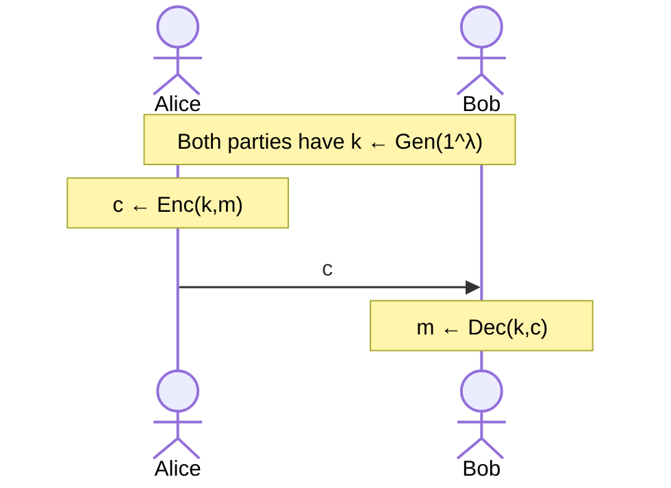

# Introduction

An outline of how a symmetric cipher works is given above. There are 3 main components:

- Key Generator (over a **key space** $\mathcal{K}$)

  $$
  \text{Gen}(1^\lambda) \to k, k \in \mathcal{K}
  $$

- Encryption (over a **message space** $\mathcal{M}$)

  $$
  \text{Enc}(k,m) \to c, m \in \mathcal{M} \land c \in \mathcal{C}
  $$

- Decryption (over a **ciphertext space** $\mathcal{C}$)

  $$
  \text{Dec}(k,c) \to m', m' \in \mathcal{M}
  $$

We should understand that $\text{Gen}$ has a $\lambda$-bit input. $\lambda$ is known as the **security parameter**.

We also expect $m=\text{Dec}(k,\text{Enc}(k,m))$, this is known as **correctness property**.

Note that if we know $\text{Gen}$ we learn the key space. With that, if we know message space and $\text{Enc}$, then we will know the ciphertext space as well.

_NOTE:_ Message is also known as _plaintext_.

_NOTE:_ Private key, Secret key, Symmetric key. These all mean the same thing usually.

## Old Ciphers

We will briefly describe some notable ciphers used back in the day.

### Caesar Cipher

A very old example of cryptogrpahy is by Julius Caesar back then, we simply rotate the alphabet.

- $\text{Enc}(k, m) = m + 3 \bmod 26$
- $\text{Dec}(k, c) = c - 3 \bmod 26$
- $\text{Gen}(1^\lambda) = 3$

Notice that key generation does not care about $\lambda$, and both encryption and decryption does not use the key. It is very easy to break this cipher; you could simply look at the letter frequencies, or **digram** (pair of letters) frequencies.

### Vigenere Cipher

```text
The key is CRYPTO.
k = C R Y P T O C R Y P T O C R Y P T
m = W H A T A N I C E D A Y T O D A Y
------------------------------------- (+ mod 26)
c = Z Z Z J U C L U D T U N W G C Q S
```

Every $n'$th character has the same shift. This was pretty powerful back then, but it is breakable; especially if you know the key length beforehand. In fact, the key length can be found by looking at the uniformity of the characters.

For a Vigenere cipher with key length $1$ to $L$:

- determining the key length $\approx 256L$
- determining the bytes of key $\approx 256L$
- brute-force $\approx 256^L$

### Rotor Machines

Then came the rotor machines, such as [Enigma Machine](https://en.wikipedia.org/wiki/Enigma_machine). Details omitted.

All of the examples so far has been "substituion ciphers" where characters are mapped to some other character.

### Digital Ciphers

Not that long ago there was [DES](https://en.wikipedia.org/wiki/Data_Encryption_Standard) (1974), [AES](https://en.wikipedia.org/wiki/Advanced_Encryption_Standard) (aka Rijndael, 2001) and [Salsa20](https://en.wikipedia.org/wiki/Salsa20) (2008).

## Probability Distribution for Encryption Scheme

Let $M$ be a random variable (r.v.) denoting the value of a message. $M$ ranges over the message space $\mathcal{M}$. For example, $\Pr[M=\text{"attack"}] = 0.7$, $\Pr[M=\text{"dont"}] = 0.3$.

Let $K$ be a r.v. denoting the key denoting the value of a key. $K$ ranges over the key space $\mathcal{K}$. Notice that $M$ and $K$ are independent random variables!

Fix some encryption scheme $(\text{Gen}, \text{Enc}, \text{Dec})$ and some distribution for $M$. Consider the following experiment:

1. Choose a message $m$ according to the given distribution.
2. Generate a key $k$ using $\text{Gen}$.
3. Compute $c \gets \text{Enc}(k,m)$. Here, $c$ will be a random value denoting the result of this experiment.

This experiment defines a distribution on the ciphertext, as such the random variable can be denoted as $C$.

_EXAMPLE:_ Consider the shift cipher on English alphabet, $\forall k \in \{0, 1, \ldots, 25\}: \Pr[K=k] = 1/26$. Suppose $\Pr[M=\text{"one"}] = 1/2, \Pr[M=\text{"ten"}] = 1/2$. What is $\Pr[C=\text{"rgh"}]$?

$$
\begin{align*}
\Pr[C=\text{"rgh"}]&= \\
&= \Pr[C=\text{"rgh"} \mid M=\text{"one"}]\times\Pr[M=\text{"one"}] \\
&+ \Pr[C=\text{"rgh"} \mid M=\text{"ten"}]\times\Pr[M=\text{"ten"}] \\
&= \frac{1}{26} \times \frac{1}{2} + 0 \times \frac{1}{2} \\
&= \frac{1}{52}
\end{align*}
$$
