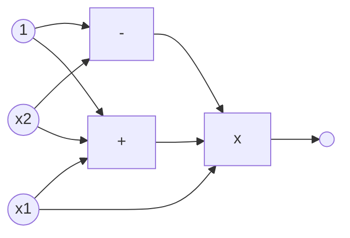
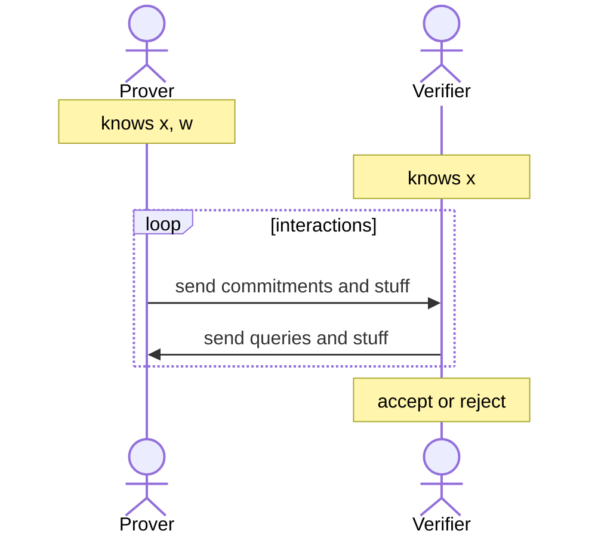
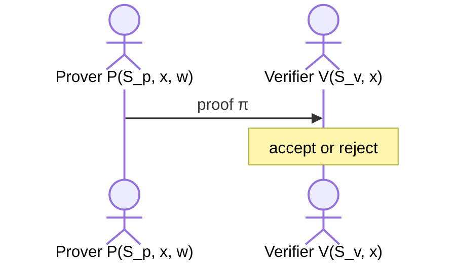
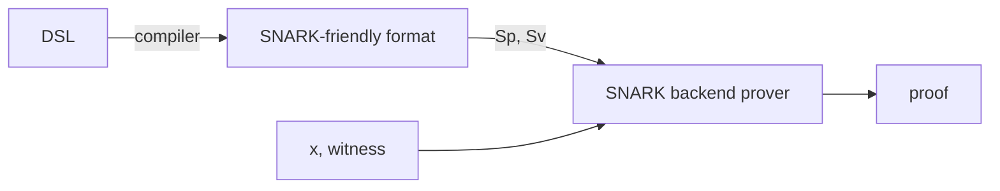

[(video)](https://www.youtube.com/watch?v=h-94UhJLeck)

# SNARK

A SNARK stands for a _succinct_ proof that a certain statement is true. Succinct here is meaning that the proof is “short”. For example, I have a statement:

- I know an $m$ such that $\text{SHA256}(m) = 0$.

In SNARK, the proof should be short and fast to verify. A trivial proof of the above statement is to simply send $m$ to the verifier. However, that proof is not short; it is as big as $m$. Verification is also not fast, as the verifier has to hash the entire message to actually see the proof.

A SNARK can have a proof size of few KBs and verification should take at most seconds.

## zk-SNARK

In the case of a zk-SNARK, the proof reveals nothing about $m$. zk-SNARKs have many applications:

- **Private transactions**: Tornado Cash, ZCash, IronFish, Aleo (private dApps).
- **Compliance**: private proofs of solvency & compliance, zero-knowledge taxes
- **Scalability**: Rollup systems with validity proofs

To understand zk-SNARKs, we need quite a bit of cryptography:

1. Arithmetic Circuits
2. Argument Systems

# (1) Arithmetic Circuits

Fix a finite field $\mathbb{F} = \{0, \ldots, p-1\}$ for some prime $p > 2$. A finite field is just a set of numbers where we can do addition and multiplication in modulo $p$.

An arithmetic circuit is a DAG (directed acyclic graph) $C : \mathbb{F}^n \to \mathbb{F}$ where internal nodes are labeled $+, -, \times$ and inputs are labeled $1, x_1, \ldots, x_n$. The circuit defines an $n$-variate polynomial with an evaluation recipe.

Here is an example:

This circuit defines the operation $x_1(x_1 + x_2 + 1)(x_2 - 1)$.

For convenience, the size of the circuit refers to the number of gates, and is denoted as $|C|$. In the example above, $|C| = 3$.

A theorem states that all polynomial time algorithms can be captured by polynomial sized arithmetic circuits!

For example:

- You can implement a circuit that does $C_{\text{hash}}(h, m) = (h - \text{SHA256}(m))$. This outputs 0 if $m$ is the preimage of $h$ using SHA256, and something other than 0 otherwise. This circuit uses around 20K gates, which is not bad!
- You can have a $C_{\text{sig}}(pk, m, \sigma)$ that outputs 0 if $\sigma$ is a valid ECDSA signature on $m$ with respect to $pk$.

# (2) Argument Systems

Consider a public arithmetic circuit $C(x, w) \to \mathbb{F}$ where

- $x$ is a public statement in $\mathbb{F}^n$
- $w$ is a secret witness in $\mathbb{F}^m$

There will be a Prover with access to $x, w$ and a Verifier with access to $x$. Prover’s goal is to convince a Verifier that $\exists w$ s.t. $C(x, w) = 0$.

The above process is interactive, prover and verifier interact with each other.

We also have non-interactive preprocessing argument systems. In this case, there is a preprocessing (setup) phase $S(C) \to (S_p, S_v)$ that generate two public parameters, one for prover and one for the verifier.

As we can see, this is non-interactive; Verifier does not talk back to Prover!

More formally, a preprocessing argument system is a triple $(S, P, V)$:

- $S(C)$ takes an arithmetic circuit $C$ and outputs $(S_p, S_v)$ public parameters for the prover and verifier respectively.
- $P(S_p, x, w)$ outputs a proof $\pi$.
- $V(S_v, x, \pi)$ accepts or rejects a given proof.

An argument system must formally have the following properties:

- **Completeness**: $\forall x, w : C(x, w) = 0$, it must hold that $\Pr[V(S_v, x, P(S_p, x, w)) = \text{accept}] = 1$ for the honest provers.
- **Knowledge Soundness**: If the Verifier accepts the proof by a Prover, then the Prover must definitely know some $w$ such that $C(x, w) = 0$. Furthermore, a Prover that does not know any such $w$ can only provide a proof that a Verifier can accept with at most negligible probability.
- **Zero-Knowledge**: An extra property is that $(C, S_p, S_v, x, \pi)$ should reveal nothing about $w$.

For a preprocessing argument system to be **succinct**, it needs to have the following to constraints:

- $|\pi| = \mathcal{O}(\log(|C|), \lambda)$ meaning that length of the proof can only be logarithmic in the size of the circuit (number of gates). It can be linear in the security parameter $\lambda$ too.
- $\text{time}(V) = \mathcal{O}(|x|, \log(|C|), \lambda)$ meaning that the time to verify should be logarithmic in the size of circuit, and linear with the size of the statement.
- $\lambda$ here is the security parameter (e.g. 128 for 128-bit security). It is mostly omitted from the complexity notation, or something like $\mathcal{O}_\lambda(\log(|C|))$ is used.

Note that with these constraints, the verifier does not have enough time to read $C$ itself, as it can’t be done in time $\log(|C|)$.

So in short, a zk-SNARK has all 4 properties above: **Complete**, **Knowledge Sound**, **Zero-Knowledge**, **Succinct**. We can go a bit more formal for the knowledge-soundness and zero-knowledge properties.

## Knowledge Soundness

Formally, for an argument system $(S, P, V)$ is knowledge-sound for some circuit $C$, if for every polynomial time adversary $A = (A_0, A_1)$ such that:

- $S(C) \to (S_p, S_v)$
- $(x, state) \gets A_0(S_p)$
- $\pi \gets A_1(S_p, x, state)$
- $\Pr[V(S_v, x, \pi) = \text{accept}] > \beta$ for some non-negligible $\beta$

there is an efficient **extractor** $E$ that uses $A_1$ as a black box (oracle) such that:

- $S(C) \to (S_p, S_v)$
- $(x, state) \gets A_0(S_p)$
- $w \gets E^{A_1(S_p, x, state)}(S_p, x)$
- $\Pr[C(x, w) = 0] > \beta - \epsilon$ for some negligible $\epsilon$.

In other words, the probability that you can convince the verifier for some witness $w$ must be at most negligibly different than the probability that this witness $w$ is a valid witness for the circuit $C$.

## Zero-Knowledge

Formally (simplified), for an argument system $(S, P, V)$ is zero-knowledge if for every statement $x \in \mathbb{F}^n$ the proof $\pi$ reveals nothing about $w$, other than its existence. By that, we mean that the Verifier is capable of generating the same proof $\pi$ without the knowledge of $w$. Formally, there must exist an efficient simulator $Sim$ such that $\forall x \in \mathbb{F}^n$ s.t. $\exists w : C(x, w) = 0$ the distribution:

- $(C, S_p, S_v, x, \pi):$ where $(S_p, S_v) \gets S(C), \pi \gets P(S_p, x, w)$

is indistinguishable from the distribution:

- $(C, S_p, S_v, x, \pi):$ where $(S_p, S_v, \pi) \gets Sim(C, x)$

## Types of Preprocessing Setup

We said that a preprocessing setup $S(C)$ is done for a circuit $C$. Things are actually a bit more detailed than this, there are 3 types of setups:

1. **Trusted Setup per Circuit**: $S(C; r)$ is a randomized algorithm. The random $r$ is calculated per circuit, and must be kept secret from the prover; if a prover can learn $r$ than they can prove false statements!
2. **Trusted Setup & Universal (Updatable)**: a random $r$ is only chosen once, and the setup phase is split in two parts: $S = (S_{init}, S_{index})$.
   1. $S_{init}(\lambda; r) \to pp$ is done a single time.
   2. $S_{index}(pp, C) \to (S_p, S_v)$ is done for each circuit, and nothing here is secret!
3. **Transparent**: $S(C)$ does not use any secret data, meaning that a trusted setup is not required.

These setups are sorted in ascending order with respect to how good they are, so Transparent is kind of the best.

# A SNARK Software System

A SNARK software system has the above format:

1. A Domain-Specific Language is used to write the circuit, there are lots of languages (Circom, ZoKrates, Leo, Zinc, Cairo, Noir, …) and there is even a framework called CirC that can help you write your own DSL.
2. The SNARK-friendly format also has options, such as R1CS, AIR, Plonk-CG, PIL, …
3. A backend will run the heavy computation of generating the proof. Note that this is in time linear of $|C|$ for a circuit $C$.
4. Finally, a generated proof!
