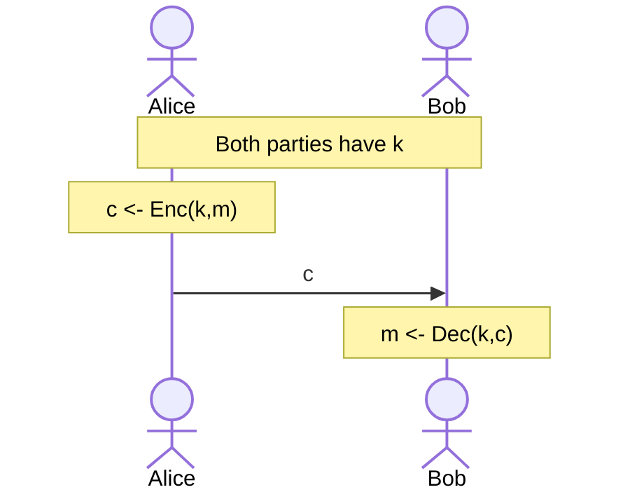

# Modern Cryptography Principles
1. Precise and format definition of security must be presented.
2. Assumptions should be clear, minimal and basic, complete.
3. Rigorous proof of security must be given.

_NOT:_ Provably secure schemes can be broken if the definition does not correspond to reality, or if the assumptions are invalid.

_NOT:_ The best assumptions are ones that are old (thus still valid against test of time), simple (thus generic enough), and shared (thus general enough).
## Formal Definition of Secure Encryption
Let us try to define the term "secure".

- ❌"_No adversary can find the secret key, no matter what the ciphertext is._" Well, $\text{Enc}(k, x) = x$ provides this, but is definitely not secure ;)
- ❌"_No adversary can find the plaintext from the ciphertext._" $\text{Enc}(k, x) = \text{last half of } x$ satisfies this, but is obviously not secure.
- ❌"_No adversary can determine and character of the plaintext that correspond to the ciphertext._" This sounds good, but the adversary can still learn which characters of the alphabet is used, which may be bad. For example if the adversary learns the characters $e, h, y$ and the message is 3 letters, it is probably "hey".
- ✔️"_No adversary can compute any function of the plaintext from the ciphertext_" Now that sounds formal, but we need to be more formal!

_NOT:_ $F(m)=|m|$ is a function of plaintext that gives its length. It is often very hard to hide this, so the last bullet often allows this function to be computable.

## Symmetric Ciphers
Here is an outline of what symmetric ciphers look like:

# Threat Models
There are 4 threat models, with increasing attack power:
1. **Ciphertext-only attack**: The adversary can attack just by looking at one (or many) ciphertexts.
2. **Known-plaintext attack**
3. **Chosen-plaintext attack**
4. **Chosen-ciphertext attack**

A good security definition against **ciphertext-only attack** is: "regardless of any prior information the attacker has about the plaintext, the ciphertext should leak no additional information about the plaintext."
  

## Probability Distribution for Encryption Scheme
Let $M$ be a random variable (r.v.) denoting the value of a message. $M$ ranges over the message space $\mathcal{M}$. For example, $\Pr[M=\text{"attack"}] = 0.7$, $\Pr[M=\text{"dont"}] = 0.3$.

Let $K$ be a r.v. denoting the key denoting the value of a key. $K$ ranges over the key space $\mathcal{K}$. Notice that $M$ and $K$ are independent random variables! 

Fix some encryption scheme $(\text{Gen}, \text{Enc}, \text{Dec})$ and some distribution for $M$. Consider the following experiment:
1. Choose a message $m$ according to the given distribution.
2. Generate a key $k$ using $\text{Gen}$.
3. Compute $c \gets \text{Enc}(k,m)$. Here, $c$ will be a random value denoting the result of this experiment.

This experiment defines a distribution on the ciphertext, as such the random variable can be denoted as $C$.

_EXAMPLE:_ Consider the shift cipher on English alphabet, $\forall k \in \{0, 1, \ldots, 25\}: \Pr[K=k] = 1/26$. Suppose $\Pr[M=\text{"one"}] = 1/2, \Pr[M=\text{"ten"}] = 1/2$. What is $\Pr[C=\text{"rgh"}]$?

$$
\begin{align}
\Pr[C=\text{"rgh"}]&= \\
&= \Pr[C=\text{"rgh"} \mid M=\text{"one"}]\times\Pr[M=\text{"one"}] \\
&+ \Pr[C=\text{"rgh"} \mid M=\text{"ten"}]\times\Pr[M=\text{"ten"}] \\
&= \frac{1}{26} \times \frac{1}{2} + 0 \times \frac{1}{2} \\
&= \frac{1}{52}
\end{align} 
$$