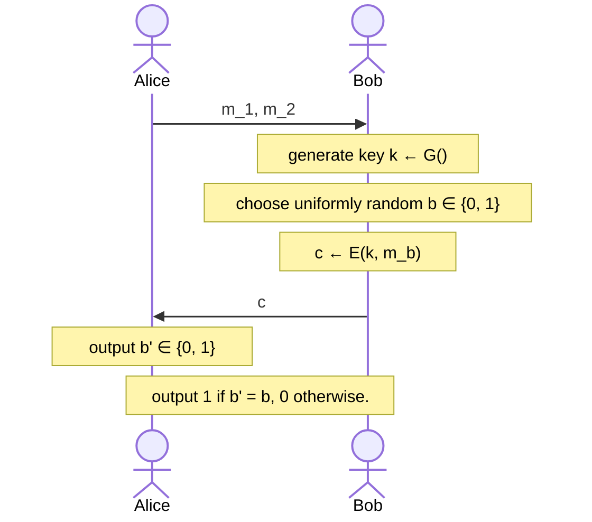

# Perfect Secrecy

An encryption scheme $(\text{Gen}, \text{Enc}, \text{Dec})$ with message space $\mathcal{M}$ and ciphertext space $\mathcal{C}$ is **perfectly secret** if $\forall m \in \mathcal{M}$ and $\forall c \in \mathcal{C}$ where $\Pr[C=c] > 0$, it holds that:

$$
\Pr[\mathcal{M}=m \mid \mathcal{C}=c] = \Pr[\mathcal{M}=m]
$$

I find this definition to be a thing of beauty. It is quite simple in logic: your idea about what a message may be at the start (_a priori_ probability, right-hand side) should be equal to what you think that message is after seeing the ciphertext (_a posteriori_ probability, left-hand side). If that is the case, seeing the cipher-text gave you no idea whatsoever.

_EXAMPLE:_ Consider the same shift cipher example from before, and notice that $\Pr[\mathcal{M}=\text{"ten"} \mid C=\text{"rqh"}] = 0$. Since $\Pr[\mathcal{M}=\text{"ten"}] = 1/2$, we can say this scheme is not perfectly secret.

**Theorem**: Suppose $(\mathcal{M}, \mathcal{C}, \mathcal{K}, \text{Enc}, \text{Dec})$ be a scheme where $|\mathcal{M}| = |\mathcal{C}|= |\mathcal{K}|$, i.e. spaces have equal cardinality. This scheme offers **perfect secrecy** if and only if every key is used with probability $1/|\mathcal{K}|$ and for every $m \in \mathcal{M}$ and $c \in \mathcal{C}$ there is a unique key $k \in \mathcal{K}$ such that $c = \text{Enc}_k(m)$.

Further note that we can convert the equation:

$$
\Pr[\mathcal{M}=m \mid \mathcal{C}=c] = \Pr[\mathcal{M}=m]
$$

to be:

$$
\Pr[\mathcal{C}=c \mid \mathcal{M}=m] = \Pr[\mathcal{C}=c]
$$

Here, $\Pr[\mathcal{C}=c] > 0$ because if not, why would $c$ be in $\mathcal{C}$? This implies that $\Pr[\mathcal{C}=c \mid \mathcal{M}=m] > 0$.

# Perfect Indistinguishability

We will now define a game between two players, and describe the security of an encryption scheme using it. Let $\Pi = (G, E, D)$ an encryption scheme. We define an experiment $\text{PrivK}_{A, \Pi}^{\text{eav}}$ as follows:

The encryption scheme $\Pi = (G, E, D)$ is perfectly indistinguishable if for every $A$ it holds that:

$$
\Pr[\text{PrivK}_{A, \Pi}^{\text{eav}} = 1] = \frac{1}{2}
$$

In otherwords, Alice is no more successfull than flipping a coin when it comes to guessing which message Bob has encrypted. Another definition for perfect indistiguishability is that:

$$
\Pr[\mathcal{C}=c \mid \mathcal{M}=m_1] =\Pr[\mathcal{C}=c \mid \mathcal{M}=m_2]
$$

which means that the probability $c$ is the ciphertext of $m_1$ is equally likely to be that of $m_2$.

**Lemma**: An encryption scheme is **perfectly secret** if and only if it is **perfectly indistinguishable**.

## One-time Pad

todo...
