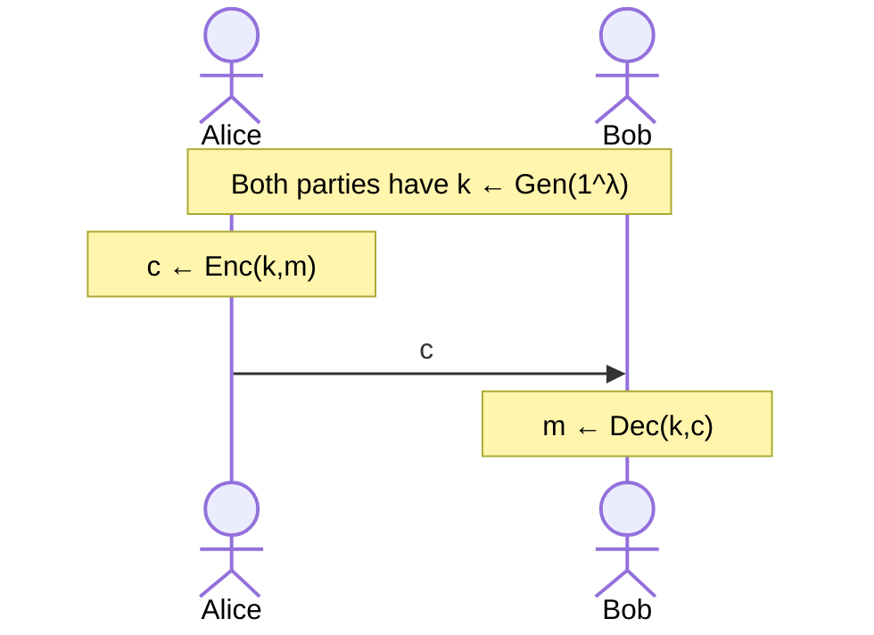

# Introduction

An outline of how a symmetric cipher works is given above. There are 3 main components:

- Key Generator (over a **key space** $\mathcal{K}$)

  $$
  \text{Gen}(1^\lambda) \to k, k \in \mathcal{K}
  $$

- Encryption (over a **message space** $\mathcal{M}$)

  $$
  \text{Enc}(k,m) \to c, m \in \mathcal{M} \land c \in \mathcal{C}
  $$

- Decryption (over a **ciphertext space** $\mathcal{C}$)

  $$
  \text{Dec}(k,c) \to m', m' \in \mathcal{M}
  $$

We should understand that $\text{Gen}$ has a $\lambda$-bit input. $\lambda$ is known as the **security parameter**.

We also expect $m=\text{Dec}(k,\text{Enc}(k,m))$, this is known as **correctness property**.

Note that if we know $\text{Gen}$ we learn the key space. With that, if we know message space and $\text{Enc}$, then we will know the ciphertext space as well. Message is also known as _plaintext_; and, "Private key", "Secret key", "Symmetric key" all mean the same thing usually.

## Old Ciphers

We will briefly describe some notable ciphers used back in the day.

### Caesar Cipher

A very old example of cryptogrpahy is by Julius Caesar back then, we simply rotate the alphabet.

- $\text{Enc}(k, m) = m + 3 \bmod 26$
- $\text{Dec}(k, c) = c - 3 \bmod 26$
- $\text{Gen}(1^\lambda) = 3$

Notice that key generation does not care about $\lambda$, and both encryption and decryption does not use the key. It is very easy to break this cipher; you could simply look at the letter frequencies, or **digram** (pair of letters) frequencies.

### Vigenere Cipher

```text
The key is CRYPTO.
k = C R Y P T O C R Y P T O C R Y P T
m = W H A T A N I C E D A Y T O D A Y
------------------------------------- (+ mod 26)
c = Z Z Z J U C L U D T U N W G C Q S
```

Every $n'$th character has the same shift. This was pretty powerful back then, but it is breakable; especially if you know the key length beforehand. In fact, the key length can be found by looking at the uniformity of the characters.

For a Vigenere cipher with key length $1$ to $L$:

- determining the key length $\approx 256L$
- determining the bytes of key $\approx 256L$
- brute-force $\approx 256^L$

### Rotor Machines

Then came the rotor machines, such as [Enigma Machine](https://en.wikipedia.org/wiki/Enigma_machine). Details omitted. All of the examples so far has been "substituion ciphers" where characters are mapped to some other character.

### Digital Ciphers

Not that long ago there was [DES](https://en.wikipedia.org/wiki/Data_Encryption_Standard) (1974), [AES](https://en.wikipedia.org/wiki/Advanced_Encryption_Standard) (aka Rijndael, 2001) and [Salsa20](https://en.wikipedia.org/wiki/Salsa20) (2008).

# Modern Cryptography Principles

1. Precise and format definition of security must be presented.
2. Assumptions should be clear, minimal and basic, complete.
3. Rigorous proof of security must be given.

Provably secure schemes can be broken if the definition does not correspond to reality, or if the assumptions are invalid. The best assumptions are ones that are old (thus still valid against test of time), simple (thus generic enough), and shared (thus general enough).

## 1: Formal Definition of Secure Encryption

Let us try to define the term "secure".

- ❌ - "_No adversary can find the secret key, no matter what the ciphertext is._": Well, $\text{Enc}(k, x) = x$ provides this, but is definitely not secure ;)
- ❌ - "_No adversary can find the plaintext from the ciphertext._": $\text{Enc}(k, x) = \text{last half of } x$ satisfies this, but is obviously not secure.
- ❌ - "_No adversary can determine and character of the plaintext that correspond to the ciphertext._": This sounds good, but the adversary can still learn which characters of the alphabet is used, which may be bad. For example if the adversary learns the characters $e, h, y$ and the message is 3 letters, it is probably "hey".
- ✔️ - "_No adversary can compute any function of the plaintext from the ciphertext_": Now that sounds formal, but we need to be more formal!

Note that $F(m)=|m|$ is a function of plaintext that gives its length. It is often very hard to hide this, so the last bullet often allows this function to be computable.

## 2: Assumptions

To make well assumptions, one usually considers threat models, i.e. how powerful is the adversary? There are 4 threat models, with increasing attack power:

1. **Ciphertext-only attack**: The adversary can attack just by looking at one (or many) ciphertexts.
2. **Known-plaintext attack**
3. **Chosen-plaintext attack**
4. **Chosen-ciphertext attack**

A good security definition against **ciphertext-only attack** is: "regardless of any prior information the attacker has about the plaintext, the ciphertext should leak no additional information about the plaintext."

## 3. Proofs

Typical proof of a scheme $X$ will show using a constructive argument, that if $X$ is broken, some **assumption** $Y$ will be violated.

- If there exists an algorithm $A$ for breaking $X$, then we can construct an algorithm $B$ to break the assumption $Y$.
- If $A$ is _efficient_ (i.e. runs in probabilistic polynomial time) then so is $B$.
- The proof cannot present $A$ (in which case $X$ is already broken) but must present the "code" of $B$. We always assume $A$ exists.

These all **assume** that if assumption $Y$ holds, $X$ is secure.
