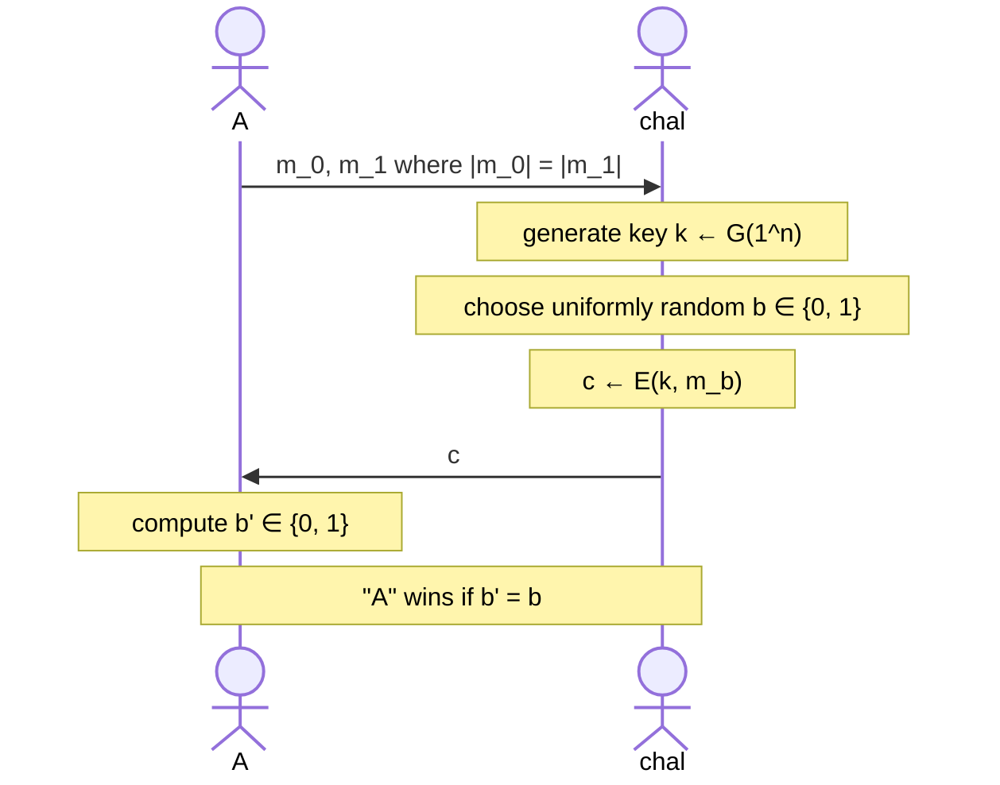
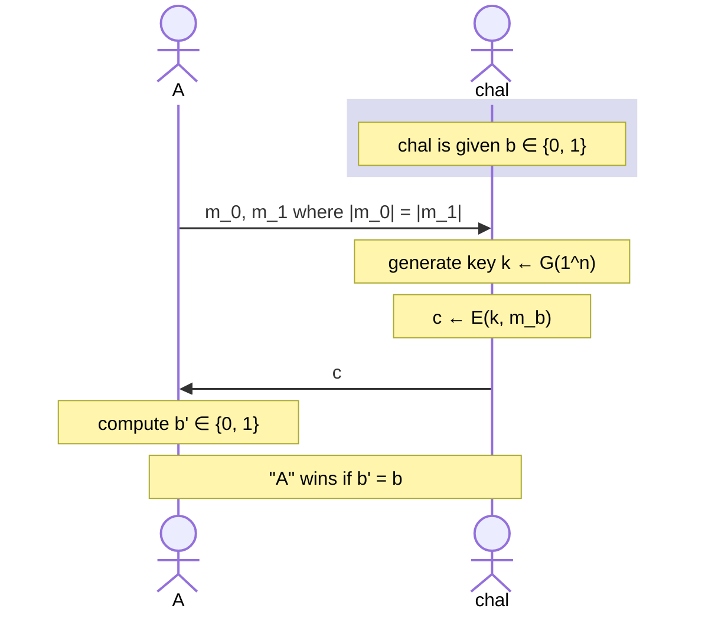

# Computational Secrecy

Having "perfect" secrecy is a bit too strict. We could perhaps allow the adversary to crack our system as long as it would take them a million years or something. We need to consider practical scenarios to be applied in real-life! A great way to think about security in this case is to have security such that it costs the attacker more than what they would gain by breaking the system.

To this extent, we could:

- Allow security to fail with tiny probability (i.e. probability of failure is a **negligible** function)
- Adversaries are efficient (i.e. run in probabilistic polynomial time)

Our parameters fit the real world, but may not be practical in terms of theory. This is why we require an "asymptotic" approach.

## Asymptotic Indistinguishability

Fix $\Pi, A$ and define a randomized experiment $\text{PrivK}_{A, \Pi}(n)$ as follows:

We assume that both parties know the security parameter $n$, and the adversary is allowed to know the message length. $\Pi$ is indistinguishable if for all efficient $A$ there is a negligible function $\epsilon$ such that

$$
\Pr[\text{PrivK}_{A, \Pi}(n) = 1] \leq \frac{1}{2} + \epsilon(n)
$$

_EXAMPLE_: Consider a scheme where the best attack is a brute-force search over the key space, and $G(1^n)$ generates a uniform $n$-bit key. The probability of guessing the correct key is $2^{-n}$. If $A$ runs in time $t(n)$, we have:

$$
\Pr[\text{PrivK}_{A, \Pi}(n) = 1] \leq \frac{1}{2} + t(n) \times 2^{-n}
$$

Since $2^{-n}$ is negligible, $t(n)\times 2^{-n}$ is negligible and thus our scheme is asymptotically indistinguishable.

_NOTE_: A **brute-force attack** requires $|\mathcal{K}|$ time to succeed with probability at most 1; a **key-guessing attack** requires $\mathcal{O}(1)$ time to succeed with probability $1/|\mathcal{K}|$.

## Semantic Security

There is yet another definition for asymptotic secrecy, which is cool but also slightly harder to work with.

Challenger is given a bit $b \in \{0, 1\}$, and we denote the respective experiment as $EXP(b)$. Similarly, the probability of adversary winning the experiment is shown as $W_b = \Pr[EXP(b) = 1]$. Now define the difference in probability of winning these experiments as:

$$
\text{Adv}_{ss}[A, \Pi] := |\Pr[W_0] - \Pr[W_1] | \in [0, 1]
$$

If a scheme $\Pi$ is **semantically secure** for all efficient $A$, then $\text{Adv}_{ss}[A, \Pi]$ is **negligible**.

_NOTE:_ This definition of looking at the difference between winning two experiments come in handy sometimes, such as when we are defining pseudo-random generators.
