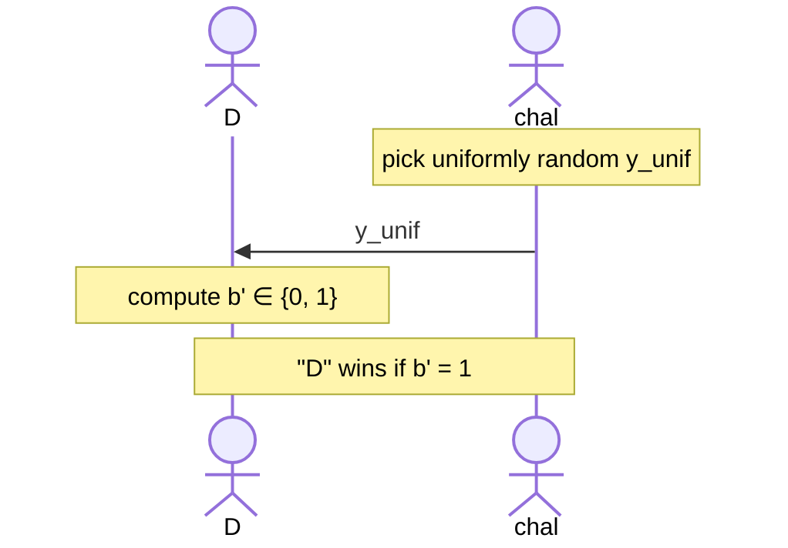
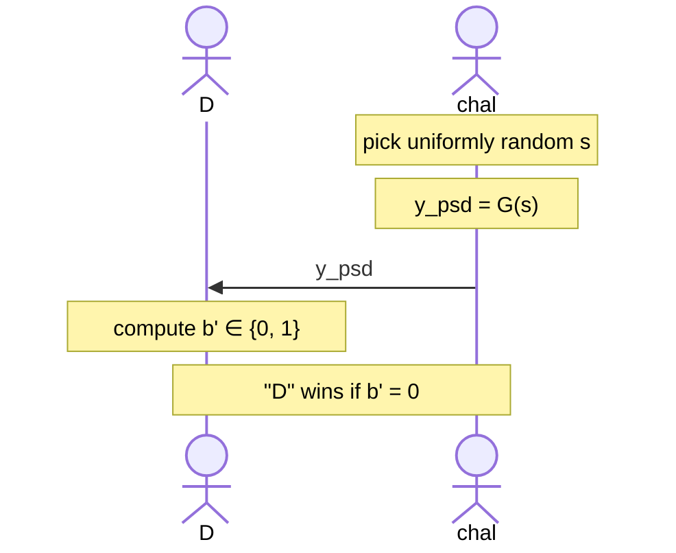
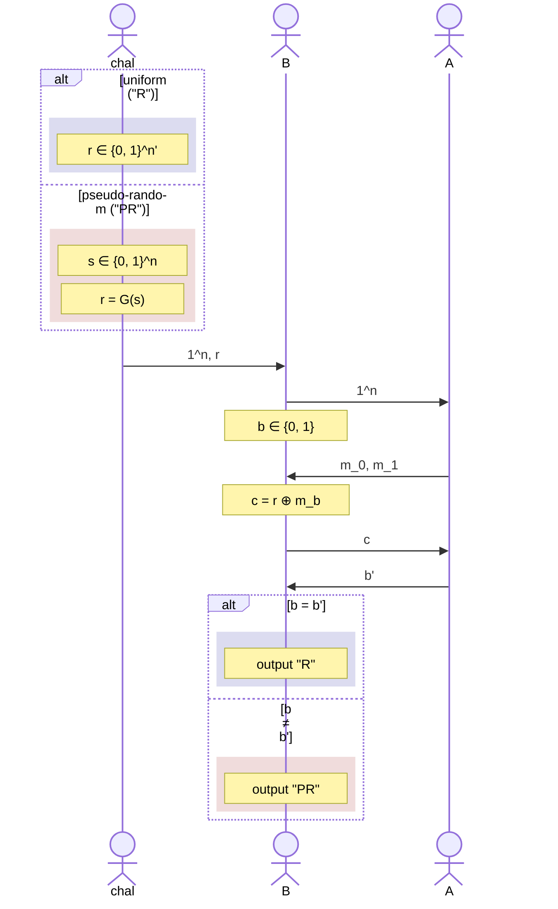

# Pseudo-random Generators

Let us think of an experiment with an efficient **distinguisher** $D$ that plays the following two games:

1. A game where challenger gives the distinguisher a uniformly random chosen value; the distinguisher wins if it can find that this value was actually uniformly randomly generated:

2. A game where challenger gives the distinguisher a pseudo-randomly generated value, with a uniformly random chosen **seed**; the distinguisher wins if it can find that this value was actually pseudo-randomly generated:

With these two games, we would like to see:

$$
|\Pr[D(y_{unif}) = 1] - \Pr[D(y_{psd}) = 1] | \leq \text{negl}
$$

Notice that this is the statement we made in semantic security. Also notice that the seed of pseudo-random generator ($s$ in $G(s)$) is assumed to be uniformly random. If the seed is known, you can easily guess which number will be generated.

## A more formal definition

Let $l$ be a polynomial and let $G$ be a **deterministic** polynomial-time algorithm such that for any $n$ and any input $s \in \{0, 1\}^n$, the result of $G(s)$ is a string of length $l(n)$. We say that $G$ is a pseudo-random generator (PRG) if the followings hold:

1. **Expansion:** For every $n$ it holds that $l(n) > n$. This $l$ is called the **expansion factor** of $G$.
2. **Pseudorandomness:** For every efficient (i.e. probabilistic polynomial time) distinguisher $D$ there is a negligible function $\text{negl}$ such that:

$$
|\Pr[D(r) = 1] - \Pr[D(G(s)) = 1] | \leq \text{negl}
$$

where $s$ is chosen uniformly random from $\{0, 1\}^n$ and $r$ is chosen uniformly random from $\{0, 1\}^{l(n)}$.

# PRG-Based Encryption: One-time Pad Example

Consider a scheme $X$ and a PRG $G : \{0, 1\}^n \to \{0, 1\}^{n'}$, $\mathcal{M} = \{0, 1\}^{n'}$.

$$
\text{Gen}(1^n) \to k : k \gets \{0, 1\}^n
$$

$$
\text{Enc}(k, m) \to c : c := G(k) \oplus m
$$

$$
\text{Dec}(k, c) \to m' : m' := G(k) \oplus c
$$

**Theorem:** $G$ is a secure PRG $\implies$ $X$ is a secure encryption scheme against a 1-message eavesdropper.

**Proof:** If $\exists$ efficient $A$ who breaks $X$, then we construct efficient $B$ who breaks $G$; as in, $B$ would be able to distinguish wheter a given value is pseudo-random or uniformly random with non-negligible advantage.

Looking at $A$'s game:

$$
\Pr[b' = b] = \frac{1}{2} + \epsilon(n)
$$

where $\epsilon(n)$ is either negligible or non-negligible, we do not know yet :)

Looking at $B$'s game:

$$
|\Pr[B \text{ outputs R} \mid r \text{ is R}] - \Pr[B \text{ outputs R} \mid r \text{ is PR}]| = \epsilon(n)
$$

Since $B \text{ outputs R}$ if and only if $b' \ne b$:

- $\Pr[B \text{ outputs R} \mid r \text{ is R}]$ is equal to $1/2$. We know this from One-time Pad.
- $\Pr[B \text{ outputs R} \mid r \text{ is PR}]$ is equal to $1/2 + \epsilon(n)$ probability, and for $b' \ne b$ player $A$ would need to lose. So what is the probability $\Pr[b' \ne b] = 1 - \Pr[b' = b] = 1 - (1/2 + \epsilon(n))$.

Our expression for $B$'s game is then:

$$
\left|\frac{1}{2} - \left(\frac{1}{2} - \epsilon(n)\right)\right| = \epsilon(n)
$$

At this point, we were able to connect formally that the probability $B$ wins it's game is equal to the probability $A$ wins it's game. If $A$ were to have a non-negligible advantage in guessing $b'$, then $B$ would have a non-negligible difference between the result of its games. However, we had assumed that $G$ is a pseudo-random generator so $B$ should not have a non-negligible difference!

Therefore, $B$ must have a negligible difference ($\epsilon(n)$ is negligible) and thus $A$ has negligible advantage. $X$ is indeed a secure scheme (against a 1-message eavesdropper, which is a very puny weak defense but hey its something). Q.E.D.

# Pseudo-random Functions

Denote the set of all function that map $\{0, 1\}^n \to \{0, 1\}^n$ as $\text{Func}_n$. Note that this a HUGE set, with the size $2^{n2^n}$.

Now, let $F : \{0, 1\}^* \times \{0, 1\}^* \to \{0, 1\}^*$ be an efficiently computable function. Define $F_k(x) := F(k, x)$. Here, we refer to $k$ as key. Assume that $F$ is length preserving : $F(k, x)$ is only defined if $|k| = |x|$, in which case $|F(k, x)| = |k| = |x|$. Notice that choosing $k \gets \{0, 1\}^n$ is then equivalent to choosing the function $F_k : \{0, 1\}^n \to \{0, 1\}^n$. In other words, $F$ defines a distribution over functions in $\text{Func}_n$.

We define that $F$ is a pseudo-random function if $F_k$ for a uniform key $k$ is indistinguishable from a uniform function $f \in \text{Func}_n$. More formally, for all distinguishers $D$:

$$
|\Pr_{k \gets \{0, 1\}^n}[D^{F_k(.)} = 1] - \Pr_{f \gets \text{Func}_n}[D^{f(.)} = 1] | \leq \text{negl}(n)
$$

where $F_k : \{0, 1\}^n \to \{0, 1\}^n$ for some $n' = \text{poly}(n)$.

It is easy to think of an interactive proof where the distinguisher keeps querying $x$ to get $f(x)$ in one scenario, and $F_k(x)$ in the other; if it can't distinguish the difference after polynomially many such queries, our dear $F_k$ is a pseudo-random function! Also note that given a PRF $F$, we can immediately obtain a PRG $G$. For example:

$$
G(k) = F_k(00\ldots0) || F_k(00\ldots01)
$$

where $||$ is concatenation.

# Pseudo-random Permutations

Let $F$ be a length-preserving keyed function. Then, $F$ is a keyed-permutation if:

- $F_k$ is a bijection for every $k$, meaning that $F_k$ is invertible.
- $F^{-1}_k$ is efficiently computable, where $F_k(F_k^{-1}(x)) = x$.

Essentially, a PRF with $n' = n$ and bijection is a PRP.
