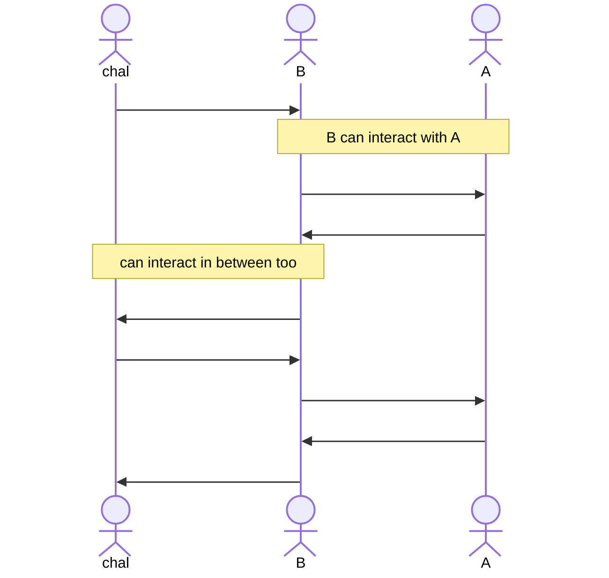

# Reduction Proofs

Reduction proofs are the main tool we will use to prove the security of some scheme. We have given a brief overview of them while describing the third principle of modern cryptography.

Suppose we have some assumption $Y$ and an encryption scheme $X$ such that:

$$
Y \text{ holds } \implies X \text{ secure}
$$

To prove this, we can look at it's **contrapositive**:

$$
X \text{ not secure } \implies Y \text{ doesn't hold}
$$

If there exists an efficient $A$ that breaks $X$, then we will construct an efficient $B$ that breaks $Y$. Similar to how we had an adversary and a challenger in the previous interactions:

- $B$ will be an adversary to an outside challenger. The interactions between $B$ and this challenger is defined by $Y$
- $B$ will use $A$ within, and it will act as the challenger for $A$. The interactions between $B$ and $A$ is defined by $X$

There are three points to consider in a reduction proof:

1. **Efficiency:** $A$ and $B$ must both be efficient, that is run in probabilistic polynomial time. As such, the interactions must be polynomially many times.
2. **Simulation:** $B$ must **simulate** a challenger to $A$ as in the definition of $X$. That is the main requirement of interacting with $A$ within.
3. **Probability:** The statement that $A$ has non-negligible advantage should imply $B$ has non-negligible advantage.

Regarding the last point, notice that:

$$
\exists A \text{ non-negl. adv.} \implies \exists B \text{ non-negl. adv.}
$$

when taken the contrapositive is expressed as:

$$
\forall B \text{ negl. adv.} \implies \forall A \text{ negl. adv.}
$$

In other words, if we can't construct any $B$ to have a non-negligible advantage then we can say there can't be any $A$ with non-negligible advantage.

## A more verbal explanation

We can state reduction proofs as follows:

1. **Goal:** Prove that a scheme $X$ is secure as long as $Y$ holds.
2. **Method:** If there exists an efficient adversary $A$ that breaks scheme $X$ with non-negligible probability, then we construct an efficient adversary $B$ that breaks assumption $Y$ with non-negligible probability.
3. **Result:** Since there is no known break on the assumption $Y$ (hopefully your assumptions are good enough for that), this means no such adversary $A$ exists; otherwise, assumption $Y$ would already be broken. Alternatively, if we could break $X$ we should be able to break $Y$, therefore if we cannot break $Y$ then we cannot break $X$.

So given an efficient adversary $A$, we try to construct adversary $B$ such that:

- $B$ uses $A$ as a subroutine,
- $B$ is efficient, that is it performs at most polynomial amount of work on top of $A$,
- The success probability of $B$ breaking $Y$ is at most negligibly worse than the success probability of $A$ breaking $X$,
- $B$ simulates the challenger in scheme $X$ for $A$.

Note that a proof can be black-box: the constructed $B$ need not know how $A$ works, but know that it does break $X$ with some non-negligible probability.
