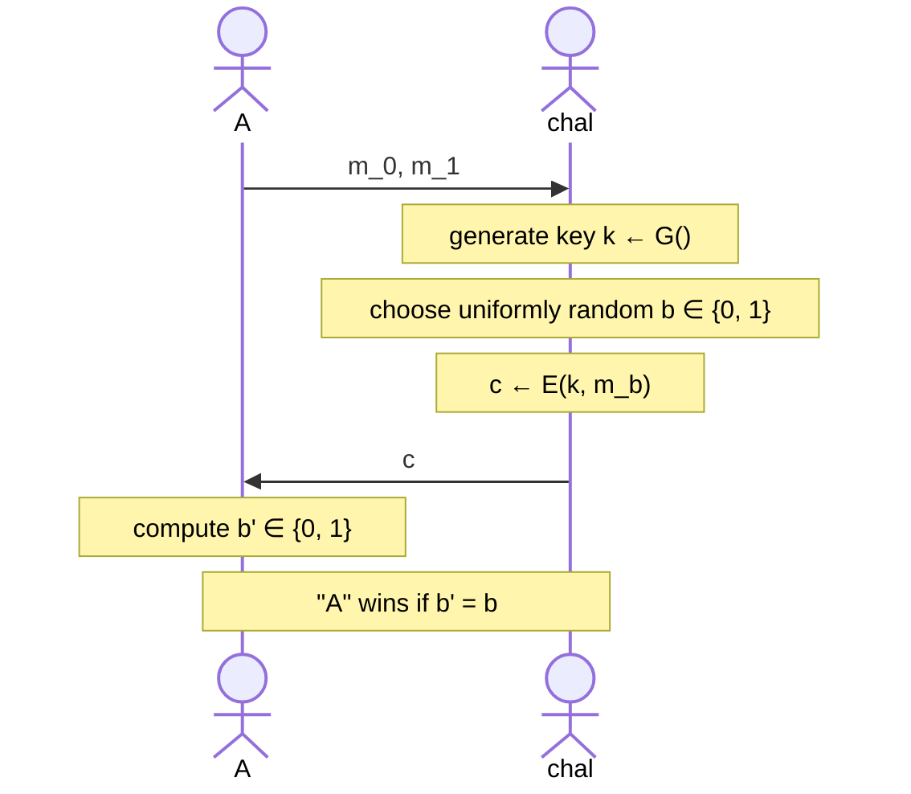
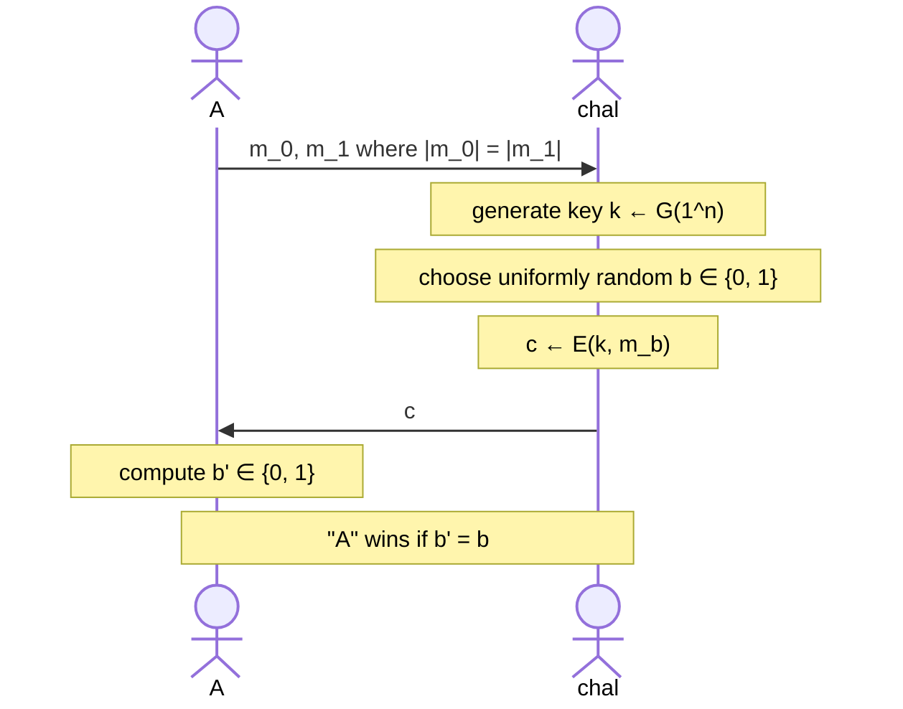
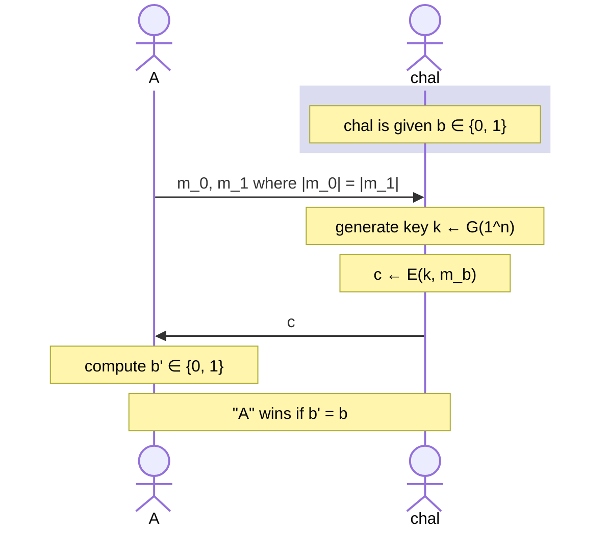

<!-- toc -->

# Perfect Secrecy

An encryption scheme $(\text{Gen}, \text{Enc}, \text{Dec})$ with message space $\mathcal{M}$ and ciphertext space $\mathcal{C}$ is **perfectly secret** if $\forall m \in \mathcal{M}$ and $\forall c \in \mathcal{C}$ where $\Pr[C=c] > 0$, it holds that:

$$
\Pr[\mathcal{M}=m \mid \mathcal{C}=c] = \Pr[\mathcal{M}=m]
$$

I find this definition to be a thing of beauty. It is quite simple in logic: your idea about what a message may be at the start (_a priori_ probability, right-hand side) should be equal to what you think that message is after seeing the ciphertext (_a posteriori_ probability, left-hand side). If that is the case, seeing the cipher-text gave you no idea whatsoever.

_EXAMPLE:_ Consider the same shift cipher example from before, and notice that $\Pr[\mathcal{M}=\text{"ten"} \mid C=\text{"rqh"}] = 0$. Since $\Pr[\mathcal{M}=\text{"ten"}] = 1/2$, we can say this scheme is not perfectly secret.

**Theorem**: Suppose $(\mathcal{M}, \mathcal{C}, \mathcal{K}, \text{Enc}, \text{Dec})$ be a scheme where $|\mathcal{M}| = |\mathcal{C}|= |\mathcal{K}|$, i.e. spaces have equal cardinality. This scheme offers **perfect secrecy** if and only if every key is used with probability $1/|\mathcal{K}|$ and for every $m \in \mathcal{M}$ and $c \in \mathcal{C}$ there is a unique key $k \in \mathcal{K}$ such that $c = \text{Enc}_k(m)$.

Further note that we can convert the equation:

$$
\Pr[\mathcal{M}=m \mid \mathcal{C}=c] = \Pr[\mathcal{M}=m]
$$

to be:

$$
\Pr[\mathcal{C}=c \mid \mathcal{M}=m] = \Pr[\mathcal{C}=c]
$$

Here, $\Pr[\mathcal{C}=c] > 0$ because if not, why would $c$ be in $\mathcal{C}$? This implies that $\Pr[\mathcal{C}=c \mid \mathcal{M}=m] > 0$.

# Perfect Indistinguishability

We will now define a game between two players (an adversary $A$ and a challenger **chal**), and describe the security of an encryption scheme using it. Let $\Pi = (G, E, D)$ an encryption scheme. We define an experiment $\text{PrivK}_{A, \Pi}^{\text{eav}}$ as follows:

We say that the experiment results in 1 if $A$ wins. The encryption scheme $\Pi = (G, E, D)$ is perfectly indistinguishable if for every $A$ it holds that:

$$
\Pr[\text{PrivK}_{A, \Pi}^{\text{eav}} = 1] = \frac{1}{2}
$$

In otherwords, $A$ is no more successfull than flipping a coin when it comes to guessing which message Bob has encrypted. Another definition for perfect indistiguishability is that:

$$
\Pr[\mathcal{C}=c \mid \mathcal{M}=m_1] =\Pr[\mathcal{C}=c \mid \mathcal{M}=m_2]
$$

which means that the probability $c$ is the ciphertext of $m_1$ is equally likely to be that of $m_2$.

**Lemma**: An encryption scheme is **perfectly secret** if and only if it is **perfectly indistinguishable**.

## One-time Pad

[One-time Pad](https://en.wikipedia.org/wiki/One-time_pad) is a symmetric encryption scheme found by Gilbert Vernam in 1917. The scheme is quite simple: it is defined over the spaces $\mathcal{M} = \mathcal{C} = \mathcal{K} = \{0, 1\}^n$ where the key is a random bit-string as long as the message.

To encrypt, you XOR (shown with $\oplus$) the message with the private key, and to decyrpt you XOR the ciphertext with the private key.

$$
E(k, m) = k \oplus m
$$

$$
D(k, m) = k \oplus c
$$

**Theorem**: One-time Pad has **perfect secrecy**.

**Proof**: Let us look at the probabilities of how a ciphertext can be obtained given a message: $\forall m \in \mathcal{M}, c \in \mathcal{C}:$

$$
\Pr_k[E(k, m) = c] = \frac{\text{\# keys } k \in \mathcal{K} \text{ s.t. } E(k,m) = c }{|\mathcal{K}|}
$$

We know that $E(k, m) = c = k \oplus m$ and thus $k \oplus m \oplus m = c \oplus m = k$. This means that for any $m, c$ pair there is only one $k$. As such, the numerator of the probability above, $\text{\# keys } k \in \mathcal{K} \text{ s.t. } E(k,m) = c $ is equal to 1.

This is exactly the requirement of perfect secrecy, recalling the theorem given above. Q.E.D.

### The Bad News

Having perfect secrecy is cool, but notice that there is something very dirty in the proof:

- Just by XOR'ing the message and it's ciphertext, we were able to obtain the private key!
- Furthermore, the key must be as long as the message itself, which is not really practical.
- You should also use the key only for one encryption (hence the name), which is yet another practicality issue.
- One-time Pad is perfectly secret only against cipher-text only attacks, it is very much vulnerable to other attacks. Especially if the attacker is active (i.e. can tamper with the message), you are going to have a bad day.

Well then, can we have some other encryption scheme that is perfectly secret? We will hear the bad news from Claude Shannon:

**Theorem \[Shannon\]**: For perfect secrecy, $|\mathcal{K}| \geq |\mathcal{M}|$.

**Proof**: Assume that for perfect secrecy, $|\mathcal{K}| < |\mathcal{M}|$. Define $\mathcal{M}(c)$ to be all possible decryptions of some ciphertext $c$:

$$
\mathcal{M}(c) = \{ m \mid m = D(k, c) \text{ for some } k \in \mathcal{K}\}
$$

Clearly, $|\mathcal{M}(c)| \leq |\mathcal{K}|$. If $|\mathcal{K}| < |\mathcal{M}|$ then there is some $m' \in \mathcal{M}$ such that $m' \not\in \mathcal{M}(c)$. But if that is the case,

$$
\Pr[\mathcal{M} = m' \mid \mathcal{C} = c] = 0 \ne \Pr[\mathcal{M} = m']
$$

and thus this contradicts perfect secrecy. Q.E.D.

# Computational Secrecy

Having "perfect" secrecy is a bit too strict. We could perhaps allow the adversary to crack our system as long as it would take them a million years or something. We need to consider practical scenarios to be applied in real-life! A great way to think about security in this case is to have security such that it costs the attacker more than what they would gain by breaking the system.

To this extent, we could:

- Allow security to fail with tiny probability (i.e. probability of failure is a **negligible** function)
- Adversaries are efficient (i.e. run in probabilistic polynomial time)

Our parameters fit the real world, but may not be practical in terms of theory. This is why we require an "asymptotic" approach.

## Asymptotic Indistinguishability

Fix $\Pi, A$ and define a randomized experiment $\text{PrivK}_{A, \Pi}(n)$ as follows:

We assume that both parties know the security parameter $n$, and the adversary is allowed to know the message length. $\Pi$ is indistinguishable if for all efficient $A$ there is a negligible function $\epsilon$ such that

$$
\Pr[\text{PrivK}_{A, \Pi}(n) = 1] \leq \frac{1}{2} + \epsilon(n)
$$

_EXAMPLE_: Consider a scheme where the best attack is a brute-force search over the key space, and $G(1^n)$ generates a uniform $n$-bit key. The probability of guessing the correct key is $2^{-n}$. If $A$ runs in time $t(n)$, we have:

$$
\Pr[\text{PrivK}_{A, \Pi}(n) = 1] \leq \frac{1}{2} + t(n) \times 2^{-n}
$$

Since $2^{-n}$ is negligible, $t(n)\times 2^{-n}$ is negligible and thus our scheme is asymptotically indistinguishable.

_NOTE_: A **brute-force attack** requires $|\mathcal{K}|$ time to succeed with probability at most 1; a **key-guessing attack** requires $\mathcal{O}(1)$ time to succeed with probability $1/|\mathcal{K}|$.

## Semantic Security

There is yet another definition for asymptotic secrecy, which is cool but also slightly harder to work with.

Challenger is given a bit $b \in \{0, 1\}$, and we denote the respective experiment as $EXP(b)$. Similarly, the probability of adversary winning the experiment is shown as $W_b = \Pr[EXP(b) = 1]$. Now define the difference in probability of winning these experiments as:

$$
\text{Adv}_{ss}[A, \Pi] := |\Pr[W_0] - \Pr[W_1] | \in [0, 1]
$$

If a scheme $\Pi$ is **semantically secure** for all efficient $A$, then $\text{Adv}_{ss}[A, \Pi]$ is **negligible**. Note that this definition of looking at the difference between winning two experiments come in handy sometimes, such as when we are defining pseudo-random generators.
