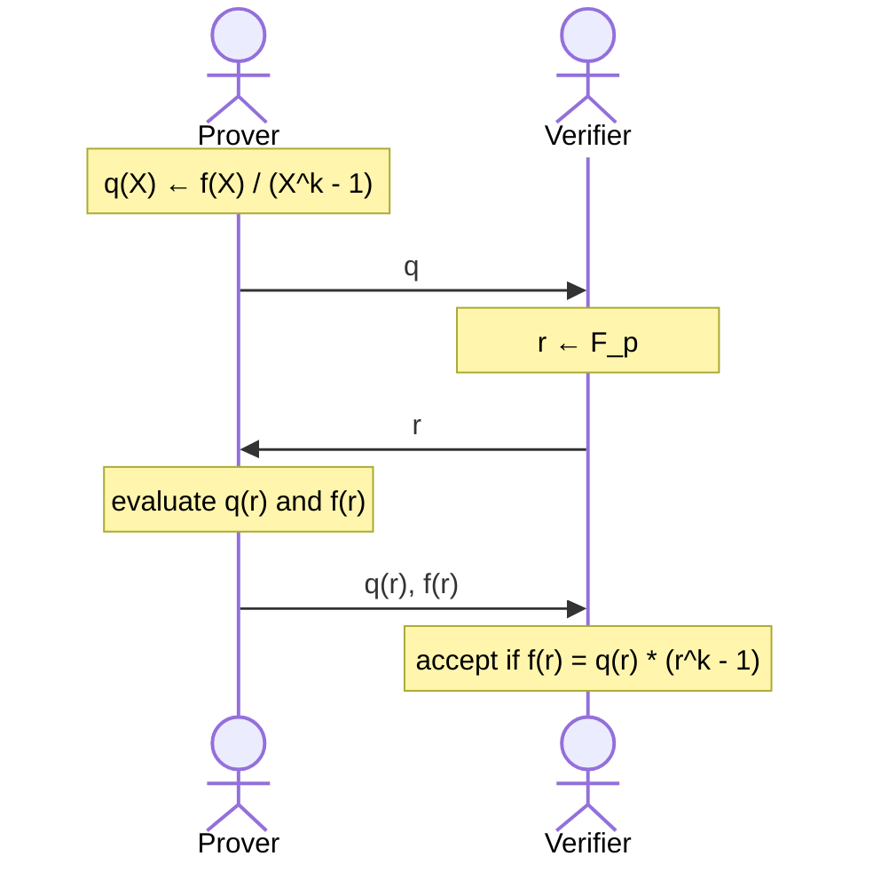
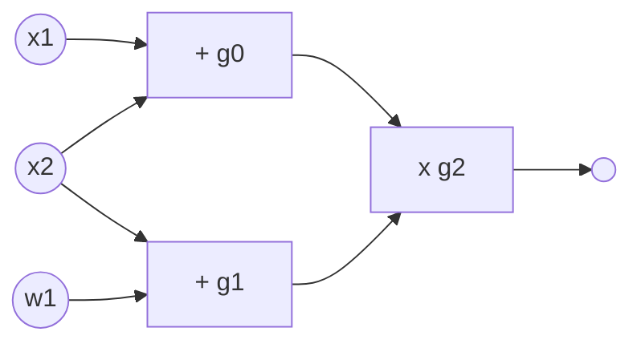
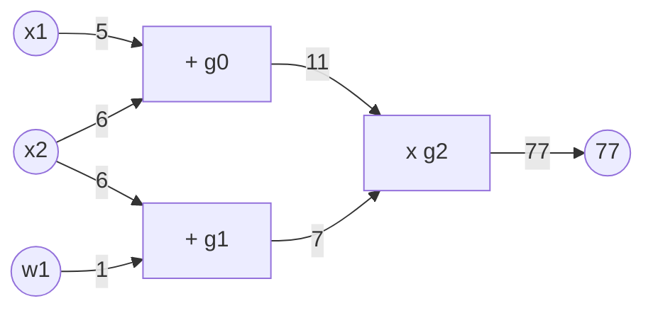

[(video)](https://www.youtube.com/watch?v=vxyoPM2m7Yg)

We will build a Poly-IOP called Plonk. Plonk + PCS will make up a SNARK, and optionally can be extended to a zk-SNARK.

# Key Observations

We can do zero test and equality test on committed polynomials, and these are used on almost all SNARK constructions.

## Zero Test

A really key fact for $0 \ne f \in \mathbb{F}_p^{(\leq d)}[X]$ (for some random non-zero polynomial with degree at most $d$) is as follows:

- for $r \gets \mathbb{F}_p$ it holds that $\Pr[f(r) = 0] \leq d/p$

We know that $f$ has at most $d$ roots. $r$ is chosen at random from a size $p$, do the probability that $r$ "hits" a root value is easy to see that $d/p$.

Suppose that $p \approx 2^{256}$ and $d \leq 2^{40}$. Then, $d/p$ is negligible! So it is really unlikely that a randomly chosen field element will be the root for $f$.

With this in mind, if you do get $f(r) = 0$ for $r \gets \mathbb{F}_p$ then $f$ is identically zero with very high probability. This gives you a simple zero test for a committed polynomial!

This condition holds even for multi-variate polynomials!

## Equality Test

Here is a related observation from the Zero Test.

Let $f, g \in \mathbb{F}_p^{(\leq d)}[X]$. For $r \gets \mathbb{F}_p$, if $f(r) = g(r)$ then $f = g$ with very high probability! This comes from the observation above (think of $f - r = 0$).

# Useful Proof Gadgets

Let $w \in \mathbb{F}_p$ be a primitive $k$-th root of unity (meaning that $w^k = 1)$. Set $H := \{1, \omega, \omega^2, \ldots, \omega^{k-1}\} \subseteq\mathbb{F}_p$. Let $f \in \mathbb{F}_p^{(\leq d)}[X]$ and $b, c \in \mathbb{F}_p$ where $d \geq k$.

There are efficient poly-IOPs for the following tasks:

1. **Zero Test**: Prove that $f$ is identically zero on $H$
2. **Sum Check**: Prove that $\sum_{a \in H}f(a) = b$ where the verifier has $com_f, b$.
3. **Product Check**: Prove that $\prod_{a\in H}f(a) = c$ where the verifier has $com_f, c$.

We will only look at zero test.

## Zero Test on $H$

There is a cute lemma that will be used here: $f$ is zero on $H$ if and only if $f(X)$ is divisible by $X^k-1$.

This protocol is complete and sound, assuming $d/p$ is negligible.

# PLONK

PLONK is a Poly-IOP for a general circuit $C(x, w)$.

## Step 1: Compile Circuit to a Computation Circuit

Consider the following circuit (gate fan-in: 2, meaning that gates can take 2 inputs):

There are 3 gates here (namely $g_0, g_1, g_2$), 2 statement inputs $x_1, x_2$ and a witness input $w_1$. The circuit outputs $(x_1 + x_2)(x_2 + w_1)$. Consider giving $x_1 = 5, x_2 = 6, w_1 = 1$. Here is what that computation would look like:

We would like to obtain a computation trace of this circuit evaluation. A computation trace is simply a table that shows the inputs, and the state of each gate (input1, input2, output). The output of the circuit is the output of the last gate in the circuit. Here is the computation trace for the circuit evaluation above:

|            |     |     |     |
| ---------- | --- | --- | --- |
| **Inputs** | 5   | 6   | 1   |
| **Gate 0** | 5   | 6   | 11  |
| **Gate 1** | 6   | 1   | 7   |
| **Gate 2** | 11  | 7   | 77  |

At this point, we can forget about the circuit and focus on proving that a computation trace is valid. Note that input count does not have to be equal to number of inputs & output of a gate.

## Step 1.5: Encoding the Trace as a Polynomial

First, some notation:

- $|C|$ is the total number of gates in circuit $C$
- $|I|$ is equal to $|I_x| + |I_w|$ which is total number of inputs to $C$
- Let $d = 3|C| + |I|$ which gives us the number of entries in the computation trace. In the example, that is $d = 12$.
- $H = \{1, \omega, \omega^2, \ldots, \omega^{d-1}\}$

**The plan**: the prover will interpolate a polynomial $P \in \mathbb{F}_p^{(\leq d)}[X]$ that encodes the entire trace, such that:

1. $P$ encodes all inputs: $P(\omega^{-j}) = \text{input \#j}$ for $j = 1, \ldots, |I|$.
2. $P$ encodes all wires: $\forall l = 0, \ldots, |C|-1$:
   1. $P(\omega^{3l})$ gives the left input to gate #$l$
   2. $P(\omega^{3l+1})$ gives the right input to gate #$l$
   3. $P(\omega^{3l+2})$ gives the output of gate #$l$

Prover uses FFT (Fast Fourier Transform) to compute the coefficients of $P$ in time $d \log_2d$, almost in linear time!

## Step 2: Proving validity of $P$

Prover needs to prove that $P$ is a correct computation trace, which means the following:

1. $P$ encodes the correct inputs
2. Every gate is evaluated correctly
3. The "wiring" is implemented correctly
4. The output of last gate is 0

### (1) $P$ encodes the correct inputs

Remember both prover and verifier has the statement $x$. They will interpolate a polynomial $v(X) \in \mathbb{F}_p^{(\leq |I_x|}[X]$ that encodes the $x$-inputs to the circuit:

- for $j = 1, \ldots, |I_x|: v(\omega^ {-j}) = \text{input \#j}$

Constructing $v(X)$ takes time proportional to the size of input $x$.

In our example: $v(\omega^{-1}) = 5, v(\omega^{-2})=6, v(\omega^{-3})=1$ so $v$ is quadratic.

Next, they will agree on the points encoding the input:

- $H_{inp} := \{\omega^{-1}, \omega^{-2}, \ldots, \omega^{-|I_x|}\}$

Prover will prove (1) by using a zero-test on $H_{inp}$ to prove that:

- $P(y) - v(y) = 0$ for all $y \in H_{inp}$

### (2): Every gate is evaluated correctly

The idea here is to encode gate types using a selector polynomial $S(X)$. Remember that in our example we encoded the two gate inputs and an output as $\omega$ to the power $3l, 3l+1, 3l+2$ for some gate $l$. Now, we will encode the "types" of these gates.

Define $S(X) \in \mathbb{F}_p^{(\leq d)}[X]$ such that $\forall l = 0, \ldots, |C|-1$:

- $S(\omega^{3l}) = 1$ if gate $\# l$ is an addition gate `+`
- $S(\omega^{3l}) = 0$ if gate $\# l$ is a multiplication gate `x`

In our example, $S(\omega^0) = 1, S(\omega^3)=1, S(\omega^6)=0$, so $S$ is a quadratic polynomial.

Now, we make a really nice observation: $\forall y \in H_{gates} := \{1, \omega^3, \omega^6, \ldots, \omega^{3(|C|-1)}\}$ it should hold that:

$$
S(y) \times (P(y) + P(\omega y)) + (1-S(y))(P(y)\times P(\omega y)) = P(\omega^2 y)
$$

Here, $P(y), P(\omega y), P(\omega^2 y)$ are left input, right input and output respectively.

Prover will use a zero-test on the set $H_{gates}$ to prove that $\forall y \in H_{gates}$:

$$
S(y) \times (P(y) + P(\omega y)) + (1-S(y))(P(y)\times P(\omega y)) - P(\omega^2 y) = 0
$$

### (3) The wiring is correct

What do we mean by wiring? Well, if you look at the circuit (or the table) you will notice that some outputs become inputs on other gates. For example, the input 6 is a right input for gate 0, and a left input for gate 1 and such. Prover will have to prove that this wiring has been done correctly.

For that, the wires of $C$ are encoded with respect to their constraints. In our example:

- $P(\omega^{-2}) = P(\omega^1) = P(\omega^3)$
- $P(\omega^{-1}) = P(\omega^0)$
- $P(\omega^2) = P(\omega^6)$
- $P(\omega^{-3}) = P(\omega^4)$

Define a polynomial $W : H \to H$ that implements a rotation:

- $W(\omega^{-2}, \omega^1, \omega^3) = (\omega^1, \omega^3, \omega^{-2})$
- $W(\omega^{0}) = (\omega^{-1})$
- $W(\omega^6) = (\omega^2)$
- $W(\omega^{4}) = (\omega^{-3})$

Why we do this fantastic thing is due to a lemma; if $\forall y \in H : P(y) = P(W(y))$ then the wire constraints are satisfied.

However, there is a problem: $P(W(y))$ has degree $d \times d = d^2$ but we want prover to work in linear time $d$ only! PLONK uses a very nice trick: use product check proof to reduce this to a constraint of linear degree. This trick is called the "PLONK Permutation" trick.

### (4) Output of last gate is 0

Proving the last one is easy, just show $P(3^{3|C|-1}) = 0$.

## Final PLONK Poly-IOP

In the setup phase:

- $Setup(C) \to (S_p, S_v)$ where
  - $S_p := (S, W)$
  - $S_v := (com_S, com_W)$

The prover has $(S_p, x, w)$ and the verifier has $(S_v, x)$.

- The prover will build $P(X) \in \mathbb{F}_p^{(\leq d)}[X]$ and give the commitment $com_P$ to the verifier.
- The verifier will then build $v(X) \in \mathbb{F}_p^{(\leq |I_x|)}[X]$

Finally, the prover will prove the four things described before:

- **Inputs**

$$
\forall y \in H_{inp} : P(y) - v(y) = 0
$$

- **Gates**

$$
\forall y \in H_{gates} : S(y) \times (P(y) + P(\omega y)) + (1-S(y))(P(y)\times P(\omega y)) - P(\omega^2 y) = 0
$$

- **Wires**

$$
\forall y \in H : P(y) - P(W(y)) = 0
$$

- **Output**

$$
P(3^{3|C|-1}) = 0
$$

There is a theorem that shows this PLONK Poly-IOP is knowledge sound and complete! The resulting proof is around 400 bytes, and verification takes around 6ms.

PLONK can actually handle circuits with more general gates than `+` and `x`, although we only used those operations in our gate constraints.

The resulting SNARK can be made into a zk-SNARK, though it is not covered here.

There is also something called PLOOKUP: efficient Poly-IOP for circuits with lookup tables, which is very very useful.
