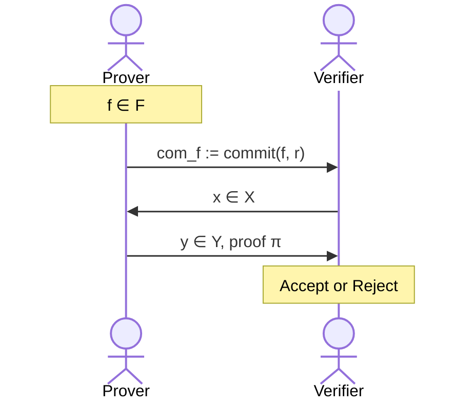
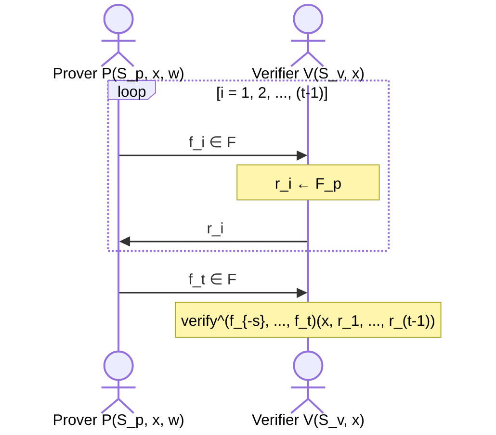
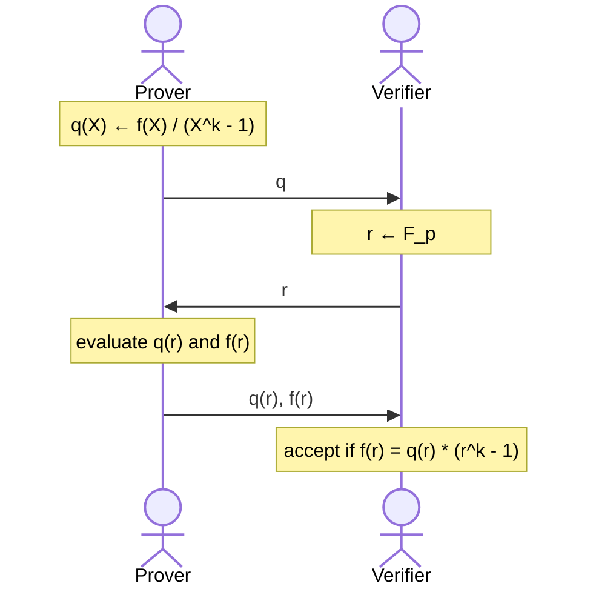
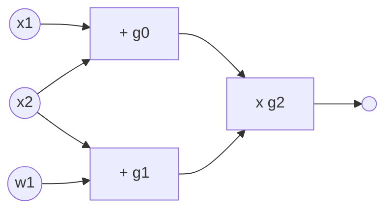
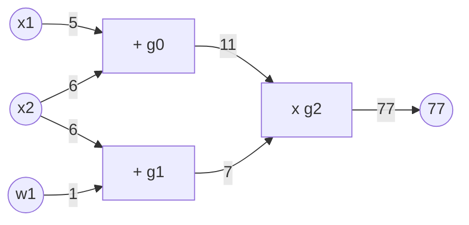

<!-- toc -->

# Building a SNARK

There are various paradigms on building SNARKs, but the general paradigm is two step:

1. A **functional commitment scheme**, where most of cryptography takes place
2. A suitable **interactive oracle proof** (IOP), where most of the information theory takes place

# Functional Commitment Scheme

Well, first, what is a commitment scheme? A cryptographic commitment is like a physical-world envelope. For instance, Bob can put a data in an envelope, and when Alice receives this envelope she can be sure that Bob has committed to whatever value is in it. Alice can later reveal that value.

The commitment scheme has two algorithms:

- $commit(m, r) \to com$ for some randomly chosen $r$
- $verify(m, com, r) \to \text{accept or reject}$

The scheme must have the following properties:

- **Binding**: cannot produce two valid openings for $com$
- **Hiding**: $com$ reveals nothing about the committed data

There is a standard construction using hash functions. Fix a hash function $H : \mathcal{M} \times \mathcal{R} \to C$ where

- $commit(m, r) = H(m, r)$
- $verify(m, com, r) = \text{accept if } com = H(m, r)$

## Committing to a function

Choose a family of functions $\mathcal{F} = \{f : X \to Y\}$. What does it really mean to commit to a function? Well, consider the following interaction:

Here, the proof $\pi$ is to show that $f(x) = y$ and $f \in \mathcal{F}$.

More formally, a functional commitment scheme for $\mathcal{F}$:

- $setup(\lambda) \to pp$ is public parameters $pp$
- $commit(pp, f, r) \to com_f$ is commitment to $f \in \mathcal{F}$ with $r \in \mathcal{R}$
  - this should be a **binding** scheme
  - optionally, it can be **hiding**, which is good for zk-SNARK
- $eval(P, V)$ with a prover $P$ and verifier $V$, where for a given $com_f$ and $x \in X, y \in Y$:
  - $P(pp, f, x, y, r) \to \text{short proof } \pi$, which is a SNARK for the relation: $f(x) = y$ and $f \in \mathcal{F}$ and $commit(pp, f, r) = com_f$.
  - $V(pp, com_f, x, y, \pi) \to \text{accept or reject}$
  - Basically, the $eval$ system is a SNARK

### Function Families

There are 3 very important functional commitment types:

- **Polynomial Commitments**: Committing to a univariate polynomial $f(X) \in \mathbb{F}_p^{(\leq d)}[X]$ where that fancy notation stands for the set of all univariate polynomials of degree at most $d$.
- **Multilinear Commitments**: Committing to a multilinear polynomial in $\mathbb{F}_p^{(\leq 1)}[X_1, \ldots, X_k]$ which is the set of all the multilinear polynomials in at most $k$ variables.
  - A multilinear polynomial is when all the variables have degree at most 1. Here is an example: $f(x_1, \ldots, x_7) = x_1x_3 + x_1x_4x_5 + x_7$.
- **Linear Commitments**: Committing to a linear function $f_{\overrightarrow{v}}(\overrightarrow{u}) = \langle  \overrightarrow{u}, \overrightarrow{v}\rangle = \sum_{i=1}^nu_iv_i$ which is just the dot product of two vectors.

Different SNARK systems may use different commitments. Note that linear commitments can be transformed into multilinear commitments, and those can be transformed into polynomial commitments. A good exercise!

From here on we will talk about Polynomial Commitments.

### Polynomial Commitment Scheme (PCS)

A PCS is a functional commitment for the family $\mathcal{F} = \mathbb{F}_p^{(\leq d)}[X]$. The prover commits to a univariate polynomial $f \in \mathbb{F}_p^{(\leq d)}[X]$, later, they can prove that $v = f(u)$ for some public $u, v \in \mathbb{F}_p$. As this is a SNARK, the proof size and verifier time should be $\mathcal{O}_\lambda(\log d)$.

- Using basic elliptic curves: Bulletproofs
- Using bilinear groups: KZG (trusted setup) (2010), Dory (transparent) (2020)
- Using groups of unknown order: Dark (20)
- Using hash functions only: based on FRI

We will focus on KZG, as it is much simpler and commonly used.

# KZG PCS

The name stands for Kate-Zaverucha-Goldberg. It operates on a cyclic group $\mathbb{G} := \{0, G, 2G, 3G, \ldots, (p-1)G\}$ of order $p$ where $G$ is the generator. Note that in such a setting, $pG = 0$.

## Setup

The setup phase $setup(\lambda) \to pp$ works as follows:

1. Sample random $\alpha \in \mathbb{F}_p$
2. $pp = (H_0 = G, H_1 = \alpha G, H_2 = \alpha^2 G, \ldots, H_d = \alpha ^ d G) \in \mathbb{G}^{d+1}$
3. Delete $\alpha$ or you get in trouble! (trusted setup)

Note that you can't do something like $H_0 / H_1 = \alpha$ because division is not defined for these guys!

## Commitment

The commitment phase $commit(pp, f) \to com_f$ is as follows:

- Compute $com_f := f(\alpha) G \in \mathbb{G}$, but wait we don't have $\alpha$ so what do we do?
- We have a univariate polynomial $f(X) = f_0 + f_1 X + \ldots + f_d X^d$
- We use the public parameters $pp$ to compute $com_f = f_0 H_0 + f_1H_1 + \ldots + f_dH_d$
- If you expand $H$ in there, you will notice that the entire thing is equal to $f(\alpha)G$.
- This is a **binding** commitment, but it is not **hiding** for now.

## Evaluation

We have $commit(pp, f) \to com_f$ where $com_f = f(\alpha)G \in \mathbb{G}$ at this point. The evaluation phase $eval(P, V)$ will work as follows:

- Prover $P(pp, f, u, v)$ has the goal of proving $f(u) = v$ and generate some proof $\pi$.
- Verifier $V(pp, com_f, u, v, \pi)$ will verify that proof.

The trick is to see that if $f(u) =v$ then $u$ is a root of $\hat{f} = f - v$. It is because $\hat{f}(u) = f(u)-v = v-v = 0$. There is a very well known result of this, that $(X-u)$ divides $\hat{f}$. This also means that there is quotient polynomial $\exists q \in \mathbb{F}_p[X]$ such that $q(x)(X-u) = f(X) - v$.

With this, the Prover will calculate the quotient polynomial $q(X)$ and will commit to it to find $com_q$. This will be the proof $\pi = com_q \in \mathbb{G}$. The verifier will accept the proof $\pi$ only if $(\alpha - u)com_q = com_f - vG$.

Note that verifier is using $\alpha$ here, even though it was secret. The truth is, it is not actually using $\alpha$ but instead uses a **pairing**, and the only thing verifier needs to know for that is $H_0 = G$ and $H_1 = \alpha G$, which are part of public parameters $pp$.

Computing $q(x)$ is pretty expensive for large $d$, and this part takes most of the computational time of the entire algorithm.

### Remarks

KZG has been generalized for committing to $k$-variate polynomials (PST 2013). There are many more generalizations of it. KZG also provides batch proofs, where a prover can prove a bunch of commitments in a single computation.

The **difficulty** with KZG is that it requires a trusted setup for $pp$, and $pp$ size is linear in $d$.

# Polynomial Interactive Oracle Proof

Now we are at the second part of a SNARK. Let $C(x, w)$ be some arithmetic circuit. Let $x \in \mathbb{F}_p^n$. Poly-IOP is a proof system that proves $\exists w : C(x,w) = 0$ as follows:

1. We preprocess the circuit $C$ as similar to previous steps. $setup(C) \to (S_p, S_v)$ where $S_v = (com_{f_0}, com_{f_{-1}}, \ldots, com_{f_{-s}})$.
2. An interactive proof is played as shown below:

Here the $verify$ in the end is just an efficient function that can evaluate $f_i$ at any point in $\mathbb{F}_p$. Also note that $r_i$ is randomly chosen only after the prover has committed to $f_i$.

The Verifier here is just creating random numbers. Using Fiat-Shamir transform, such an interactive proof can be made non-interactive!

As usual, we expect the following properties:

- **Complete**: if $\exists w : C(x, w) = 0$ then verifier always accepts.
- **Knowledge Sound**: Let $x \in \mathbb{F}_p^n$ . For every $P*$ that convinces the verifier with some non-negligible probability $\beta$, there is an efficient extractor $E$ such that for some negligible $\epsilon$:

$$
\Pr[E(x, f_1, r_1, \ldots, f_{t-1}, r_{t-1}, f_t) \to w : C(x, w) = 0] \geq \beta - \epsilon
$$

- **Zero-Knowledge**: This is optional, but will be required for a zk-SNARK.

# The Resulting SNARK

The resulting SNARK will look the following: there will be $t$ number of polynomials committed, and $q$ number of evaluation queries (points) for the verification. This is parameterized as $(t, q)$ POLY-IOP.

For the SNARK:

- Prover send $t$ polynomial commitments
- During Poly-IOP verify, the PCS $eval$ is run $q$ times.
- Note that $eval$ is made non-interactive via Fiat-Shamir transform.

The length of the SNARK proof is $t$ polynomial commitments + $q$ evaluation proofs.

- Prover Time: $t \times \text{time}(commit) + q \times \text{time}(prove) + \text{time}(IOP_{prove})$
- Verifier Time: $q \times \text{time}(eval_{verify}) + \text{time}(IOP_{verify})$

Usually, both $t, q \leq 3$ so these times are really short, in fact, in constant time w.r.t the polynomial count which is awesome.

---

We will build a Poly-IOP called Plonk. Plonk + PCS will make up a SNARK, and optionally can be extended to a zk-SNARK.

# Key Observations

We can do zero test and equality test on committed polynomials, and these are used on almost all SNARK constructions.

## Zero Test

A really key fact for $0 \ne f \in \mathbb{F}_p^{(\leq d)}[X]$ (for some random non-zero polynomial with degree at most $d$) is as follows:

- for $r \gets \mathbb{F}_p$ it holds that $\Pr[f(r) = 0] \leq d/p$

We know that $f$ has at most $d$ roots. $r$ is chosen at random from a size $p$, do the probability that $r$ "hits" a root value is easy to see that $d/p$.

Suppose that $p \approx 2^{256}$ and $d \leq 2^{40}$. Then, $d/p$ is negligible! So it is really unlikely that a randomly chosen field element will be the root for $f$.

With this in mind, if you do get $f(r) = 0$ for $r \gets \mathbb{F}_p$ then $f$ is identically zero with very high probability. This gives you a simple zero test for a committed polynomial!

This condition holds even for multi-variate polynomials!

## Equality Test

Here is a related observation from the Zero Test.

Let $f, g \in \mathbb{F}_p^{(\leq d)}[X]$. For $r \gets \mathbb{F}_p$, if $f(r) = g(r)$ then $f = g$ with very high probability! This comes from the observation above (think of $f - r = 0$).

# Useful Proof Gadgets

Let $w \in \mathbb{F}_p$ be a primitive $k$-th root of unity (meaning that $w^k = 1)$. Set $H := \{1, \omega, \omega^2, \ldots, \omega^{k-1}\} \subseteq\mathbb{F}_p$. Let $f \in \mathbb{F}_p^{(\leq d)}[X]$ and $b, c \in \mathbb{F}_p$ where $d \geq k$.

There are efficient poly-IOPs for the following tasks:

1. **Zero Test**: Prove that $f$ is identically zero on $H$
2. **Sum Check**: Prove that $\sum_{a \in H}f(a) = b$ where the verifier has $com_f, b$.
3. **Product Check**: Prove that $\prod_{a\in H}f(a) = c$ where the verifier has $com_f, c$.

We will only look at zero test.

## Zero Test on $H$

There is a cute lemma that will be used here: $f$ is zero on $H$ if and only if $f(X)$ is divisible by $X^k-1$.

This protocol is complete and sound, assuming $d/p$ is negligible.

# PLONK

PLONK is a Poly-IOP for a general circuit $C(x, w)$.

## Step 1: Compile Circuit to a Computation Circuit

Consider the following circuit (gate fan-in: 2, meaning that gates can take 2 inputs):

There are 3 gates here (namely $g_0, g_1, g_2$), 2 statement inputs $x_1, x_2$ and a witness input $w_1$. The circuit outputs $(x_1 + x_2)(x_2 + w_1)$. Consider giving $x_1 = 5, x_2 = 6, w_1 = 1$. Here is what that computation would look like:

We would like to obtain a computation trace of this circuit evaluation. A computation trace is simply a table that shows the inputs, and the state of each gate (input1, input2, output). The output of the circuit is the output of the last gate in the circuit. Here is the computation trace for the circuit evaluation above:

|            |     |     |     |
| ---------- | --- | --- | --- |
| **Inputs** | 5   | 6   | 1   |
| **Gate 0** | 5   | 6   | 11  |
| **Gate 1** | 6   | 1   | 7   |
| **Gate 2** | 11  | 7   | 77  |

At this point, we can forget about the circuit and focus on proving that a computation trace is valid. Note that input count does not have to be equal to number of inputs & output of a gate.

## Step 1.5: Encoding the Trace as a Polynomial

First, some notation:

- $|C|$ is the total number of gates in circuit $C$
- $|I|$ is equal to $|I_x| + |I_w|$ which is total number of inputs to $C$
- Let $d = 3|C| + |I|$ which gives us the number of entries in the computation trace. In the example, that is $d = 12$.
- $H = \{1, \omega, \omega^2, \ldots, \omega^{d-1}\}$

**The plan**: the prover will interpolate a polynomial $P \in \mathbb{F}_p^{(\leq d)}[X]$ that encodes the entire trace, such that:

1. $P$ encodes all inputs: $P(\omega^{-j}) = \text{input \#j}$ for $j = 1, \ldots, |I|$.
2. $P$ encodes all wires: $\forall l = 0, \ldots, |C|-1$:
   1. $P(\omega^{3l})$ gives the left input to gate #$l$
   2. $P(\omega^{3l+1})$ gives the right input to gate #$l$
   3. $P(\omega^{3l+2})$ gives the output of gate #$l$

Prover uses FFT (Fast Fourier Transform) to compute the coefficients of $P$ in time $d \log_2d$, almost in linear time!

## Step 2: Proving validity of $P$

Prover needs to prove that $P$ is a correct computation trace, which means the following:

1. $P$ encodes the correct inputs
2. Every gate is evaluated correctly
3. The "wiring" is implemented correctly
4. The output of last gate is 0

### (1) $P$ encodes the correct inputs

Remember both prover and verifier has the statement $x$. They will interpolate a polynomial $v(X) \in \mathbb{F}_p^{(\leq |I_x|}[X]$ that encodes the $x$-inputs to the circuit:

- for $j = 1, \ldots, |I_x|: v(\omega^ {-j}) = \text{input \#j}$

Constructing $v(X)$ takes time proportional to the size of input $x$.

In our example: $v(\omega^{-1}) = 5, v(\omega^{-2})=6, v(\omega^{-3})=1$ so $v$ is quadratic.

Next, they will agree on the points encoding the input:

- $H_{inp} := \{\omega^{-1}, \omega^{-2}, \ldots, \omega^{-|I_x|}\}$

Prover will prove (1) by using a zero-test on $H_{inp}$ to prove that:

- $P(y) - v(y) = 0$ for all $y \in H_{inp}$

### (2): Every gate is evaluated correctly

The idea here is to encode gate types using a selector polynomial $S(X)$. Remember that in our example we encoded the two gate inputs and an output as $\omega$ to the power $3l, 3l+1, 3l+2$ for some gate $l$. Now, we will encode the "types" of these gates.

Define $S(X) \in \mathbb{F}_p^{(\leq d)}[X]$ such that $\forall l = 0, \ldots, |C|-1$:

- $S(\omega^{3l}) = 1$ if gate $\# l$ is an addition gate `+`
- $S(\omega^{3l}) = 0$ if gate $\# l$ is a multiplication gate `x`

In our example, $S(\omega^0) = 1, S(\omega^3)=1, S(\omega^6)=0$, so $S$ is a quadratic polynomial.

Now, we make a really nice observation: $\forall y \in H_{gates} := \{1, \omega^3, \omega^6, \ldots, \omega^{3(|C|-1)}\}$ it should hold that:

$$
S(y) \times (P(y) + P(\omega y)) + (1-S(y))(P(y)\times P(\omega y)) = P(\omega^2 y)
$$

Here, $P(y), P(\omega y), P(\omega^2 y)$ are left input, right input and output respectively.

Prover will use a zero-test on the set $H_{gates}$ to prove that $\forall y \in H_{gates}$:

$$
S(y) \times (P(y) + P(\omega y)) + (1-S(y))(P(y)\times P(\omega y)) - P(\omega^2 y) = 0
$$

### (3) The wiring is correct

What do we mean by wiring? Well, if you look at the circuit (or the table) you will notice that some outputs become inputs on other gates. For example, the input 6 is a right input for gate 0, and a left input for gate 1 and such. Prover will have to prove that this wiring has been done correctly.

For that, the wires of $C$ are encoded with respect to their constraints. In our example:

- $P(\omega^{-2}) = P(\omega^1) = P(\omega^3)$
- $P(\omega^{-1}) = P(\omega^0)$
- $P(\omega^2) = P(\omega^6)$
- $P(\omega^{-3}) = P(\omega^4)$

Define a polynomial $W : H \to H$ that implements a rotation:

- $W(\omega^{-2}, \omega^1, \omega^3) = (\omega^1, \omega^3, \omega^{-2})$
- $W(\omega^{0}) = (\omega^{-1})$
- $W(\omega^6) = (\omega^2)$
- $W(\omega^{4}) = (\omega^{-3})$

Why we do this fantastic thing is due to a lemma; if $\forall y \in H : P(y) = P(W(y))$ then the wire constraints are satisfied.

However, there is a problem: $P(W(y))$ has degree $d \times d = d^2$ but we want prover to work in linear time $d$ only! PLONK uses a very nice trick: use product check proof to reduce this to a constraint of linear degree. This trick is called the "PLONK Permutation" trick.

### (4) Output of last gate is 0

Proving the last one is easy, just show $P(3^{3|C|-1}) = 0$.

## Final PLONK Poly-IOP

In the setup phase:

- $Setup(C) \to (S_p, S_v)$ where
  - $S_p := (S, W)$
  - $S_v := (com_S, com_W)$

The prover has $(S_p, x, w)$ and the verifier has $(S_v, x)$.

- The prover will build $P(X) \in \mathbb{F}_p^{(\leq d)}[X]$ and give the commitment $com_P$ to the verifier.
- The verifier will then build $v(X) \in \mathbb{F}_p^{(\leq |I_x|)}[X]$

Finally, the prover will prove the four things described before:

- **Inputs**

$$
\forall y \in H_{inp} : P(y) - v(y) = 0
$$

- **Gates**

$$
\forall y \in H_{gates} : S(y) \times (P(y) + P(\omega y)) + (1-S(y))(P(y)\times P(\omega y)) - P(\omega^2 y) = 0
$$

- **Wires**

$$
\forall y \in H : P(y) - P(W(y)) = 0
$$

- **Output**

$$
P(3^{3|C|-1}) = 0
$$

There is a theorem that shows this PLONK Poly-IOP is knowledge sound and complete! The resulting proof is around 400 bytes, and verification takes around 6ms. PLONK can actually handle circuits with more general gates than `+` and `x`, although we only used those operations in our gate constraints. The resulting SNARK can be made into a zk-SNARK, though it is not covered here.

There is also something called PLOOKUP: efficient Poly-IOP for circuits with lookup tables, which is very very useful.
