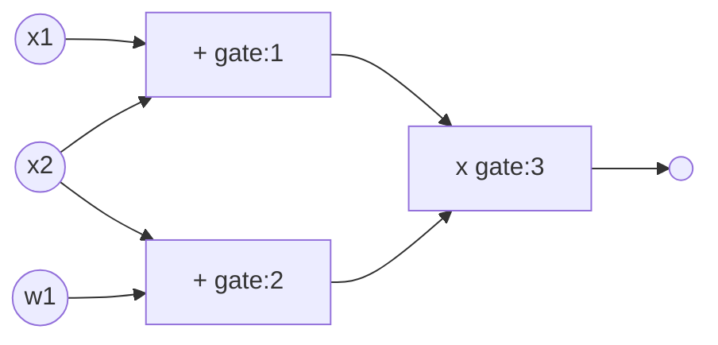

<!-- adding toc here breaks some stuff, dunno why -->

# Custom Gates

Consider the circuit below:

For a gate number $g$, denote the left input, right input, and the output as $a_g, b_g, c_g$ respectively. We would like the circuit to satisfy the following:

- $a_1 + b_1 = c_1 = a_3$
- $a_2 + b_2 = c_2 = b_3$
- $a_3 \times b_3 = c_3$

You can write down these in a table:

|        | $a$ (left input) | $b$ (right input) | $c$ (output) | $s$ (selector) |
| ------ | ---------------- | ----------------- | ------------ | -------------- |
| Gate 1 | $a_1$            | $b_1$             | $c_1$        | 1              |
| Gate 2 | $a_2$            | $b_2$             | $c_2$        | 1              |
| Gate 3 | $a_3$            | $b_3$             | $c_3$        | 0              |

Notice the **selector** input $s$, where it is denoted as 1 for addition gates, and 0 for multiplication gates. With this, the entire circuit can be captured by the following equation:

$$
(s_i)(a_i + b_i) + (1-s_i)(a_i \times b_i) - c_i = 0
$$

Theoretically, you can capture any kind of computation using this model, but still, using addition and multiplication alone is a bit constraining set of functionality. We would in particularly like to have specialized parts of a circuit that can be re-used, say for elliptic curve operations or hash functions; saving us a lot of time (and decreasing the number of rows in the table)!

## Example: Using Hash Functions for Signature

Consider an example:

- Key generation:
  - For the secret key, just sample $\bar{s_k} \in \mathbb{B}$ where $\mathbb{B} = \{0, 1\}^{32}$. The bar over $s_k$ denotes that it is a binary representation.
  - $p_k = \mathbb{F}(H(\bar{sk}))$ which is the hash of $\bar{s_k}$ mapped to some Field element.
- Signing a message $\bar{m} \in \mathbb{B}$:
  - First, pick a random $\bar{r} \in \mathbb{B}$.
  - Your signature is $\sigma = \mathbb{F}(H(\bar{r}, \bar{s_k}, \bar{m}))$

So let us construct our circuit $C(pk, \bar{m}, \sigma, \bar{s_k}, \bar{r})$. This circuit must check the following:

- Ensure that given variables are in the defined binary set: $\bar{r}, \bar{s_k}, \bar{m} \in \mathbb{B}$
- Recreate the signature: $\bar{\sigma} = H(\bar{r}, \bar{s_k}, \bar{m})$
- Ensure that the given signature key matches the derived one: $\sigma = \mathbb{F}(\bar{\sigma})$
- Ensure that public key is derived from the secret key: $\bar{p_k} = H(\bar{sk})$
- Ensure that the given public key matches the derived one: $p_k = \mathbb{F}(\bar{p_k})$

Working with binary is expensive in circuits, because technically you are checking if a given linear combination of field elements times some multiple of two is equal to some other field element, e.g. $35 = 2^5 \times 1 + 2^4 \times 0 + 2^3 \times 0 + 2^2 \times 0 + 2^1 \times 1 + 2^0 \times 1$.

## Decomposing Circuits to Binary Sets

For the sake of this example, let us have 3-bit numbers only (rather than 256 as most people use). You might have a number $\bar{c} = [c_3, c_2, c_1] \in \mathbb{B}$ where $\mathbb{B}=\{0, 1\}^3$. This gives us the constraint of $c = c_3 + 2c_2 + 4c_1 = c_3 + 2\times (c_2 + 2\times (c_1 + 2\times0))$.

When we look at the second formulation, we realize that the same operation ($… + 2\times(…))$ is happening a lot of times repetitively! Now let us do some renaming:

- $a_0 = 0$
- $a_1 = c_1 + 2\times a_0 = c_1$
- $a_2 = c_2 + 2\times a_1 = c_2 + 2\times c_1$
- $a_3 = c_3 + 2 \times a_2 = c_3 + 2\times c_2 + 4\times c_1 = c$

This way, notice that we are always doing the same operation on some other variable $a_i$. Let us write a table for these.

| $i$ (index) | $b$ (bits)  | $a$ (accumulation) |
| ----------- | ----------- | ------------------ |
| 0           | $b_0 = c$   | $a_0 = 0$          |
| 1           | $b_1 = c_1$ | $a_1 = c_1$        |
| 2           | $b_2 = c_2$ | $a_2 = c_2 + 2c_1$ |
| 3           | $b_3 = c_3$ | $a_3 = c$          |

There are some constraints to be written from this table:

- We need to make sure $b_i$ is a bit for $i = 1,2,3$. We can do that simply by $b_i^2 - b_i = 0$.
- We also need to make sure $a_i$ is computed correctly. We can do that by: $a_i - b_i - 2a_{i-1} = 0$ for $i = 1,2,3$.
- For $a_0$, we have the constraint $a_0 = 0$.
- Finally, for $b_0$ we have the constraint $b_0 - a_3 = 0$.

We will capture all these constraints with a polynomial. For that, we use something called **Lagrange Interpolation**. Denote $\omega$ as a root of unity. Let $H := \{1, \omega, \omega^2, \omega^3\}$. We had 3 bits in our example, and our table has 3+1 rows, so that is why we use this degree. In this case, $\omega^4 = \omega^0 = 1$ which is as it is a root of unity.

Construct a set of Lagrange polynomials $L_0[X], L_1[X], \ldots$ which gives us a really nice property:

$$
L_j(w^i) = \begin{cases} 1& i = j  \\ 0 & i \ne j
\end{cases}
$$

Now consider an element $a \in \mathbb{F}^4$. We will also have a polynomial:

$$
\tilde{a}(x) = a_0L_0(x)+a_1L_1(x)+\ldots
$$

This is a really neat polynomial where we can select values of $a$ such as: $\tilde{a}(\omega^i) = a_i$. You can create one for $b$ with the same procedure.

Let us revisit the constraints from before:

| Applied Indices | Constraint             | Selector          | Polynomial Constraint                                       |
| --------------- | ---------------------- | ----------------- | ----------------------------------------------------------- |
| 1, 2, 3         | $b_i^2 - b_i = 0$      | $\tilde{S}(x)$    | $\tilde{b}(x)^2 - \tilde{b}(x) = 0$                         |
| 1, 2, 3         | $a_i - b_i - 2a_{i-1}$ | $\tilde{S}(x)$    | $\tilde{a}(x) - \tilde{b}(x) -2\tilde{a}(\omega^{-1}x) = 0$ |
| 0               | $a_i = 0$              | $1 -\tilde{S}(x)$ | $\tilde{a}(x) = 0$                                          |
| 0               | $b_i - a_{i-3}= 0$     | $1 -\tilde{S}(x)$ | $\tilde{b}(x) - \tilde{a}(\omega^3x) = 0$                   |

Then you will make a single polynomial out of these, that the verifier can query at random points!

# Lookup Tables

Consider a computation like $c_i = a_i \oplus b_i$ where $\oplus$ is the XOR operation. Calculating this every time in the proof and writing the constraints for it will be costly. Instead, you could have a large table that shows all possible operation for the XOR (for example if $a, b, c \in \{0, 1\}$ then the table has 4 rows, literally just the truth table for XOR operation) and simply make the argument "is there a row in this table with $a_i, b_i, c_i$? This is what is called a **Lookup Argument**. It is an optimization method to save from computation time, although generating the table could take time.

Think of the following problem, you have a $w$ and you would like to show that $w \in \{0, 3, 4, 7\}$ which is a set and is known publicly. You would like to prove $w$ is in this set without revealing what $w$ is! (Set Membership Proof)

## Range Proof

For a private $w$, we would like to prove $w \in [0, 2^3)$. Proofs like this appear a lot of times in SNARKs.

One of the ways this is done is via binary decompositions: $\exists b_0, b_1, b_2 \in \{0, 1\}$ such that $w = b_0 + 2b_1 + 4b_2$ where all $b_i$ are secret too (otherwise you would reveal $w$ somewhat). We write this as:

- $-w + b_0 + 2b_1 + 4b_2 = 0$

There are additional constraints to ensure that $b_i$ is a bit, which is done by $b_i^2 - b_i = 0$ (one for each $i$):

- $b_0 \times b_0 - b_0 = 0$
- $b_1 \times b_1 - b_1 = 0$
- $b_2 \times b_2 - b_2 = 0$

### Rank-1 Constraint System

Let us construct the R1CS for this set of constraints.

$$
\begin{pmatrix}
0 & 0 & 0 & 0 \\
0 & 1 & 0 & 0 \\
0 & 0 & 1 & 0 \\
0 & 0 & 0 & 1
\end{pmatrix}
\begin{pmatrix}
w \\ b_0 \\ b_1 \\ b_2
\end{pmatrix}
\times
\begin{pmatrix}
0 & 0 & 0 & 0 \\
0 & 1 & 0 & 0 \\
0 & 0 & 1 & 0 \\
0 & 0 & 0 & 1
\end{pmatrix}
\begin{pmatrix}
w \\ b_0 \\ b_1 \\ b_2
\end{pmatrix}
-
\begin{pmatrix}
1 & -1 & -2 & -4 \\
0 & 1 & 0 & 0 \\
0 & 0 & 1 & 0 \\
0 & 0 & 0 & 1
\end{pmatrix}
\begin{pmatrix}
w \\ b_0 \\ b_1 \\ b_2
\end{pmatrix}
=
\begin{pmatrix}
0 \\ 0 \\ 0 \\ 0
\end{pmatrix}
$$

If you look at the calculations here for each element in the resulting vector, it captures all the four constraints! This literally captures the R1CS for the proof of $w \in [0, 2^3)$. Again, note that this set is public, but $w$ is not.

### Using a Table

So again, let us consider the same example: for some private $w$, prove that $w \in [0, 2^3)$. We will use a table this time:

|     |     |
| --- | --- |
| 0   | 5   |
| 1   | 6   |
| 2   | 7   |
| 3   | -   |
| 4   | -   |

We want to commit to a set of values in a table. We can do that by making a polynomial with the coefficients as these values. Suppose these values are $a_0, a_1, a_2$. Then, construct a polynomial:

$$
f(x) = a_0L_0(x) + a_1L_1(x) + a_2L_2(x)
$$

where $L_0, L_1, L_2$ are the Lagrange polynomials over the public set $V = \{\omega_0, \omega_1, \omega_2\}$ where $\omega$ is a root of unity. What is a root of unity? It is a value such that $\omega_i^n \equiv 1 \pmod{p}$, also known as an $n$-th root of unity.

The thing about Lagrange polynomial is that $L_0(x)$ is the unique polynomial such that:

- $L_0(w_0) = 1$
- $L_0(w_1) = 0$
- $L_0(w_2) = 0$

When you use roots of unity, these polynomials turn out to be really quick to compute thanks to Fast Fourier Transform, but that is a bit too much detail to go into here.

Now, if you were to open $a_1$ on $f$, all you do is show that $f(w_1) = a_1$. For this, you do the following constraint:

$$
f(x) - a_1 = (x - w_1)q(x)
$$

for some quotient polynomial $q(x)$.

**The rest of the video talks about HALO2, which I have not yet noted down.**
