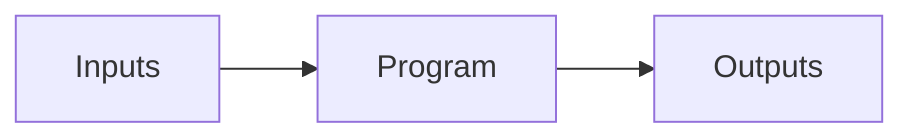
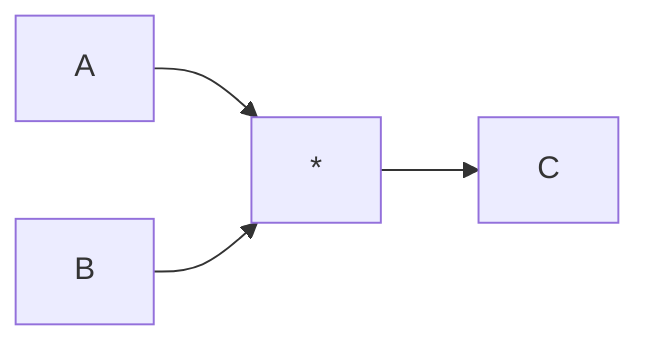
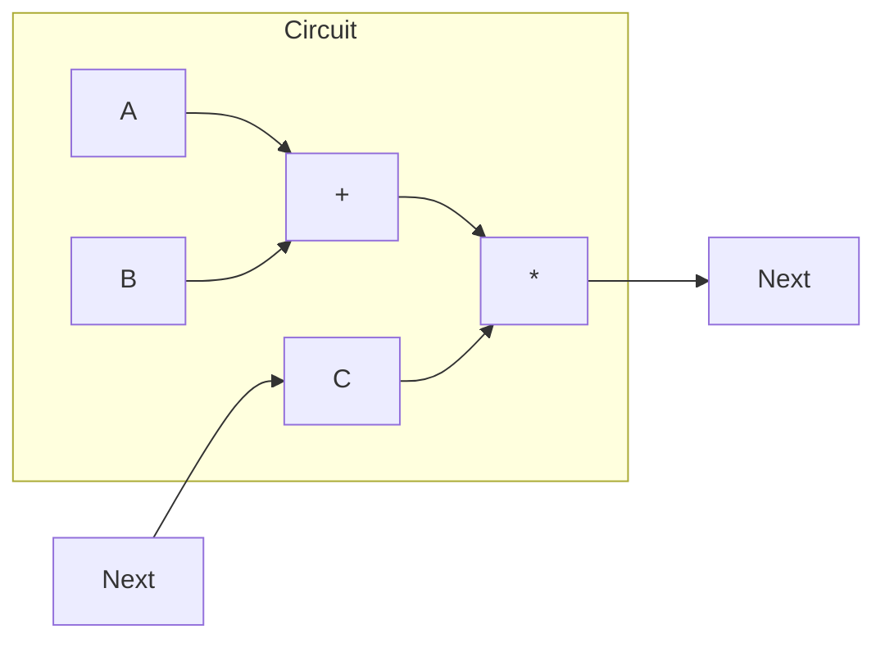
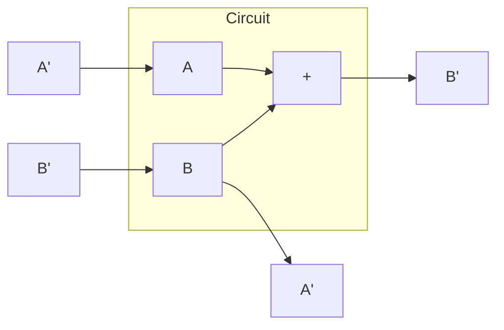
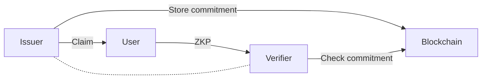

[(video 1)](https://www.youtube.com/watch?v=mrf9HjjL_38&list=PLj80z0cJm8QErn3akRcqvxUsyXWC81OGq&index=11)
[(video 2)](https://www.youtube.com/watch?v=5TJ3BZEc1Ro&list=PLj80z0cJm8QErn3akRcqvxUsyXWC81OGq&index=14)

# zkEVM with Jordi Baylina

To start with zkEVM, first we must consider a really basic program:



**Inputs**:

- The state of Ethereum $s_i$
- A set of transactions $tx_1, tx_2, \ldots$

**Output**:

- The new state of Ethereum $s_{i+1}$

The proof using zkEVM is to show that given some state $s_i$ and transactions, you will obtain $s_{i+1}$. The **Program** is a deterministic program here though!

_Note_: Having lots of public inputs will make the verifier quite complex. So, instead of having all the inputs as a public input by themselves, a hash $h = H(s_i, tx_1, tx_2, \ldots)$ is computed. This hash is then asked for a public input, and the circuit simply checks if the hashes match.

## Example: Multiplication Circuit



The relationship in this circuit is $C = A \times B$. zkEVM will have huge amounts of these, it is very complex.

## Example: State Transition Circuit

When we want to make use of a state transition circuit, the trick is to attach the output to an input.



This way, the output will be the input on the next "clock". We can represent this circuit as:

$$
C' = (A+B)\times C
$$

We would like to work with Polynomials though. Let us represent this with polynomials then:

$$
C(wx) = (A(x)+B(x))\times C(x)
$$

Here, $w$ will be a root of unity. This causes a "shifting" effect, the polynomial of say $F(x)$ will be the same polynomial $F(wx)$ but shifted horizontally.

## Example: Fibonacci (Hello World of ZK)



This circuit defines the following constraints:

- $b' = a + b$
- $a' = b$

We need to express these polynomial entities in some way. At Polygon zkEVM, they have developed [PIL: Polynomial Identity Language](https://wiki.polygon.technology/docs/zkEVM/PIL/introduction/). Let us write the PIL for this Fibonacci circuit:

```cpp
// A Fibonacci circuit with 4 clocks
namespace Fibonacci(4);
	// Input Polynomials
	pol commit a;
	pol commit b;

	// Constraints
	b' = a + b
	a' = b

	// Public Input
	public r = b[3]; // value of b at clock 3 will be public input

	LL(b - r) = 0;
	pol constant LL;
```

This will give you the following computational trace:

| Clock | $a$ | $b$         | $LL$ |
| ----- | --- | ----------- | ---- |
| 0     | 1   | 2           | 0    |
| 1     | 2   | 3           | 0    |
| 2     | 3   | 5           | 0    |
| 3     | 5   | 8 (result!) | 1    |

Here, the end result 8 will be the public input.

## Writing a Processor

If we can write a processor using constraints and circuits, we can do anything! That is the main idea. A processor typically has registers, a program counter, some ROM. These basically make up a state machine in the end. zkEVM has many state machines that handle various parts within (RAM, Storage, Arithmetic, etc.) but we will not cover it here.

Consider a simple machine, with the following registers:

- `A` register that stores some value
- `B` register that stores some value
- `A'` register stores the new value of `A` in the next state
- `B'` register stores the new value of `B` in the next state
- `PC` is the program counter
- `ROM` is a read-only memory, no details about this.
- `INST` is a set of instructions:
  - `inA` a Boolean
  - `inB` a Boolean
  - `setA` a Boolean
  - `setB` a Boolean

Here is how this works:

```cpp
namespace ExampleMain(2^28)
	pol constant inA, intB, setA, setB;
	pol commit A, B;

	pol op = inA * A + inB * B; // an intermediate value
	a' = op * setA; // if setA = 1, a will be op
	b' = op * setB; // if setB = 1, b will be op
```

---

# zkID with Oleksandr Brezhniev

There are two big groups of identities:

- **Physical**: Documents like Passport. Driver License. Diploma, and such. Mostly paper documents.
- **Digital**: We can have three groups to consider in the digital identity world.
  - **Centralized Identities (Siloed)**: A separate email & password to login websites, one for each of them.
  - **Federated Identities**: Uses don't want a separate identity for each website, so they do this only once (e.g. Google, Facebook) and they use this to access websites.
  - **Self-Sovereign Identities**: Also known as Decentralized Identities, in this case the user has control over their own digital identity. They share this identity with others on request. This is more like the Web3.0 way of doing things.

## Triangle of Trust + Blockchain



In this diagram, a User can be an actual User, or it could be group of entities, machines, whatever; it's digital identity in the end!

For the ZKP (zero-knowledge proof) to work, we need:

- Private Data
- Public Data

Actual claim data (e.g. I am above 18 years old) is stored on the user's device, but the commitment to these claims are stored on the blockchain. For this, PolygonID uses a Merkle Tree and stores only the root of the tree of claims in the blockchain. What if you lost your phone, that has the digital identity data (claims)? In this case, only the Issuer can revoke the claim.

## Polygon ID

In the blockchain, PolygonID stores the identity state in a smart contract. All Issuer's use this same contract. It is the hash of three Merkle Tree roots:

- **Claims Tree**: This tree is Private, only the Issuer has access to it.
  - Claims Schema
  - Identifier (to whom it was issued)
  - Data
  - Revocation Nonce
- **Revocation Tree:** This tree is Public, anyone can see the nonce values.
  - Revocation Nonce, if a nonce in the Claim tree is included here, the claim will be revoked.
- **Roots Tree**
  - Stores roots of Claim Tree and such, this is for optimization purposes they say.

An additional optimization by PolygonID is that Issuer can sign the claims with their private key, for others to verify. This is helpful in the case Blockchain update did not happen fast enough.

## Circuit Example for Age

Here is an example circuit:

- Private Inputs:
  - Claim (age)
  - Non Revocation
  - Signature / Merkle Tree Proof
  - …
- Public Inputs:
  - ID of the Issuer
  - Query (e.g. `eq`, `lt`, `in`, `nin`)
- Circuit: The circuit itself is a generic circuit designed by PolygonID. It takes the operation query as a public input so that you have less number of circuits.

_Note_: They are using Groth16. They have made a generic circuit that handles many many operations within. The operation itself is given as a public variable. Groth16 also helps generate these proofs on Mobile phones! They think it will take around 1 second to generate the proof.

_Note_: They aim to expand the queries (such as `eq`, `lt`) to provide more functionality. They are also developing a platform for Issuer's to onboard the PolygonID without worrying about key-management, and they can provide validator nodes for the blockchain that hosts the smart contract for verification. They also plan on providing KYC for this!
