[(video)](https://www.youtube.com/watch?v=uchjTIlPzFo)

When we think of proofs made by Euclid, Gauss, Euler and such, we think of proofs where we are trying to show that given some axioms and declarations, you can show that some claim is true.

For ZKP, we must think of proofs more interactively:

# Efficiently Verifiable Proofs (NP-Proofs)

For **efficiently verifiable proofs** (aka NP-Proofs) we have the following setting:

Let us check some example claims.

## Example: $N$ is a product of 2 large primes

A trivial proof of this would be the following:

- Prover sends $p, q$ as a proof.
- Verifier would check for $N = pq$, and if true it will accept. In doing so, the Verifier learned about $p, q$, which is not good for us!

## Example: $y$ is a quadratic residue mod $N$

What this means is that, $\exists x \in \mathbb{Z}^*_{N}$ such that $y \equiv x^2 \pmod N$. It turns out that finding such an $x$ is a very hard problem, as hard as factoring problem actually.

Even so, our prover is unbounded and can find such an $x$ in the end. A trivial proof for this would be:

- Prover sends $x$ as a proof.
- Verifier calculates $x^2$ and check if $y \equiv x^2 \pmod N$, accepts if true and rejects otherwise.

## Example: Two graphs are isomorphic

Consider two graphs, as a set of edges $E_1 = \{(i_1, j_1), (i_2, j_2), \ldots\}$ and $E_2 = \{(p_1, q_1), (p_2, q_2), \ldots\}$. We say that if there is an isomorphism $\pi$ that maps an edge $e_1 \in E_1$ to $e_2 \in E_2$ such that $\forall (i, j) : (i, j) \in E_1 \iff (\pi(i), \pi(j)) \in E_2$.

In layman terms, these two graphs are the same graph, but they are drawn a bit differently. Again, a trivial proof here would be to simply send the isomorphism itself to the Verifier. However, finding the proof itself is a very hard problem, although checking if it is correct is not!

# NP-Languages

**Definition**: $\mathcal{L}$ is an NP-language (or NP-decision problem) if there is a $poly(|x|)$ time verifier $V$ where:

- **Completeness**: true claims have short proofs, meaning that if $x \in \mathcal{L}$ then there is a $poly(|x|)$ sized witness $w \in \{0, 1\}^*$ such that $V(x,w) = 1$.
- **Soundness**: false theorems have no proofs, meaning that if $x \not \in \mathcal{L}$ then there is no witness, so $\forall w\in \{0, 1\}^*$ we have $V(x, w) = 0$.

The main question of this course is not focused on this subject though. Instead, we are trying to see if there is another way to convince a verifier, for example considering the questions given above.

# Zero-Knowledge Interactive Proofs

The main idea of ZKP, although very informally, is that a Prover “will prove that they can indeed prove the claim if they wanted to”, but they are not doing that so that information is kept private.

We need to extend our proof model to work with ZK. We will need two more ingredients:

- **Interaction**: rather than passively reading a proof, the verifier engages in a non-trivial interaction with the prover.
- **Randomness**: verifier is randomized, i.e. coin tossing is allowed as a primitive operation. Furthermore, the verifier can have an error in accepting/rejecting but with a small negligible probability.

With this, our proof model becomes as follows:

Here, the Prover is computationally unbounded but the Verifier must be efficient, i.e. runs in probabilistic polynomial-time (PPT).

## Example: Two Colors

Consider a string x=”🔴🔵”. We claim that there are two colors in this string. However, our verifier is color-blind! How can we prove that indeed this string has two colors?

```mermaid
sequenceDiagram
	actor P as Prover
	actor V as Verifier

	note over P, V: claim: x=”🔴🔵” has 🔴 and 🔵
	loop i = 1, 2, ...
		P ->> V: x
		note over V: b ← {0, 1}
		alt b = 1
			note over V: x' := flip(x)
		else
			note over V: x' := x
		end
		V ->> P: x'
		alt x' = flip(x)
			note over P: b' := 1
		else
			note over P: b' := 0
		end
		P ->> V: b'
		note over V: if [b != b'] then reject
	end
	note over V: accept


```

Let us describe what happens in this interactive proof:

- The prover sends x to the verifier, say $x$ = ”🔴🔵”.
- The verifier tosses a coin, and flips $x$ if it is heads $(b=1)$ meaning $x'$ = ”🔵🔴”. Otherwise, $x$ stays the same, meaning $x'$ = ”🔴🔵”. Verifier sends this $x'$ to the prover.
- Prover will then compare $x$ to $x'$, and since he can see colors, he will be able to tell whether $x'$ is flipped or not. Based on this, he will say $b'$ = heads or tails, depending on the flip. Prover sends $b'$ to the verifier.
- Verifier looks at $b'$, and says “wow this guy can actually guess whether I got heads or tails, he must be seeing colors then!”. If $b'$ and $b$ does not match, she rejects.
- This interaction is repeated polynomially many times, until finally the Verifier accepts.

Let us analyze this formally. If there are 2 colors, then verifier will accept. If there is a single color only, for all provers $\Pr[V\text{ accepts}] \leq 1/2$ for a single interaction. Repeating this interaction $k$ times would mean that $\Pr[V\text{ accepts}] \leq 1/2^k$ which becomes a tiny probability for large $k$. So, it is very unlikely that a prover can keep faking it for that many interactions.

## Example: $y$ is a quadratic residue mod $N$

Here, the claim is the language $\{(N, y) : \exists x \text{ s.t. } y \equiv x^2 \pmod{N}\}$.

```mermaid
sequenceDiagram
	actor P as Prover
	actor V as Verifier

	note over P, V: claim: ∃x s.t. y ≡ x^2 (mod N)

	loop i = 1, 2, ...
		note over P: choose r where 1 ≤ r ≤ N and gcd(r,N)=1
		note over P: s := r^2 mod N
		P ->> V: s

		note over V: b ← {0, 1}
    V ->> P: b

	  alt b = 1
			note over P: z := r * sqrt(y) mod N
		else
			note over P: z := r
		end
		note over V: if [z^2 != s * y^c mod N] then reject
	end

	note over V: accept
```

So basically what the prover is doing is,

- generates a random quadratic residue $s$
- asks for the verifier to make a coin toss
  - if heads $(b=1)$, it sends $z := \sqrt{sy}$
  - if tails $(b=0)$, it sends $z := \sqrt{s}$
- the verifier checks if $z^2 \equiv s \times y^c \pmod{N}$. if not, it rejects
- after many interactions, if the verifier hasn't rejected so far, it accepts

Similar to the previous example, if the prover had not known $x$, he would not be able to win many interactions.

**So what made this whole thing possible**? Let's recap:

- The statement to be proven has **many possible proofs** of which the prover chooses one **at random**.
- Each such proof is made up of exactly **2 parts**: seeing either part on its own gives the verifier **no knowledge**; seeing both parts imply 100% correctness.
- Verifier chooses **at random** which of the two parts of the proof he wants the prover to give him. The ability of the prover to provide either part, **convinces** the verifier.

# Interactive Proofs for a Language $\mathcal{L}$

**Definition**: $(P, V)$ is an interactive proof for $\mathcal{L}$, if $V$ is probability polynomial ($|x|$) time, and:

- **Completeness**: if $x \in \mathcal{L}$ then $V$ always accepts. Formally: $\Pr[(P,V)(x) = \text{ accept}] \geq c$.
- **Soundness**: if $x \not \in \mathcal{L}$ then for all cheating prover strategies, $V$ will not accept except with negligible probability. Formally: for such cheater provers $P^*$, it holds that $\Pr[(P^*,V)(x)=\text{ accept}] \leq s$
- In a good scenario, we would except $c = 1$ and $s=negl(|x|)$ where $negl(\lambda)$ is a [negligible function](https://mathwiki.cs.ut.ee/asymptotics/06_the_negligible_the_noticeable_and_the_overwhelming). However, we might also show that $c - s \geq negl(|x|)$ or equivalently: $c - s \geq 1/poly(|x|)$.

**Definition**: Class of languages IP = $\{\mathcal{L} \text{ for which there is an interactive proof}\}$.

---

# What is Zero-Knowledge?

For true statements, we want the following to be true: what the verifier could have computed before the interaction IS EQUAL TO what the verifier can compute after the interaction.

So basically, these interactions had no effect whatsoever on the computational power of the verifier! That is what zero-knowledge means. Now, let's be more formal.

After an interactive proof, the verifier has learned:

- that the claim/theorem is true
- a **view** of interactions, i.e. the transcript of answers and queries, and the coins that $V$ has tossed.

A view is formally defined as a random variable from the probability distribution over coins of $V$ and interactions with $P$:

$$
 \text{view}_V(P, V)[x] = \{(q_1, a_1, q_2, a_2, \ldots, \text{ coin tosses of } V\}
$$

## The Simulation Paradigm

$V$'s view gives him nothing new, if he could have simulated that view on it's own. In other words, the _simulated view_ and _real view_ are computationally indistinguishable!

In cryptography, we have the notion of computational indistinguishability, where there are two distributions $D_1$ and $D_2$, and a distinguisher that tries to distinguish these two. In doing so, he will sample both distributions at random, and will try to guess from which distribution that sample is taken from. If the probability of distinguishing this sample is at most $1/2 + \text{negl}$ then $D_1$ and $D_2$ are indistinguishable!

That is a rather heavy paragraph, so let me give an example. A vendor is selling watches, and they have a set of real Rolex watches, and a set of fake Rolex watches. You go to the shop, and ask for a sample. The vendor secretly flips a coin,

- if heads, vendor gives you a real Rolex watch
- if tails, vendor gives you a fake Rolex watch

You try to guess whether the flip was heads or tails. If the probability that you guess correctly is at most $1/2 + \text{negl}$ then the set of fake Rolex watches are indistinguishable from the set of real Rolex watches! Good for the vendor 🙂

**Definition:** An interactive protocol $(P,V)$ is **honest-verifier** zero-knowledge for a language $\mathcal{L}$ if there exists a PPT algorithm $\text{Sim}$ (a simulator) such that $\forall x \in \mathcal{L}$ the following two probability distributions are poly-time indistinguishable:

- $\text{view}_V(P,V)[x]$
- $\text{Sim}(x, 1^\lambda)$, here $\lambda$ is for technical reasons and for large $x$ you can just ignore it.

A _caveat_ about $\text{Sim}$ is that we allow it to run in expected-poly-time. Meaning that there may be some very unlucky cases where the algorithm takes a long time, but in expectation it is poly-time.

Also notice that this is for honest verifiers, and we would like the proof to hold for all verifiers. So, our final definition should cover all verifiers.

**Definition:** An interactive protocol $(P,V)$ is zero-knowledge for a language $\mathcal{L}$ if for every PPT $V^*$, there exists a PPT algorithm $\text{Sim}$ (a simulator) such that $\forall x \in \mathcal{L}$:

$$
\text{view}_V(P, V)[x] \approx \text{Sim}(x, 1^\lambda)
$$

## Flavors of Zero-Knowledge

Again, consider the real distribution $\text{view}_V(P, V)$ and simulated distribution $\text{Sim}(x, 1^\lambda)$. Based on these, there are flavors of ZK:

- **Computationally Indistinguishable Distributions** (CZK), where the two distributions are computationally indistinguishable.
- **Perfectly Identical Distributions** (PZK), where the two distributions are the same.
- **Statistically Close Distributions** (SZK), where the two distributions are statistically close.

## A Simulation for Quadratic-Residue (QR) Proof

Consider the QR proof from above, where we were able to prove with zero-knowledge that we know there exists some $x$ such that $y \equiv x^2 \pmod{N}$. Check that interactive proof again, what is the $\text{view}$ here? We see that the verifier learns about $s$, it also generates some coin toss value $c$ and finally it learns $z$.

So, $\text{view}_V(P, V) : (s, b, z)$. A simulator should output the same view on its own! Can we do it? Yes, in fact, we can do it perfectly!

Simulator $S$ works as follows:

1. First, pick a random bit $b \in \{0, 1\}$.
2. Then, pick random $z \in \mathbb{Z}^*_N$.
3. Compute $s = z^2/y^c$.
4. Output $(s, b, z)$.

This is identical to what the honest verifier had viewed in the actual interactive proof. Notice that the simulator did not have to know about $x$, but thanks to that division on 3rd step, it could produce a valid $s$ for the view.

What about an adversarial verifier, for example, one that does not pick $b$ at random? Well, we can still construct a simulator:

1. First, pick a random bit $b \in \{0, 1\}$.
2. Then, pick random $z \in \mathbb{Z}^*_N$.
3. Compute $s = z^2/y^c$.
4. If $V^*(N, y, s) = b$ then output $(s, b, z)$, otherwise go to step 1 and repeat!

With this setting, even if we don't know what $V^*$ is doing behind the scenes, we should expect that our randomly picked $b$ should match their fixed and adversarially computed $b$. In fact, in expectation this takes 2 attempts, since it is just a coin flip!

# ZK Proof of Knowledge (ZKPOK)

Notice that prover has prove not only that the claim is correct, but also that they know a square root modulo $N$. This is more than just a proof of the claim! So, consider the language $\mathcal{L}_R = \{x : \exists w \text{ s.t. } R(x, w) = \text{ accept}\}$ for poly-time relation $R$.

**Definition**: $(P, V)$ is a proof of knowledge (POK) for $\mathcal{L}_R$ if $\exists$ PPT _knowledge_ extractor algorithm $E$ such that $\forall x \in \mathcal{L}$, in expected poly-time $E^P(X)$ outputs $w$ such that $V(x, w) = \text{ accept}$.

Here, $E^P(x)$ means that $E$ may run $P$ repeatedly on the same randomness, possibly asking different questions in every execution. This is called the **Rewinding Technique**.

## A ZKPOK for Quadratic-Residue (QR) Proof

We have seen the ZKP for a prover that knows $x$ such that $y \equiv x^2 \pmod{N}$. Let's construct the Extractor for this proof.

```mermaid
sequenceDiagram
	actor P as Prover
	actor E as Extractor

	note over P, E: claim: ∃x s.t. y ≡ x^2 (mod N)
	note over P: choose r where 1 ≤ r ≤ N and gcd(r,N)=1
	note over P: s := r^2 mod N
	P ->> E: s
	E ->> P: 1 (heads)
  P ->> E: z = r
	note over P, E: rewind
	P ->> E: s
	E ->> P: 0 (tails)
	P ->> E: z = rx
	note over E: output rx/r = x mod N
```

Notice the rewind there, hence the Rewinding Technique. What this trick does is that it allows us to access $s$ again! In the interactive proof, we would normally have a new random $s$ every time the prover sent us something, but here we can have access to the same $s$ again and again. As such, we were able to obtain $r$ and $rx$, and thus find $x$ via division.

## Example: Graph Isomorphism

Consider the graph isomorphism problem from the examples at the beginning. The proof is similar to how it works for quadratic residues. So, the claim is that there is an isomorphism $\sigma$ between $G_0$ and $G_1$.

- The prover produces a random graph $H$ and sends it to verifier.
- The prover finds an isomorphism $\gamma_0$ from $G_0$ to $H$.
- The prover also finds an isomorphism $\gamma_1$ from $G_1$ to $H$.
- The verifier sends a coin toss (bit) $b$ to prover, and prover returns $\gamma_b$.
- Verifier checks if $H=\gamma_b(G_b)$.
- These steps happen repetitively, until some poly-time later if the verifier did not reject so far, it accepts.

Notice that since $H = \gamma_0(G_0) = \gamma_1(G_1)$ then $G_1 = \gamma_1^{-1}(\gamma_0(G_0))$. So, the prover indeed knows $\sigma = \gamma_1^{-1}\gamma_0$. However, since both isomorphisms are never given to the verifier at the same time, the verifier can't find that isomorphism!

This ZKP is actually of flavor PZK, so the two distributions of real view and simulator view are identical! Furthermore, there is a ZKPOK that prover knowns an isomorphism from $G_0$ to $G_1$. Formal proofs left to the reader.

---

# Graph 3-Colorability

**Do all NP Languages have ZK Interactive Proofs?** Proven in [[Goldwasser-Micali-Widgerson'86]](https://link.springer.com/chapter/10.1007/3-540-47721-7_11), the answer is **YES**! They show that if one-way functions exist, then every $\mathcal{L}$ in NP has computational zero-knowledge interactive proofs. The proof will come from an NP-complete problem known as Graph 3-Colorability, hence the title of this section.

The ideas of the proof are as follows:

1. Show that an NP-complete problem has a ZK interactive proof. [GMW87] showed a ZK interactive proof for $\text{G3-COLOR}$ (graph 3-colorability problem).
   For any other $\mathcal{L}$ in NP, $\mathcal{L} <_p \text{G3-COLOR}$ due to NPC reducibility.
   Every instance $x$ can be reduced to a graph $G_x$ such that if $x \in \mathcal{L}$ then $G_x$ is 3-colorable, and if $x \not \in \mathcal{L}$ then $G_x$ is not 3-colorable.
2. Existence of one way functions imply a hiding & binding bit **commitment protocol**.

## What is a Commitment Scheme?

In a commitment scheme, there are two functions:

- $\text{Commit}(m)$ takes an input $m$, let us think of it as a bit in $\{0, 1\}$, and produces a commitment $c$. Once committed, the commitment does not reveal whether $m$ is 0 or 1.
- $\text{Decommit}(c)$ allows a receiver of a commitment $c$ to open it, and reveal what is in there. In this case, some bit $m$ that is either 0 or 1.

For a commitment scheme,

- Binding means that if you have committed to some $m$, then the decommit procedure on that commitment may only reveal $m$, not something else.
- Hiding means that from outside, you can't guess the bit $m$ with more than 1/2 probability.

An example commitment scheme would be to use a semantically secure probabilistic encryption scheme.

- $\text{Commit}(b)$ where sender chooses some random $r$ and sends $c := Enc(b; r)$.
- $\text{Decommit}(c)$ where sender send the same random $r$ and $b$, and receiver rejects unless $c = Enc(b; r)$.

## Proving a graph $G$ is $\text{G3-COLORABLE}$

Suppose there is a graph $G = (V, E)$ as in the set of vertices and set of edges, and the prover knows some coloring $\pi : V \to \{0, 1, 2\}$ which is a mapping that maps a vertex to a color.

1. **Prover** picks a random permutation of colors $\sigma : \{0, 1, 2\} \to \phi$ and the colors the graph with this permutation. It still is valid because its just different colors for the same graph. We show this as $\phi(v) := \sigma(\pi(v))$ for $v \in V$.
   Then, the prover commits to each newly colored vertex $v$ by running $\text{Commit}(\phi(v))$ protocol.
2. **Verifier** selects a random edge $e = (a, b)$ and sends it to prover.
3. **Prover** runs $\text{Decommit}$ on the colors of edge points $a, b$ and reveals $\phi(a)$ and $\phi(b)$.
4. **Verifier** rejects if $\phi(a) = \phi(b)$, otherwise it repeats steps 1-3 and accepts after $k$ iterations.

Now, let's look at the properties of this interactive proof:

- **Completeness**: if $G$ is 3-colorable, then the honest prover uses a proper 3-coloring & the verifier always accepts.
- **Soundness**: if $G$ is not 3-colorable, then for all $P^*$ it holds for $k=|E|^2$ (meaning that we have iterations as many as the square of number of edges) that,

$$
\Pr[V \text{ accepts}] < \left(1 - \frac{1}{|E|}\right)^k < \frac{1}{e^|E|}
$$

- **Zero-Knowledge**: Easy to see informally, messy to prove formally.

### Honest-Verifier Computational ZK Simulator

First, let us examine the view of this interactive proof.

- We have an edge $(a, b)$
- We have the commitments to each vertex coloring as $\text{Commit}(\phi(v))$.
- We have the decommit of colors $\phi(a), \phi(b)$.

Let us show the honest-verifier CZK simulator. For the graph $G=(V,E)$ the simulator will choose a random edge $(a, b) \in E$. Then, it will pick random colors $\phi(a), \phi(b) \in \{0, 1, 2\}$ such that $\phi(a) \ne \phi(b)$. For all other vertices $v$, it will set $\phi(v)$ to some fixed color, and commit to all $\phi(v)$.

The output of simulated view is:

- We have an edge $(a, b)$
- We have the commitments to each vertex coloring $\text{Commit}(\phi(v))$.
- We have the decommit of colors $\phi(a), \phi(b)$.

As we can see, the views are kind of indistinguishable! They are not the same though, as the commitments to vertices other than $a, b$ are illegal colors, the simulation had no idea how to color the graph anyways. However, since the distinguisher can't see what is under the commitment (hiding property) they are computationally indistinguishable.

_The simulator for all verifiers is also given in the lecture, but not noted here._

---

# Practical Applications of ZK

So far, we have seen some ZK proofs of claims:

- $N$ is the product of two primes $p, q$.
- $x$ is a square $\bmod$ $n$.
- Two graphs $(G_0, G_1)$ are isomorphic.

There are a lot more proofs in the domain of Interactive Proofs, for example see the following claims:

- Any SAT Boolean Formula has satisfying assignment.
- Given encrypted inputs $E(x)$, and some program $\text{Prog}$, the program has output $y$ such that $y = \text{Prog}(x)$.
- Given encrypted inputs $E(x)$, and some encrypted program $E(\text{Prog})$, the program has output $y$ such that $y = \text{Prog}(x)$.

These are all provable in ZK, and when you think about the last example that is pretty awesome. Let's talk a bit more general:

- You can prove properties about some message $m$, without revealing $m$ itself but only showing $Enc(m)$ or $Hash(m)$.
- You can prove relationships between messages $m_1, m_2$ without revealing them, such as $m_1 = m_2$ or $m_1 \ne m_2$. In fact, you can show that there is some value $v$ that when used with a poly-time function $f$, you have $v = f(m_1, m_2)$.

In general idea: you can use ZK as a tool to enforce honest behavior in protocols without revealing any information. To do that, imagine that a protocol player sends a message $m$ and along with that new message, it sends a ZKP that $m = \text{Protocol}(h, r)$ for some history $h$ and randomness $r$. Furthermore, they will commit to this randomness as $c = \text{Commit}(r)$. This makes honest behavior with ZK possible since $\mathcal{L} = \{\exists r : m = \text{Protocol}(h, r) \text{ and } c = \text{Commit}(r)\}$ is in NP.

Some more real-world applications are:

- Computation Delegation
- ZK and Nuclear Disarmament
- ZK and Forensics
- ZCash: Bitcoin with Privacy and Anonymity
- ZK and Verification Dilemmas in Law

---

# Complexity Theory: Randomized Analogue to NP

|                        | No Randomizations                      | With Randomizations (Coin toss)                   |
| ---------------------- | -------------------------------------- | ------------------------------------------------- |
| Efficiently Solvable   | P (Polynomial time)                    | BPP (Bounded-error Probabilistic Polynomial time) |
| Efficiently Verifiable | NP (Non-deterministic Polynomial time) | IP (Interactive Polynomial time)                  |

## Is IP greater than NP?

The answer is YES! Let's go over an example. Suppose that you have two graphs $G_0, G_1$ that are NOT isomorphic. The shortest classical proof of this would be to go over all possible isomorphisms (takes time in the order of factorials!) and show that none of them work.

However, there is an efficient interactive proof!

```mermaid
sequenceDiagram
	actor P as Prover
	actor V as Verifier

	note over P, V: claim : G_0 and G_1 not isomorphic
	loop i = 1, 2, ..., k
		note over V: flip coin: b = {0, 1}
		note over V: pick random isomorphism γ
		V ->> P: H := γ(G_b)
		alt H isomorphic to G_0
		note over P: b' = 0
	  else
		note over P: b' = 1
		end
		P ->> V: b'
		note over V: reject if b' != b
	end
	note over V: accept
```

Here is the idea of this proof: if $G_0$ and $G_1$ are indeed isomorphic, then the prover would have no idea whether $H$ is isomorphic to $G_0$ or $G_1$, because it would be isomorphic to both of them! So, he would have at most 1/2 chance in guessing the correct bit. After $k$ iterations, the possibility of not being rejected by the verifier becomes $1/2^k$, which is negligible.

Also, how does prover find isomorphisms like that so easily? Well, remember that the prover is all-powerful and computationally unbounded, so they are very well allowed to find such hard stuff.

Here is what is different about this IP though; here, the Verifier is doing more than just tossing coins. Here, it actually picks a random isomorphism, and creates the graph $H$ from that!

Completeness and soundness hold for this proof; however, it is not zero-knowledge! This is because if the verifier is not honest, and it's just someone that wants to find out whether some graph $H$ is isomorphic to $G_0$, they can very well find it by sending $H$ to the honest prover! Therefore, there is knowledge that is learned about $H$ depending on what the prover replies to that.

The solution to this problem is rather straightforward: have the verifier send a ZKP that they know the isomorphism $\gamma$, this way the reply from prover does not change the knowledge of verifier.

# Arthur-Merlin Games & is AM = IP?

In the Interactive Proof's so far, the Verifier was hiding the result of coin tosses and also was able to do some extra computations, it was a PPT Verifier so it could do anything that the time allows. However, in an Arthur-Merlin game [[Babai-Moran'88]](https://www.sciencedirect.com/science/article/pii/0022000088900281), the Verifier will only acts as two things:

- A public coin tosses
- A decision function

So, the prover will see in clear the result of coin tosses!

**The question here**: is Interactive-Proofs more powerful (i.e. can prove more claims) than Arthur-Merlin Games? Is coin privacy necessary?

The answer turns out to be no, AM = IP actually [[Goldwasser-Sipser'86]](http://www.cs.toronto.edu/tss/files/papers/goldwasser-Sipser.pdf)!

## Fiat-Shamir Paradigm

You can remove the interaction in AM protocols via Fiat-Shamir Paradigm [[Fiat-Shamir'87]](https://link.springer.com/chapter/10.1007/3-540-47721-7_12). Let that sink in, you are literally removing the interaction from an interactive proof, more specifically, you are removing the coin tossing machine. How is that possible?

Let $H : \{0, 1\}^* \to \{0, 1\}^k$ be a cryptographic Hash function, meaning that you can use this function as a random oracle that when you feed any string it gives you back random string of length $k$, essentially an output of $k$ coin tosses.

The idea is the following:

- Normally, we had a Prover that sent some answer $a_i$ and got back $coins_i$ from the Verifier.
- Now, the Prover will send $a_i$ but instead of waiting for coins by the Verifier, it will generate its own coins simply via $H(a_i)$.

What if the Prover needs coins before sending any answer? In that case, the first message of coins is posted “publicly” for all to see, and then Fiat-Shamir heuristics is applied to the rest.

However, Fiat-Shamir does not mean you can make all interactive proof's into non-interactive proofs! Yet, many specific AM protocols with an efficient prover can benefit from this heuristic.

# Efficient Verification

| Problem Class | Objective Idea                           | Classical Proofs | Interactive Proofs |
| ------------- | ---------------------------------------- | ---------------- | ------------------ |
| NP            | $\exists$ a solution                     | YES              | YES                |
| Co-NP         | 0 solutions                              | ?                | YES                |
| #P            | $k$ many solutions                       | ?                | YES                |
| PSPACE        | $\forall \exists \forall \exists \ldots$ | ?                | YES                |

It was shown by [[Fortnow-Karloff-Lund-Nissan'89]](https://dl.acm.org/doi/10.1145/146585.146605) and [[Shamir'89]](https://dl.acm.org/doi/10.1145/146585.146609), that IP can be used to prove many many more problems than what classical proofs are able to! In fact, this brought the question: what if we have something more powerful than IP, for example, what if there is a second prover?

Indeed, as shown in [[Benor-Goldwasser-Kilian-Wigderson'88]](https://dl.acm.org/doi/10.1145/62212.62223), you can prove a lot more with two provers! In fact, you now have unconditional PZK for NP problems. [[Babai-Fortnow-Lund'91]](https://link.springer.com/article/10.1007/BF01200056) has shown that you can even prove NEXPTIME (non-deterministic exponential time) problems with interactive proofs.

Going even further, [[Reichardt-Unger-Vazirani'13]](https://www.nature.com/articles/nature12035) has shown that a classical verifier can verify the computation of two entangled but non-communicating polynomial time quantum algorithms. Finally, a recent work [[Ji-Natarajan-Vidick-Wright-Yuen‘20]](https://cacm.acm.org/magazines/2021/11/256404-mip-re/fulltext) has shown that with two not necessarily efficient quantum provers, and a classical verifier, you can prove all Recursively Enumerable Languages. Kind of meaning like everything; that's one bizarre result!
