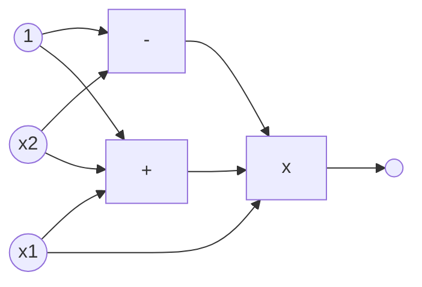
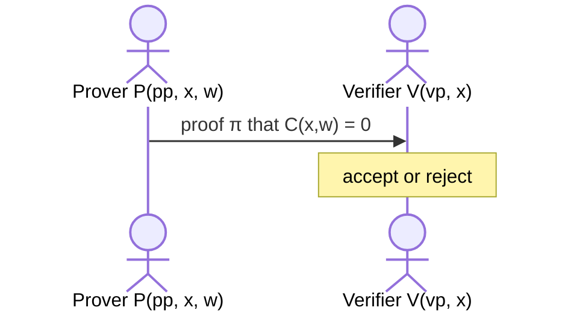
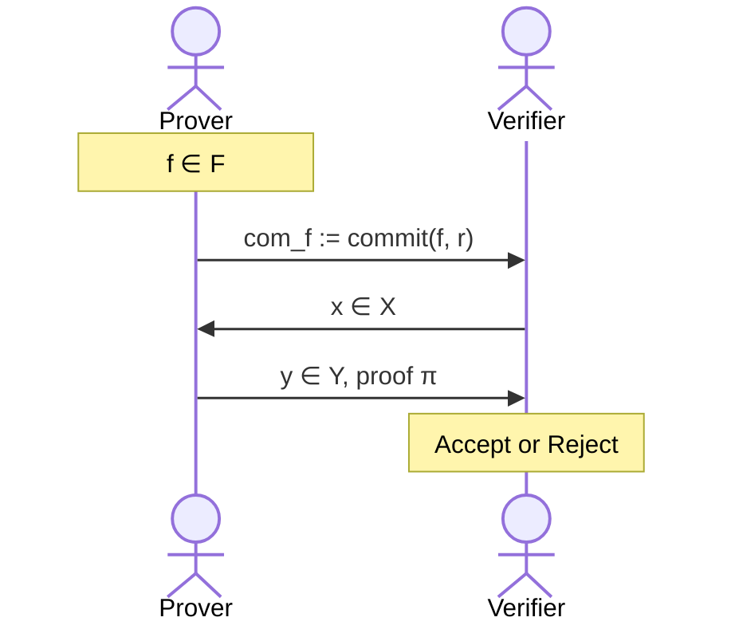
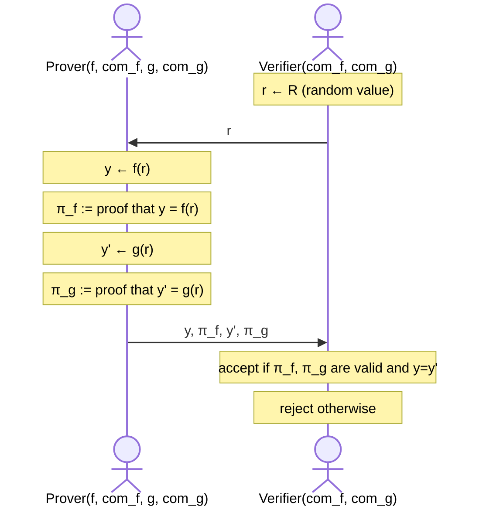
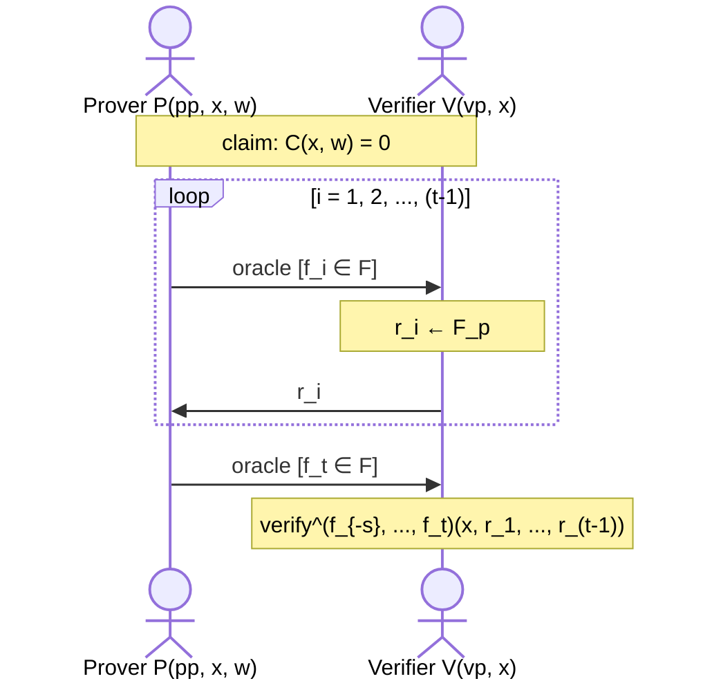
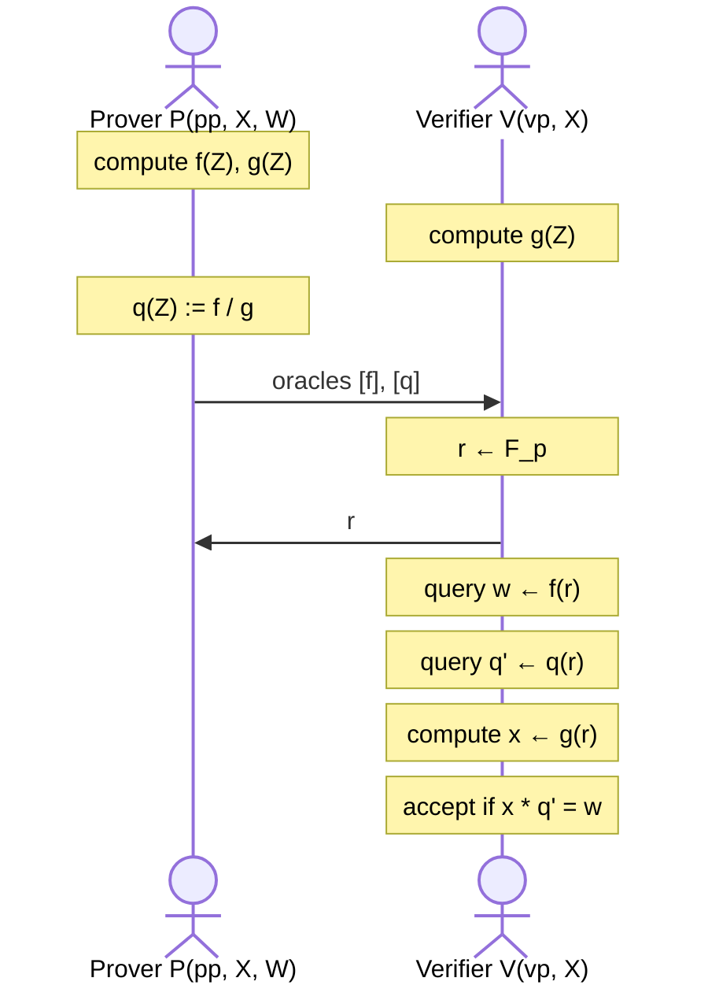
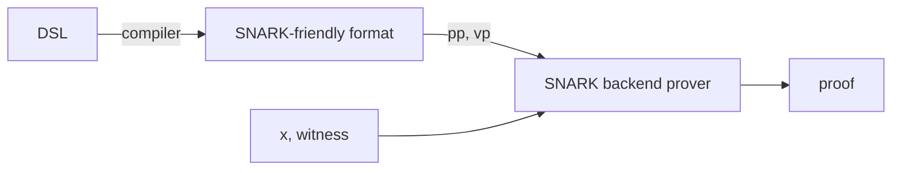

[(video 1)](https://www.youtube.com/watch?v=MUnlR3gMKu0) [(video 2)](https://www.youtube.com/watch?v=9XOi_iEtTt8) [(video 3)](https://www.youtube.com/watch?v=Sv99taTJJmM)

In the previous lecture, we have discussed interactive proofs (IP) in general. Now, we will mostly be talking about non-interactive proofs, in particular SNARKs.

# SNARK

A SNARK stands for a _succinct_ proof that a certain statement is true. Succinct here is meaning that the proof is “short”. For example, I have a statement:

- I know an $m$ such that $\text{SHA256}(m) = 0$.

In SNARK, the proof should be **short** and **fast** to verify. A trivial proof of the above statement is to simply send $m$ to the verifier. However, that proof is not short; it is as big as $m$. Verification is also not fast, as the verifier has to hash the entire message to actually see the proof.

A SNARK can have a proof size of few KBs and verification should take at most seconds.

## zk-SNARK

In the case of a zk-SNARK, the proof reveals nothing about $m$. zk-SNARKs have many applications:

- **Private transactions**: Tornado Cash, ZCash, IronFish, Aleo (private dApps).
- **Compliance**: private proofs of solvency & compliance, zero-knowledge taxes
- **Scalability**: Rollup systems with validity proofs
- and a lot more commercial interest…

Why is there so much commercial interest? Well, things go back to a paper [Babai-Fortnow-Levin-Szegedy'91] where they show that a single reliable PC can monitor the operation of a herd of supercomputers running unrealiable software.

This single reliable PC is a slow and expensive computer. An example of such a machine from today is actually a L1 Blockchain!

## Blockchain Applications

SNARKs and zk-SNARKs can be used in many ways within a blockchain.

- **Outsourcing Computation**: Even without the need of zero-knowledge, an L1-chain can quickly verify that some off-chain service has done some work correctly.
- **Scaling with Proof-based Rollups (zkRollup)**: An off-chain service processes batch of transactions, and the L1-chain verifies a succinct proof that transactions were processed correctly.
- **Bridging Blockchains (zkBridge)**: A source chain locks up some asset, so that it can be used in another destination chain. In doing so, it proves that indeed the asset is locked.
- **Private Transactions**: A ZKP that a private transaction is valid. Many examples: TornadoCash, ZCash, Ironfish, Aleo.
- **Compliance**: A proof that a private transaction is compliant with banking laws (e.g. Espresso), or a proof that an exchange is solvent without showing the assets (e.g. Raposa).

### A non-Blockchain Application

Blockchain is really spearheading the development in these areas, but there are many non-blockchain applications of SNARKs too. Here is one example: proving that a photo is taken at some time and at some place.

The initial attempts to this was made via C2PA, a standard of content provenance. With C2PA, the camera that captures the picture will sign its metadata with a secret key (that is assumed not to be extractable by a user). The signed metadata will ensure that the location and timestamp is valid.

However, newspapers and press that display a picture often have to apply some post-processing, such as rescaling, cropping and gray-scaling. There is actually a list of allowed operations by Associated Press. Doing any of these will break the signature, as it can be though of as tampering.

Here is the solution by [[Kang-Hashimoto-Stoica-Sun'22]](https://arxiv.org/abs/2211.04775) to this problem using zk-SNARKs: suppose that the machine that is doing the post-processing has the photo $P$ and some list of allowed operations $Ops$. Denote the original photo as $P_{orig}$ and $s$ as the signature. The editing software will attach a proof $\pi$ of claim: “I know a pair $(P_{orig}, s)$” such that:

- $s$ is a valid C2PA signature on $P_{orig}$
- $P$ is the result of applying $Ops$ to $P_{orig}$
- Metadata of $P$ is equal to metadata of $P_{orig}$

Et viola, you can now be sure that the processed photo is original! The proof size is less than 1KB, with verification time less than 10ms in browser. For images around 6000x4000, just a few minutes is enough to generate a proof, which is awesome.

---

# Arithmetic Circuits

**Definition**: Fix a finite field $\mathbb{F} = \{0, 1, \ldots, p-1\}$ for some prime $p > 2$. A finite field is just a set of numbers where we can do addition and multiplication in modulo $p$. An arithmetic circuit is a DAG (directed acyclic graph) $C : \mathbb{F}^n \to \mathbb{F}$ where internal nodes are labeled $+, -, \times$ and inputs are labeled $1, x_1, \ldots, x_n$. The circuit defines an $n$-variate polynomial with an evaluation recipe.

Here is an example:

This circuit defines the operation $x_1(x_1 + x_2 + 1)(x_2 - 1)$.

For convenience, the size of the circuit refers to the number of gates, and is denoted as $|C|$. In the example above, $|C| = 3$.

For example:

- You can implement a circuit that does $C_{\text{hash}}(h, m) = (h - \text{SHA256}(m))$. This outputs 0 if $m$ is the preimage of $h$ using SHA256, and something other than 0 otherwise. This circuit uses around 20K gates, which is not bad!
- You can have a $C_{\text{sig}}(pk, m, \sigma)$ that outputs 0 if $\sigma$ is a valid ECDSA signature on $m$ with respect to $pk$.
- A theorem states that all polynomial time algorithms can be captured by polynomial sized arithmetic circuits!

## Structured vs. Unstructured

There are two types of arithmetic circuits in terms of structure:

- Unstructured Circuit is a circuit with arbitrary wires.
- Structured Circuit is a circuit with repeating structure within, denoted as $M$, and for some input $in$ and output $out$ the flow of this arithmetic circuit looks like the following:

$$
in \to M \to M \to \ldots \to M \to out
$$

$M$ is often called a virtual machine (VM), and every step of execution in this structure can be thought of as a single step of some processor, or like a clock cycle.

Some SNARK techniques only apply to structured circuits.

# NARK: Non-interactive Argument of Knowledge

Suppose you have some public arithmetic circuit $C(x, w) \to \mathbb{F}$ where,

- $x \in \mathbb{F}^n$ is a public statement
- $w \in \mathbb{F}^m$ is a secret witness

Denote $S(C)$ as a preprocessing step for this circuit, which will output a pair $(pp, vp)$ as in public parameters prover and verifier respectively.

Notice that the Verifier does not talk back to Prover, i.e. it does not interact with it! It just reads the generated proof and that's all, making the entire thing non-interactive.

More formally, a NARK is a triple $(S, P, V)$:

- $S(C) \to (pp, vp)$ is the preprocessing setup, generating public parameters for prover and verifier
- $P(pp, x, w) \to \pi$ is the prover function, generating the proof given the public prover parameters, public inputs and the secret inputs (witness).
- $V(vp, x, \pi) \to \{0, 1\}$ is the verification function, either accepting or rejecting a given proof $\pi$, along with the circuit's public verifier parameters and public inputs.

A technical point to be made here is that, all of these algorithms and the adversary are assumed to have an access to a **random oracle**. This is most likely due to Fiat-Shamir Paradigm we have learned in the previous lecture, but we will get to more details of this later.

## Requirements of a NARK

There are 2 requirements of a NARK, and an optional 3rd requirement of zero-knowledgeness:

- **Completeness**: If the prover does indeed knows the argued knowledge, verifier should definitely accept the proof.

$$
\forall x , w : C(x, w) = 0 \implies \Pr[V(vp, x, P(pp, x, w)) = \text{accept}] = 1
$$

- **Soundness:** If the verifier accepts a proof, the prover should indeed know the argued knowledge. “Knowing” something is rather interesting to capture formally, but for now let's say there is an extractor algorithm $E$ that can extract a valid $w$ from the prover.

$$
V(vp, x, P(pp, x, w)) = \text{accept} \implies P \text{ knows } w : C(x, w) = 0
$$

- **Zero-knowledge (optional)**: The view of this interaction, consisting of $(C, pp, vp, x, \pi)$ “reveals nothing new” of $w$.

## Trivial NARK

We can easily think of a trivial NARK, that is not zero-knowledge but has the other two properties. Simply, the proof $\pi = w$. Yeah, just send the witness to the verifier! All the Verifier has to do next is check if $C(x, w) = 0$, since both $x$ and $C$ were public anyways.

# SNARK: Succinct NARK

We will introduce some constraints over the proof size and verification time, giving us two types of NARKs:

- succint preprocessing NARK
- strongly succinct preprocessing NARK

Let us see the first one.

A **succinct preprocessing NARK** is a triple $(S, P, V)$:

- $S(C) \to (pp, vp)$ is the preprocessing step, generating public parameters for prover and verifier
- $P(pp, x, w) \to \pi$ is the prover function, where $|\pi| = \text{sublinear}(|w|)$. So, the proof length must be less than linear in the size of witness.
- $V(vp, x, \pi) \to \{0, 1\}$ is the verification function, where $\text{time}(V) = \mathcal{O}_\lambda(|x|, \text{sublinear}(|C|)$. Note that the verification will have to read the public inputs, so it is allowed to run in $|x|$ time, but it must run sub-linear in the size of circuit $C$.

In practice, we are even more greedy than this, so we have a much better and efficient type of NARK.

A **strongly succinct preprocessing NARK** is a triple $(S, P, V)$:

- $S(C) \to (pp, vp)$ is the preprocessing step, generating public parameters for prover and verifier
- $P(pp, x, w) \to \pi$ is the prover function, where $|\pi| = \mathcal{O}(\log{(|C|)})$. The proof length must be logarithmic to the size of circuit, making the proof very tiny compared to the circuit!
- $V(vp, x, \pi) \to \{0, 1\}$ is the verification function, where $\text{time}(V) = \mathcal{O}_\lambda(|x|, \log{(|C|)})$. Again, the verification will have to read the public inputs, so it is allowed to run in $|x|$ time, but it will not have time to read the entire circuit, which is quite magical. This is actually what $vp$ public parameter is for, it is capturing a summary of the circuit for the verifier so that $\log{(|C|)}$ is enough to run the verification.

A **zk-SNARK** is simply a SNARK proof that reveals nothing about the witness $w$.

## Trivial SNARK?

Let us again come back to the trivial proof, where $\pi = w$.

- Prover sends $w$ to the verifier.
- Verifier checks if $C(x, w) = 0$

Why can't there be a trivial SNARK? Well, there may be several reasons:

- If $w$ is long, the proof size will be too large.
- If $C(x, w)$ is taking lots of time, the verifier time will be too long.
- Naturally, we might want to keep $w$ secret.

## Preprocessing Setup

We said that a preprocessing setup $S(C)$ is done for a circuit $C$. Things are actually a bit more detailed than this, there are 3 types of setups:

1. **Trusted Setup per Circuit**: $S(C; r)$ is a randomized algorithm. The random $r$ is calculated per circuit, and must be kept secret from the prover; if a prover can learn $r$ then they can prove false statements!
2. **Trusted Setup & Universal (Updatable)**: a random $r$ is only chosen once and is independent of the circuit. The setup phase is split in two parts: $S = (S_{init}, S_{index})$.
   1. $S_{init}(\lambda; r) \to gp$ is a one-time setup, done in a trusted environment. $r$ must be kept secret!
   2. $S_{index}(gp, C) \to (pp, vp)$ is done for each circuit, and nothing here is secret! Furthermore, $S_{index}$ is a deterministic algorithm.
3. **Transparent**: $S(C)$ does not use any secret data, meaning that a trusted setup is not required.

## SNARKs in Practice

Notice that we had no constraints on the proof generation time. In the recent years, prover time has been reduced to be in linear time with the size of circuit $|C|$, and this kind of enabled the SNARK revolution we are seeing these past few years.

We will go into details of 4 categories of SNARKs throughout the lecture, and again all of these have provers that run in linear time $|C|$.

|                | Size of proof $\pi$                          | Verifier time                               | Setup                   | Post-Quantum? |
| -------------- | -------------------------------------------- | ------------------------------------------- | ----------------------- | ------------- |
| Groth16        | ~200 B $\mathcal{O}_\lambda(1)$              | ~1.5 ms $\mathcal{O}_\lambda(1)$            | Truster per Circuit     | No            |
| Plonk / Marlin | ~400 B $\mathcal{O}_\lambda(1)$              | ~3 ms $\mathcal{O}_\lambda(1)$              | Universal trusted setup | No            |
| Bulletproofs   | ~1.5 KB $\mathcal{O}_\lambda(\log{\|C\|})$   | ~3 sec $\mathcal{O}_\lambda(\|C\|)$         | Transparent             | No            |
| STARK          | ~100 KB $\mathcal{O}_\lambda(\log^2{\|C\|})$ | ~10 ms $\mathcal{O}_\lambda(\log^2{\|C\|})$ | Transparent             | Yes           |

The approximations here are made for a circuit that is size $|C| \approx 2^{20}$ gates. There are many more SNARKs out there, but these four are the ones we will go into detail of.

Also note that some of these SNARKs have constant sized proofs and constant time verifiers, which is kind of awesome considering that no matter what your circuit $C$ is, the proof size and verifier time will be approximately the same!

## Knowledge Soundness

While describing the properties of a NARK, we mentioned soundness:

$$
V(vp, x, P(pp, x, w)) = \text{accept} \implies P \text{ knows } w : C(x, w) = 0
$$

Well, what does it mean to “know” here? Informally, $P$ knows $w$ if this $w$ can be somehow extracted from the prover $P$. The way we do that is kind of torturing the $P$ until it spits out $w$. Let us give the formal definition now.

Formally, an argument system $(S, P, V)$ is _(adaptively)_ knowledge-sound for some circuit $C$, if for every polynomial time adversary $A = (A_0, A_1)$ such that:

- $gp \gets S_{init}()$
- $(C, x, st) \gets A_0(gp)$
- $(pp, vp) \gets S_{index}(C)$
- $\pi \gets A_1(pp, x, st)$
- $\Pr[V(vp, x, \pi) = \text{accept}] > \beta$ for some non-negligible $\beta$

there is an efficient **extractor** $E$ that uses $A_1$ as a black box (oracle) such that:

- $gp \gets S_{init}()$
- $(C, x, st) \gets A_0(gp)$
- $(pp, vp) \gets S_{index}(C)$
- $w \gets E^{A_1(pp, x, st)}(gp, C, x)$
- $\Pr[C(x, w) = 0] > \beta - \epsilon$ for some negligible $\epsilon$ and non-negligible $\beta$.

In other words, the probability that a prover can convince the verifier for some witness $w$ must be at most negligibly different than the probability that this witness $w$ is a valid witness for the circuit $C$. In doing so, this witness $w$ must be extractable by the efficient extractor $E$.

---

# Building a SNARK

There are various paradigms on building SNARKs, but the general paradigm is made up of two steps:

1. A **functional commitment scheme**, which is a cryptographic object
2. A suitable **interactive oracle proof** (IOP), which is an information theoretic object

# (1) Functional Commitment Scheme

Well, first, what is a **commitment scheme**? A cryptographic commitment is like a physical-world envelope. For instance, Bob can put a data in an envelope, and when Alice receives this envelope she can be sure that Bob has committed to whatever value is in it. Alice can later reveal that value.

The commitment scheme has two algorithms:

- $commit(m, r) \to com$ for some randomly chosen $r$
- $verify(m, com, r) \to \text{accept or reject}$

The scheme must have the following properties:

- **Binding**: cannot produce two valid openings for $com$
- **Hiding**: $com$ reveals nothing about the committed data

There is a standard construction using hash functions. Fix a hash function $H : \mathcal{M} \times \mathcal{R} \to C$ where

- $commit(m, r) = H(m, r)$
- $verify(m, com, r) = \text{accept if } com = H(m, r)$

## Committing to a function

Choose a family of functions $\mathcal{F} = \{f : X \to Y\}$. The function $f$ can be an arithmetic circuit, a C program, whatever; but what does it really mean to commit to a function? Well, consider the following interaction:

Here, the proof $\pi$ is to show that $f(x) = y$ and $f \in \mathcal{F}$. Also, $com_f$ is a commitment to function $f$, but we may also use the notation $\boxed{f}$ to indicate a commitment (think of it like $f$ in an envelope).

Formally, a functional commitment scheme for $\mathcal{F}$ is defined by the following:

- $setup(1^\lambda) \to gp$ outputs public parameters $gp$.
- $commit(gp, f, r) \to com_f$ is commitment to $f \in \mathcal{F}$ with $r \in \mathcal{R}$.
  - this should be a **binding** scheme
  - _optionally_, it can be **hiding**, which is good for a zk-SNARK
- $eval(P, V)$ with a prover $P$ and verifier $V$, for a given $com_f$ and $x \in X, y \in Y$:
  - $P(gp, f, x, y, r) \to\pi$ (a **short** proof!),
  - $V(gp, com_f, x, y, \pi) \to \text{accept or reject}$
  - Basically, the $eval$ system is a SNARK proof wof the relations: $f(x) = y$ and $f \in \mathcal{F}$ and $commit(pp, f, r) = com_f$.

### Four Important Functional Commitments

There are 4 very important functional commitment types:

- **Polynomial Commitments**: Committing to a univariate polynomial $f(X) \in \mathbb{F}_p^{(\leq d)}[X]$ where that fancy notation stands for the set of all univariate polynomials of degree at most $d$.
- **Multilinear Commitments**: Committing to a multilinear polynomial in $\mathbb{F}_p^{(\leq 1)}[X_1, \ldots, X_k]$ which is the set of all the multilinear polynomials in at most $k$ variables, each variable with degree at most 1. Here is an example multilinear polynomial: $f(x_1, \ldots, x_7) = x_1x_3 + x_1x_4x_5 + x_7$.
- **Vector Commitments**: Committing to a vector $\vec{u} = (u_1, \ldots, u_d) \in \mathbb{F}^d_p$ which is a vector of $d$ elements. With our commitment, we would like to be able to open any cell at a later time, such that $f_{\vec{u}}(i) = u_i$.
  An example vector commitment scheme is Merkle Trees, which you may have heard of!
- **Inner-Product Commitments**: Committing to a vector $\vec{u} \in \mathbb{F}^d_p$. Opening an inner product is done as $f_{\vec{u}}(\vec{v}) = (\vec{u}, \vec{v})$.
  These are also known as _Linear Product Arguments_.

It turns out that for these 4 functional commitments, you can obtain any of these from any other.

## Polynomial Commitment Scheme (PCS)

A PCS is a functional commitment for the family $\mathcal{F} = \mathbb{F}_p^{(\leq d)}[X]$.

- The prover commits to a univariate polynomial $f \in \mathbb{F}_p^{(\leq d)}[X]$, later, they can prove that:
  - $v = f(u)$ for some public $u, v \in \mathbb{F}_p$
  - $\text{deg}(f) \leq d$.
    As this is a SNARK, the proof size and verifier time should be $\mathcal{O}_\lambda(\log d)$.
- The verifier has access to $(d, com_f, u, v)$.

There are some example PCSs with different mechanisms:

- Using basic elliptic curves: **Bulletproofs** (short proof, but verifier time is $\mathcal{O}(d)$)
- Using bilinear groups: **KZG'10** (trusted setup), **Dory'20** (transparent)
- Using groups of unknown order: **Dark'20**
- Using hash functions only: based on FRI (long eval proofs)

### Trivial Commitment is bad!

What would be a trivial commitment scheme for a polynomial? Well, first realize that a polynomial is just $f = \sum_{i = 0}^d a_ix^i$. Then, our commitment will be:

- $commit(f, r) = H((a_0, a_1, \ldots, a_d), r)$ as in simply hashing the coefficients and some random variable.
- $eval$ will be done as follows:
  - prover will send $\pi = ((a_0, a_1, \ldots, a_d), r)$ to the verifier
  - verifier will construct $f$ from the coefficients, and check if $f(u) = v$ and $H((a_0, a_1, \ldots, a_d), r) = com_f$.

This is problematic because the proof size and verification time are linear in $d$, but we wanted a lot smaller values, such as $\log{d}$.

### Zero Test: A Useful Observation

We will now make a really useful observation, which is an essential part of SNARKs and is really what makes SNARKs possible!

Consider some non-zero polynomial with degree at most $d$, shown as $f \in \mathbb{F}_p^{(\leq d)}[X]$.

- for $r \gets \mathbb{F}_p$ it holds that $\Pr[f(r) = 0] \leq d/p$

We know that $f$ has at most $d$ roots. $r$ is chosen at random from a size $p$, do the probability that $r$ “hits” a root value is easy to see that $d/p$.

Now suppose that $p \approx 2^{256}$ and $d \leq 2^{40}$. Then, $d/p$ is negligible! So it is really unlikely that a randomly chosen field element will be the root for $f$.

With this in mind, if you do get $f(r) = 0$ for $r \gets \mathbb{F}_p$ then $f$ is identically zero with very high probability. This gives you a simple zero test for a committed polynomial!

[[Schwartz-Zippel-DeMillo-Lipton]](https://en.wikipedia.org/wiki/Schwartz%E2%80%93Zippel_lemma) lemma states that this observation holds for multivariate polynomials too, where $d$ is treated as the total degree of $f$. The total degree is calculated as the sum of degrees of all variables, for example $f(x,y)=x^2 + y^3$ has degree $5 = 3 + 2$.

### Equality Test: A Following Observation

Following the zero-test observation, we can make another observation that allows to check if two polynomials are equal.

Let $f, g \in \mathbb{F}_p^{(\leq d)}[X]$. For $r \gets \mathbb{F}_p$, if $f(r) = g(r)$ then $f = g$ with very high probability! This comes from the observation above, where if $f(r) - g(r) = 0$ then $f - g = 0$ with very high probability.

Here is an interactive protocol that makes use of this equality test, where a prover can commit to polynomials and show that they are equal:

That's cool and all, but wait, we talked about non-interactiveness the entire lecture; why are we making an interactive protocol right now? Well, $r$ here is the only interaction that a verifier makes to the prover. It is a “public coin”, just some coin-toss (or a series of tosses) given by the verifier to the prover for everyone to see.

Thanks to Fiat-Shamir Transform, we can transform interactive protocols of this nature into non-interactive proofs! More specifically, Fiat-Shamir Transform can take a “public-coin interactive protocol” which means all verifier randomness is public, and transform it into a non-interactive protocol.

To be technical, Fiat-Shamir Transform isn't safe to transform ALL interactive proofs of this nature, but it is good enough for our needs right now.

Let $H :M \to R$ be a hash function. For the example above, the prover will generate $r := H(com_f, com_g)$ and this will be used as the random challenge. Since the verifier also has access to $com_f, com_g$ they can generate the same $r$ during verification. That is how the interactiveness is removed!

If $H$ is modeled as a random-oracle, and $d/p$ is negligible (as we discussed in zero-test), then this is a SNARK. In practice, SHA256 is used for the hash function.

Is this a zk-SNARK? No, because the verifier learns the result of evaluating the polynomials at point $r$.

# (2) $\mathcal{F}$ - Interactive Oracle Proof

The goal of an $\mathcal{F}$-IOP is to boost a commitment to function $f \in \mathcal{F}$ to become a SNARK for general circuits. For example, you could have a polynomial function family $\mathcal{F} = \mathbb{F}_p^{(\leq d)}[X]$ and with $\mathcal{F}$-IOP you can turn that into a SNARK for any circuit with size $|C| < d$.

**Definition**: Let $C(x, w)$ be some arithmetic circuit. Let $x \in \mathbb{F}_p^n$. An $\mathcal{F}$-IOP is then a proof system that proves $\exists w : C(x, w) = 0$. In other words, some prover knows a witness $w$.

- **Setup**: $S(C) \to (pp, vp)$ where $vp = (\boxed{f_0}, \boxed{f_{-1}}, \ldots, \boxed{f_{-s}})$ which are oracles of functions in the function family. These oracles can be though of as function commitments, where the verifier can ask to reveal a function result at some given value, equivalent to making an oracle request. Remember that we have seen setup procedures back when we discussed SNARKs!
- **Interactive Proof**: Proving that $C(x, w) = 0$.

Let's digest what is happening in this interactive proof:

1. The prover starts by sending an oracle for function $f_1$. In practice, this is a commitment to function $f_1$ which we may show as $\boxed{f_1}$.
2. The verifier samples a uniformly random field element $r_1$, and sends it back to the prover.
3. Steps 1 and 2 happen for $t-1$ rounds.
4. Finally, the prover sends one last oracle $\boxed{f_t}$, an oracle for function $f_t$.
5. The verifier starts the verification process. This process has access to all oracles given by the prover, as well as all the generated randomness, and public inputs $x$ as well.

The IOP must have the following properties:

- **Completeness**: If there exists a valid witness known by the prover, the verifier should definitely accept the proof.

$$
\exists w : C(x, w) = 1 \implies \Pr[V \text{ accepts}] = 1
$$

- **Soundness**: The second property is knowledge soundness (unconditional), meaning that a malicious prover can not convince a verifier that they know a witness $w$ such that $C(x, w) = 0$. The way to prove that is using an **extractor**: this extractor is given the statement $x$ and functions $f_1, f_2, \ldots, f_t$ in **clear**! Why in clear? Because, the commitments to those functions were SNARKs too and the extractor can extract the functions themselves from there too. The extractor must extract the witness $w$ from this process.
- **Zero-knowledge (optional)**: The view of this IOP “reveals nothing new” of $w$.

## Example: Polynomial IOP for claim $X \subseteq W \subseteq \mathbb{F}_p$

We will go over an example where the public input $X$ is a set, and secret witness $W$ is a set that contains or is equal to $X$. Furthermore, $W$ is a subset of or equal to the finite field for prime $p$. Suppose we capture this relation with a circuit $C$ such that the claim becomes:

$$
C(X, W) = 0 \iff X \subseteq W \subseteq \mathbb{F}_p
$$

I will explain how $f(Z)$ and $g(Z)$ are computed here, let's dig in.

1. Prover computes two polynomials $f$ and $g$, a polynomial with roots in $W$ and $X$ respectively. It does that by the following:
   1. $f(Z) = \prod_{w \in W}(Z - w)$
   2. $g(Z) = \prod_{x \in X}(Z - x)$
2. Verifier computes $g(Z)$ the same way, because $X$ is public.
3. Prover computes a quotient polynomial $q(Z) = f / g \in \mathbb{F}_p^{(\leq d)}[X]$, which is a polynomial that is the result of dividing $f$ by $g$. This is only a polynomial if $g$ has all the roots that $f$ has, and that implies $X \subseteq W$. That is a key point to understand in this proof.
   Let me give an example: $X = \{1, 2\}$ and $W = \{1, 2, 4\}$. Then, 1. $f(Z) = (Z - 1)(Z - 2)(Z - 4)$ 2. $g(Z) = (Z-1)(Z - 2)$ 3. $q(Z) = f / g = (Z-4)$ is a valid polynomial in the finite field!
4. Prover sends oracles of $f$ and $q$ to the verifier. In practice, it uses a polynomial commitment scheme and sends commitments to these functions, $\boxed{f}$ and $\boxed{q}$.
5. Verifier samples a uniform random variable $r$ from the finite field. It sends this to the prover, but the prover makes no use of it. There is a reason why it sends $r$ anyways: it is to make $r$ public! If the verifier didn't send $r$, we would not be able to say that it is publicly known.
6. Verifier queries the value of $\boxed{f}$ and $\boxed{q}$ at point $r$, and also computes $g(r)$. Denote these as $w, q', x$ respectively. Note that this querying happens via the polynomial commitment scheme in practice, so behind the scenes verifier sends $r$ to the prover, the prover evaluates it and sends back the result along with a proof that it is evaluated correctly and so on, check the previous section for this.
7. Verifier checks if $x \times q' = w$. This is only possible if $q(Z) = f / g$ indeed, think of it like checking $f \times q = g$ in this example.

Replacing the oracles with commitments, and oracle queries with commitment interactions and so on is often called “compilation step”, where this Poly-IOP is “compiled” into a SNARK by adding in the PCS (poly-commitment scheme) steps.

## The IOP Zoo

There are many SNARKs for general circuits.

| IOP             | Commitment Scheme          | Examples                    |
| --------------- | -------------------------- | --------------------------- |
| Poly-IOP        | Poly-Commit                | Sonic, Marlin, Plonk        |
| Multilinear-IOP | Multilinear-Commit         | Spartan, Clover, Hyperplonk |
| Vector-IOP      | Vector-Commit (e.g Merkle) | STARK, Breakdown, Orion     |

You construct the IOP, and use the relevant commitment scheme to do the commitments and queries; et viola, you have a SNARK. However, the examples we have were interactive so far, but a SNARK is non-interactive. To do that final touch, you use the Fiat-Shamir Transform (using hash functions) to make the entire thing non-interactive.

# SNARKs in Practice

In practice, you wouldn't want to write the entire circuit yourself. We use DSLs (domain-specific languages) to do that for us.

Some DSL examples are:

- [Circom](https://docs.circom.io/)
- [ZoKrates](https://zokrates.github.io/) for Ethereum
- [Leo](https://leo-lang.org/) for Aleo
- [Zinc](https://github.com/matter-labs/zinc) for zkSync
- [Cairo](https://www.cairo-lang.org/) for StarkNet
- [Noir](https://github.com/noir-lang/noir)
- [GNARK](https://github.com/ConsenSys/gnark)
- …

The DSL compiles the circuits for you, and outputs a SNARK friendly format. There are several formats:

- Circuit
- R1CS (Rank-1 Constraint System)
- EVM Bytecode (yea, that is possible!)
- …

Finally, with the public parameters $pp, vp$, the public input $x$ and witness $w$ a SNARK backend prover generates a proof.

That is the end of this lecture!
