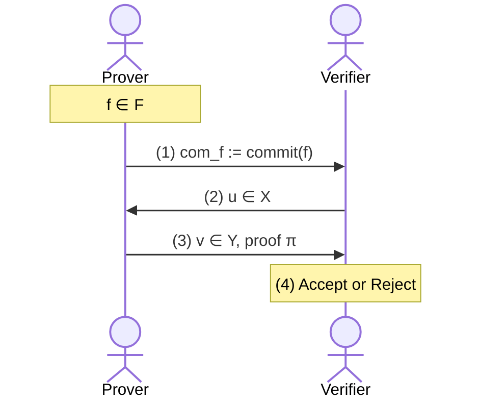
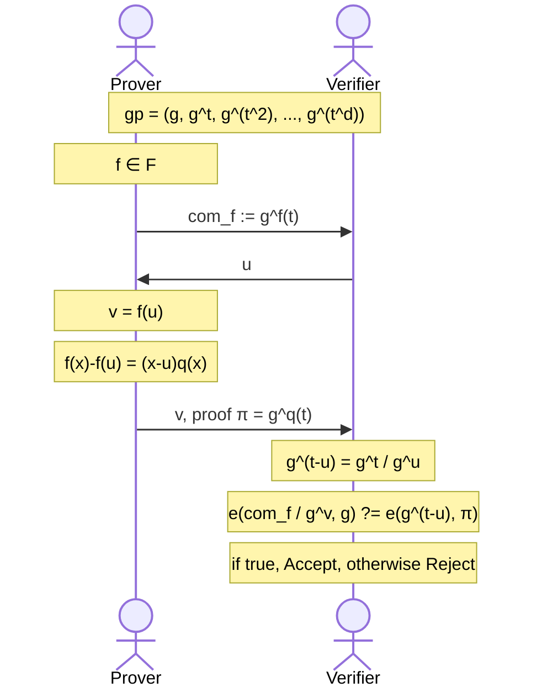
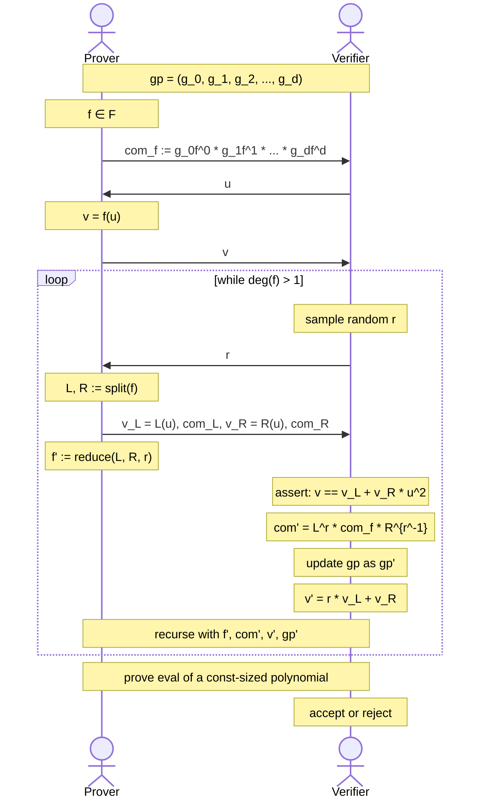

[(video 1)](https://www.youtube.com/watch?v=HdwMtrXLLWk) [(video 2)](https://www.youtube.com/watch?v=xuGQYEvytxk) [(video 3)](https://www.youtube.com/watch?v=a9H3tHnSxT4) [(video 4)](https://www.youtube.com/watch?v=9MnC8dNK-ic) [(video 5)](https://www.youtube.com/watch?v=9J7omEbXj3I)

# Recall: How to build an Efficient SNARK?

There are various paradigms on building SNARKs, but the general paradigm is made up of two steps:

1. A **functional commitment scheme**, which is a cryptographic object
2. A suitable **interactive oracle proof** (IOP), which is an information theoretic object

In Lecture 5, we have seen PLONK, which operated with:

1. A **univariate polynomial commitment scheme**
2. PLONK **polynomial IOP**

In Lecture 4, we have seen another method using the sum-check protocol:

1. A **multivariate polynomial commitment scheme**
2. Sum-check protocol for **IOP**

In this lecture, we will dive deeper into polynomial commitment schemes, in particular those that are based on bilinear pairings and discrete logarithm.

# What is a Polynomial Commitment?

Consider a family of polynomials $\mathcal{F}$. The prover has some polynomial $f \in \mathcal{F}$ that is a function $f : X \to Y$. The interactions of a polynomial commitment scheme look like the following:

Let us explain each numbered step in this sequence diagram:

1. Prover commits to the polynomial, and sends the commitment $com_f$, also shown as $\boxed{f}$.
2. The verifier would like to query this polynomial at some value $u$, so it sends this to the prover.
3. Prover evaluates $v := f(u)$ and sends this to verifier, along with a proof $\pi$ that indeed $v = f(u)$ and $f \in \mathcal{F}$.
4. The verifier will verify this proof, and accept if it is valid.

## A bit more formality

Let's make a more formal definition of polynomial commitments now. They are made of 4 algorithms:

- $keygen(\lambda, \mathcal{F}) \to gp$ generate public parameters given the polynomial family and security parameter $\lambda$. Note the $gp$ is also known as "common reference string", or "public key" too.
- $commit(gp, f) \to com_f$ computes the commitment to the given polynomial.
- $eval(gp, f, u) \to v, \pi$ is the evaluation method that the prover uses to compute $v := f(u)$ and generate a proof that $v = f(u)$ this is true and $f \in \mathcal{F}$.
- $verify(gp, com_f, u, v, \pi) \to \{0, 1\}$ verifies an evaluation, and it will either accept or reject (which is why I used a bit to represent output).

Polynomial commitment has the following properties:

**Correctness**: if the prover is honest, and follows the given algorithms above, then $verify$ should always accept. We won't go too much into this one yet.

**Knowledge Soundness**: for every polynomial time adversary $A = (A_0, A_1)$ such that:

- $gp \gets keygen(\lambda, \mathcal{F})$
- $com_f \gets A_0(gp)$
- $v, \pi \gets A_1(gp, u)$

where $\Pr[V(vp, x, \pi) = \text{accept}] =1$, then there is an efficient **extractor** $E$ that uses $A_1$ as a black box (oracle) such that:

- $gp \gets keygen(\lambda, \mathcal{F})$
- $com_f \gets A_0(gp)$
- $f \gets E(gp, com_f)$

where $\Pr[f(u) = v \text{ and } f \in \mathcal{F}] > 1 - \epsilon$. Meaning that if the prover can convince the verifier about some committed polynomial $f$, then an efficient extractor can "extract" that $f$ from the prover via some algorithm, and then find out that indeed the evaluations are correct, with at most some negligible probability of failure.

# Group Theory

It will be good to refresh our memory on some of the preliminary concepts, starting with group theory!

A group is a set $\mathbb{G}$ and an operation $*$. It satisfies the following properties:

- **Closure**: $\forall a, b \in \mathbb{G}$ it holds that $a * b \in \mathbb{G}$. In other words, the result of this operation is still an element of this group, it is closed in this group!
- **Associativity**: $\forall a, b, c \in \mathbb{G}$ it holds that $(a * b) * c = a * (b * c)$. The order of execution should not matter.
- **Identity**: $\exists e \in \mathbb{G}$ such that $\forall a \in \mathbb{G}$ it holds that $e * a = a* e = a$. We call $e$ the identity element, because the result of operating on it is **identical** to the operand.
- **Inverse**: $\forall a \in \mathbb{G}, \exists b \in \mathbb{G}$ such that $a * b = b * a = e$. This is very important to keep in mind.

For example, the set of integers $\mathbb{Z} = \{\ldots, -1, 0, 1, \ldots \}$ under addition operation $+$ satisfies all these properties. You might also be familiar with rational numbers, real numbers, complex numbers and such.

In cryptography, here are some commonly used groups:

- **Positive integers** $\bmod$ **some prime number** $p$, which is the set $\{1, 2, \ldots, p-1\}$ under the multiplication operation $\times$. This is denoted as $\mathbb{Z}^*_p$.
- **Elliptic curves**, we will not go into this yet though.

## Generator of a Group

An element $g \in \mathbb{G}$ that generates all the other elements in the group by taking its powers is called the generator of that group. For example, consider the multiplicative group $\mathbb{Z}^*_7=\{1, 2, 3, 4, 5, 6\}$. See what happens if we take powers of 3 in this group.

| $1$   | $2$   | $3$   | $4$   | $5$   | $6$   |
| ----- | ----- | ----- | ----- | ----- | ----- |
| $3^6$ | $3^2$ | $3^1$ | $3^4$ | $3^5$ | $3^3$ |

Notice that $3^6 = 1$, so you can continue to powering $3^7 = 3$, $3^8 = 2$ and so on but you will keep getting the same values. Furthermore, there can be multiple generators within a group!

## Discrete Logarithm Assumption

So think of a some group $\mathbb{G}$ with $p$ elements. You could represent the group by literally writing out all its $p$ elements. Alternatively, you could just note down the generator $g$ and find its $p$ powers to obtain the group elements; keep in mind that there may be different generators too. With that in mind, let us look at the **discrete logarithm problem**:

- given $y \in \mathbb{G}$ find $x$ such that $g^x = y$

It turns out that this is very hard to do, you basically have to try your luck with $x$. There are some clever methods too, but it is the general consensus that this problem is **computationally hard**, meaning that you can't solve it in polynomial time.

Quantum computers can actually solve this in polynomial time, and any scheme that uses discrete log is therefore not post-quantum secure.

## Diffie-Hellman Assumption

You might remember this duo from the Diffie-Hellman Key-Exchange [[Diffie-Hellamn'76]](https://www-ee.stanford.edu/~hellman/publications/24.pdf). The paper is based on the Diffie-Hellman Assumption, which is very similar to the discrete logarithm assumption.

- given $\mathbb{G}, g, g^x, g^y$ compute $g^{xy}$

This is a stronger assumption that the discrete logarithm assumption, meaning that it "assumes more stuff". In other words, if discrete logarithm assumption breaks, you can break this one too. What you could do it, simply find $x$ from $g^x$ and $y$ from $g^y$ and just compute $g^{xy}$.

To our best knowledge, this is also a hard problem and there is no efficient solution yet.

## Bilinear Pairing

Bilinear pairings are an awesome building block that we will make use of. You have the following:

- $\mathbb{G}$: the **base group**, a multiplicative cyclic group
- $\mathbb{G}_T$: the **target group**, yet another multiplicative cyclic group
- $p$: the **order** of both $\mathbb{G}$ and $\mathbb{G}_T$
- $g$: the **generator** of base group $\mathbb{G}$
- $e$: a **pairing** operation $e : \mathbb{G} \times \mathbb{G} \to \mathbb{G}_T$

The pairing must have the following **bilinearity** property:

$$
\forall P, Q, \in \mathbb{G} : e(P^x, Q^y) = e(P, Q)^{xy}
$$

Note that computing $e$ itself may be efficient or not, that depends on the groups that are being used. Also note that you could have two different base groups, unlike our example above which just uses on base group for both $P$ and $Q$.

### Example: Diffie-Hellman

Consider $e(g, g)^{xy}$, what can this be equal to?

- $e(g, g)^{xy} = e(g^x, g^y)$
- $e(g, g)^{xy} = e(g^{xy}, g)$

That means $e(g^x, g^y) = e(g^{xy}, g)$. We know that given $g^x, g^y$ we can't compute $g^{xy}$ that is the Diffie-Hellman assumption. However, what if someone claims that they have computed $g^{xy}$? Well, we can check this without learning what $x, y$ is simply with the aforementioned equality.

### Example: BLS Signature

BLS signature [[Boneh-Lynn-Shacham'01]](https://www.iacr.org/archive/asiacrypt2001/22480516.pdf) is an example usage of bilinear pairings. It is a signature scheme with the following functions:

- $keygen(p, \mathbb{G}, g, \mathbb{G}_T, e) \to (sk = x, pk = g^x)$ that is the secret (private) key and public key respectively
- $sign(sk, m) \to \sigma= H(m)^x$ where $H$ is a cryptographic hash function that maps the message space to $\mathbb{G}$
- $verify(pk, \sigma, m) \to \{0, 1\}$ will verify if $e(H(m), g^x) = e(\sigma, g)$. Notice that $g^x$ comes from $pk$, and $H$ is a known public hash function

# KZG Poly-Commit Scheme with Pairings

Remember we had went over KZG in the previous lecture, but there at some point we had to mention "pairings". Now, we will look at KZG again but with pairings included.

Suppose you have a univariate polynomial function family $\mathcal{F} = \mathbb{F}_p^{(\leq d)}[X]$ and some polynomial that you would like to commit $f \in \mathcal{F}$. You also have a bilinear pairing $p, \mathbb{G}, q, \mathbb{G}_T, e$. Let's see how KZG works with these.

- $keygen(\lambda, \mathcal{F}) \to gp$
  - Sample a random $\tau \in \mathbb{F}_P$
  - Set $gp = (g, g^\tau, g^{\tau^2}, \ldots, g^{\tau^d})$
  - Delete $\tau$, its toxic waste at this point and you should make sure no one gets it. If they do, they can generate fake proofs. This is why a **trusted setup** is required for KZG.
- $commit(gp, f) \to com_f$
  - The polynomial is represented with its coefficients $f(x) = f_0 + f_1x. +f_2x^2 + \ldots + f_dx^d$.
  - The commitment is $com_f = g^{f(\tau)}$. How can this be done without knowing $\tau$? Well, that is where $gp$ comes into play.
  - Notice that $g^{f(\tau)} = g^{f_0 = f_1\tau + f^2\tau^2 + \ldots + f_d\tau^d}$
  - Its equal to $(g)^{f_0} + (g^\tau)^{f_1} + (g^{\tau^2})^{f_2} + \ldots (g^{\tau^d})^{f_d}$ which can be done using just the elements in the public parameters $gp$ and the coefficients of $f$.
- $eval(gp, f, u) \to v, \pi$
  - A verifier wants to query this polynomial at point $u$, and you would like to show that $f(u) = v$ along with a proof $\pi$ that this is indeed true.
  - To do this, first you find a quotient polynomial $q(x)$ such that $f(x) - f(u) = (x-u)q(x)$. Note that $u$ is a a root of $f(x) - f(u)$.
  - Then, your proof is $\pi = g^{q(\tau)}$ which you can do without knowing $\tau$ but instead using $gp$, as shown in the last bullet under $commit$.
- $verify(gp, com_f, u, v, \pi) \to \{0, 1\}$

  - The idea is to check the equation at point $\tau$ as $g^{f(\tau)-f(u)} = g^{(\tau - u)q(\tau)}$.
  - The verifier knows $g^{(\tau-u)}$ as $g^\tau$ is in $gp$ and $g^u$ the verifier can calculate, and it also knows $g^{q(\tau)}$ because that is the proof $\pi$ sent by the prover. However, Diffie-Hellman assumption tells us that just by knowing these two, the verifier can't compute $g^{(\tau - u)q(\tau)}$. So what do we do?
  - We can use a bilinear pairing! We will make use of the pairing $e(com_f/g^v, g) = e(g^{(\tau-u)}, \pi)$. Notice that this pairing translates to $e(g, g)^{f(\tau)-f(u)}=e(g, g)^{(\tau-u)q(\tau)}$. The verifier can simply check this equality, and accepts if it is correct.

## q-Strong Bilinear Diffie-Hellman

What about the properties of KZG?

- **Correctness**: if the prover is honest, then the verifier will always accept.
- **Soundness**: how likely is a fake proof to be verified?

The answer to this comes from something called "q-Strong Bilinear Diffie-Hellman" (short for q-SBDH) assumption. That is, given $(p, \mathbb{G}, g, \mathbb{G}_T, e)$ and $(g, g^\tau, g^{\tau^2}, \ldots, g^{\tau^d})$ it is hard to compute $e(g, g)^{\frac{1}{\tau - u}}$ for any $u$. This is a stronger assumption that computational Diffie-Hellman.

Let us prove the soundness then! We will do a **Proof by Contradiction**. Suppose $v^* \ne f(u)$ yet a fake proof $\pi^*$ passes the verification. We begin the proof by writing the bilinear pairing equivalence that the verifier checks for:

$$
e(com_f / g^{v^*}, g) = e(g^{\tau - u}, \pi^*)
$$

We will assume that the prover knows $f$, which is a strong assumption but we will explain it later (see Knowledge of Exponent). Therefore, we have the following equivalence:

$$
e(g^{f(\tau)-v^*}, g) = e(g^{\tau - u}, \pi^*)
$$

Now the trick of the proof: we add $f(u) - f(u)$ to the leftmost exponent, which is effectively adding 0 so it does not change anything.

$$
e(g^{f(\tau)-f(u) + f(u) - v^*}, g) = e(g^{\tau - u}, \pi^*)
$$

Now define $\delta = f(u) - v^*$, which is non-zero because we have said above that $v^* \ne f(u)$. We rewrite the left hand-side:

$$
e(g^{(\tau-u)q(\tau)+\delta}, g) = e(g^{\tau - u}, \pi^*)
$$

As a result of pairing, we can move the exponents outside $e$ as:

$$
e(g, g)^{(\tau - u)q(\tau) + \delta} = e(g, \pi^*)^{\tau - u}
$$

Dividing both sides by $e(g, g)^{\tau-u}$ we get:

$$
e(g, g)^{\delta} = \left(e(g, \pi^*) / e(g, g)^{q(\tau)}\right)^{\tau - u}
$$

Finally, taking both sides to power $-1/(\tau-u)$ leads to a contradiction!

$$
e(g, g)^\frac{\delta}{\tau-u} = e(g, \pi^*) / e(g, g)^{q(\tau)}
$$

Notice the left side that is $e(g, g)^\frac{\delta}{\tau-u}$, which is what q-SBDH was about! Even more, the right side of the equation only has globally available variables, so this means that the prover can break q-SBDH assumption.

## Knowledge of Exponent (KoE)

We have said that we assume the prover knows $f$ such that $com_f = g^{f(\tau)}$. How can we make sure of this? Here is how:

- Again you have $gp = (g, g^\tau, g^{\tau^2}, \ldots, g^{\tau^d})$
- Sample some random $\alpha$ compute $gp^\alpha = (g^\alpha, g^{\alpha\tau}, g^{\alpha\tau^2}, \ldots, g^{\alpha\tau^d})$
- Now compute two commitments instead of one, $com_f = g^{f(\tau)}$ and $com_f' = g^{\alpha f(\tau)}$

Now we can make use of bilinear pairings: if $e(com_f, g^\alpha) = e(com'_f, g)$ there exists an extractor $E$ that extracts $f$ such that $com_f = g^{f(\tau)}$. This extractor will extract $f$ in our proof above, where we assumed the prover knows $f$.

Let us then describe the KZG with knowledge soundness:

- **Keygen** generates both $gp$ and $gp^\alpha$
- **Commit** computes both $com_f$ and $com_f'$
- **Verify** additionally checks $e(com_f, g^\alpha) = e(com_f', g)$

Note that this doubles the cost of key generation and commitments, as well as the verifier time.

## Generic Group Model (GGM)

GGM [Shoup'97], [Maurer'05] can replace the KoE assumption and **reduce commitment size** in KZG. The informal definition is that the adversary is only given an oracle to compute the group operation, that is: given $(g, g^\tau, g^{\tau^2}, \ldots, g^{\tau^d})$ the adversary can only compute their linear combinations.

## Properties of KZG

So let us write down the properties of KZG.

- **Keygen** requires trusted setup
- **Commit** requires $\mathcal{O}(d)$ group exponentiations and $\mathcal{O}(1)$ commitment size
- **Eval** requires $\mathcal{O}(d)$ group exponentiations, and $q(x)$ can be computed efficiently in linear time
- **Proof** size is $\mathcal{O}(1)$ for the single group element
- **Verifier** time is $\mathcal{O}(1)$ for the pairing check

## Powers of Tau Ceremony

Okay, trusted setup sucks but we can make it a bit nicer: instead of letting one party come up with the global parameters, we will distribute this process to multiple parties. In doing so, even if only one party is honest and gets rid of the "toxic waste", then that is enough for us so that no one will be able to reconstruct the trapdoor. Here is how:

- Suppose your global parameters are $gp$ right now:

$$
gp = (g^\tau, g^{\tau^2}, \ldots, g^{\tau^d}) = (g_1, g_2, \ldots, g_d)
$$

- As a participant in this ceremony, you sample some random $s$, and obtain new $gp'$ as:

$$
gp' = (g_1^s, g_2^{s^2}, \ldots, g_d^{s^d}) = (g^{s\tau}, g^{(s\tau)^2}, \ldots, g^{(s\tau)^d})
$$

- This can go on for many participants, see for example [Perpetual Powers of Tau](https://github.com/privacy-scaling-explorations/perpetualpowersoftau).

A new method [[Nikolaenko-Ragsdale-Bonneau-Boneh'22]](https://eprint.iacr.org/2022/1592.pdf) provides a way to check the correctness of $gp'$ too. The idea is:

- the contributor knows $s$ such that $g_1' = (g_1)^s$
- and $gp'$ consists of consecutive powers $e(g_i', g_1') = e(g_{i+1}', g)$ where $g_1' \ne 1$

## Variants of KZG

We will look at several extensions of KZG univariate polynomial commitment scheme.

### Multivariate KZG

[Papamanthou-Shi-Tamassia'13] describes a way to use KZG for multivariate polynomials. The idea is:

$$
f(x_1, x_2, \ldots, x_k) - f(u_1, u_2, \ldots, u_k) = \sum_{i=1}^k(x_i-u_i)q_i(\vec{x})
$$

- Keygen will sample $\vec{\tau} =\tau_1, \tau_2, \ldots, \tau_k$ to compute $gp$ as $g$ raised to all possible monomials of $\vec{\tau}$
- Commit will compute $com_f = g^{f(\tau_1, \tau_2, \ldots, \tau_k)}$
- Eval will compute a group element for each polynomial $\pi_i = g^{q_i(\vec{\tau})}$
- Verify will check $e(com_f / g^v, g) = \prod_{i=1}^k e(g^{\tau_i - u_i}, \pi_i)$

Notice that the proof size and verifier time is greater here.

You can find in practice **vSQL** [[ZGKPP'17]](https://eprint.iacr.org/2017/1146) and **Libra** [[XZZPS'19]](https://eprint.iacr.org/2019/317) that makes use of multivariate KZG as the commitment scheme and Sum-check protocol or GKR protocol as the IOP to obtain a SNARK.

### Achieving Zero-Knowledge

Plain KZG is not zero-knowledge, e.g. $com_f = g^{f(\tau)}$ is deterministic. Also remember that to formally show zero-knowledgeness, we need a simulator construction that can simulate the view of the commitment scheme.

[ZGKPP'18] shows a method to do this by masking with randomizers.

- Commit will compute the masked $com_f = g^{f(\tau)+ r\eta}$
- Eval will also be masked as follows:

$$
f(x) +ry -f(u) = (x-u)(q(x)+r'y) + y(r - r'(x-u))
$$

The proof will therefore be $\pi = g^{q(\tau) + r'\eta}, g^{r-r'(\tau-u)}$. Note that this looks much like the bivariate extension of KZG, but the other polynomial is like some added randomness to provide zero-knowledge property.

### Batch Proofs on a Single Polynomial

Prover wants to prove $f$ at multiple points $u_1, u_2, \ldots, u_m$ for $m <d$. The key idea is to extrapolate $f(u_1), f(u_2), \ldots, f(u_m)$ to obtain $h(x)$. Then,

- we find a quotient polynomial from $f(x) - h(x) = \prod_{i=1}^m(x-u_i)q(x)$
- the proof then becomes $\pi=g^{q(\tau)}$
- verifier will check $e(com_f /g^{h(\tau)}, g) = e(g^{\prod_{i=1}^m(\tau-u_i)}, \pi)$

### Batch Proofs on Multiple Polynomials

Prover wants to prove $f$ at multiple points and polynomials $f_i(u_{i,j}) = v_{i,j}$ for $i \in [n], j \in [m]$. The key idea is to extrapolate $f_i(u_{i,1}), f_i(u_{i,2}), \ldots, f_i(u_{i,m})$ to obtain $h_i(x)$. Then,

- we find quotient polynomials from $f_i(x) - h_i(x) = \prod_{j=1}^m(x-u_{i,j})q_i(x)$
- the proof will have all $q_i(x)$ in a random linear combination

# Bulletproofs

Although the powers-of-tau ceremony helps on the "trusted setup" problem, Bulletproofs [[BCCGP'16]](https://eprint.iacr.org/2016/263.pdf), [[BBBPWM'18]](https://eprint.iacr.org/2017/1066.pdf) completely remove the "trusted setup" problem of KZG!

- $keygen$
  - Bulletproofs have a "transparent setup" phase, which is to simply $d+1$ randomly sampled elements from a group $\mathbb{G}$, resulting in $gp = (g_0, g_1, \ldots, g_d)$
- $commit(gp, f) \to com_f$
  - suppose you have a polynomial $f(x) = f_0 + f_1x + f_2x^2 + \ldots f_dx^d$
  - commitment is $com_f = g_0^{f_0}g_1^{f_1} \ldots g_d^{f_d}$
  - notice that this is a "vector commitment" version of a Pedersen Commitment

Then, do $eval$ and $verify$ recursively around $\log{d}$ times:

- $eval(gp, f, u)$
  - find $v = f(u)$
  - compute $L, R, v_l, v_r$
  - receive a random $r$ from verifier and reduce $f$ to $f'$ of degree $d/2$
  - update the global parameter to be $gp'$
- $verify(gp, com_f, u, v, \pi)$
  - check $v = v_L + v_R \times u^{d/2}$
  - generate $r$ randomly
  - update $com' = L^r \times com_f \times R^{r^{-1}}$ (this is the magic trick)
  - update the global parameter to be $gp'$
  - set $v' = rv_L + r_R$

The idea of Bulletproofs is to recursively divide a polynomial in two polynomials, and commit to those smaller polynomials, eventually reducing whatever degree you have started with to 1.

## The Magic Trick

So let's go over what happens in that magical line where we obtain the new commitment given $L, R$ (left & right respectively). Suppose we have a polynomial of degree 3

$$
f(x) = f_0 + f_1x + f_2x^2 + f_3x^3
$$

and our commitment is:

$$
com_f = g_0^{f_0}g_1^{f_1}g_2^{f_2}g_3^{f_3}
$$

The prover splits the polynomial into two polynomials of half the degree:

- left half: $f_L(x) = f_0 + f_1x$
- right half: $f_R(x) = f_2 + f_3x$

It will also commit the each half:

- left half: $L = g_2^{f_0}g_3^{f_1}$
- right half: $R = g_0^{f_2}g_1^{f_3}$

Did you notice the criss-cross between the group elements and their exponents? The $g$ terms are fitting nicely with the coefficients, but the exponents are actually belonging to the other polynomial! This is a way of "relating" both halves together, so to restrain the prover to some extent and keep the computations sound.

The magical line is the following:

$$
com' = L^r \times com_f \times R^{r^{-1}}
$$

$$
com' = \left(g_0^{f_0 + r^{-1}f_2}g_2^{rf_0 + f_2}\right)\left(g_1^{f_1 + r^{-1}f_3}g_3^{rf_1 + f_3}\right)
$$

$$
com' = \left(g_0^{r^{-1}}g_2\right)^{rf_0 + f_2}\times\left(g_1^{r^{-1}}g_3\right)^{rf_1 + f_3}
$$

Now notice that this commitment is what you would have gotten if you had:

- a polynomial $f'(x) = (rf_0 + f_2) + (rf_1 + f_3)x$
- and $gp' = \left(g_0^{r^{-1}}g_2, g_1^{r^{-1}}g_3\right)$

Both are half the size of what we had started with! If you keep doing this recursively, you will end up with a degree-1 polynomial in around $\log{d}$ steps. Without caring about zero-knowledge property, the prover could simply send the constant sized polynomial for the last step to prove the evaluation.

Also to mention, you could take "odd-elements & even-elements" instead of "left-half & right-half" for this process, which is similar to what is done in FFT, and it would still work!

# More Poly-Commit Schemes

More advanced schemes based on d-log with transparent setup are out there, and we will go over them quickly.

## Hyrax

Hyrax [[Wahby-Tzialla-Shelat-Thaler-Walfish'18]](https://eprint.iacr.org/2017/1132.pdf) improves the verifier time to $\mathcal{O}(\sqrt{d})$ by representing the coefficients as a 2D matrix. This way, it commits to the matrix row-wise, and does reduction column-wise. Proof size also becomes $\mathcal{O}(\sqrt{d})$.

## Dory

Dory [[Lee'21]](https://eprint.iacr.org/2020/1274) delegates the structured computation to the prover using inner pairing product arguments [[BMMTV'21]](https://eprint.iacr.org/2019/1177.pdf). This way, verifier time becomes $\mathcal{O}(\log{d})$ and prover time becomes $\mathcal{O}(\sqrt{d})$ exponentiations plus $\mathcal{O}(d)$ field operations, so prover time is still linear but in practice it is a bit more efficient.

## Dark

Dark [[Bünz-Fisch-Szepieniec'20]](https://eprint.iacr.org/2019/1229) achieves $\mathcal{O}(\log{d})$ proof size and verifier time! The trick here is to use group of an unknown order.

# Summary

Here is a quick summary of all the methods covered in this lecture.

| Scheme       | Prover Time      | Proof Size              | Verifier Time           | Setup Phase | Cryptographic primitive |
| ------------ | ---------------- | ----------------------- | ----------------------- | ----------- | ----------------------- |
| KZG          | $\mathcal{O}(d)$ | $\mathcal{O}(1)$        | $\mathcal{O}(1)$        | Trusted     | Pairing                 |
| Bulletproofs | $\mathcal{O}(d)$ | $\mathcal{O}(\log{d})$  | $\mathcal{O}(d)$        | Transparent | Discrete-log            |
| Hyrax        | $\mathcal{O}(d)$ | $\mathcal{O}(\sqrt{d})$ | $\mathcal{O}(\sqrt{d})$ | Transparent | Discrete-log            |
| Dory         | $\mathcal{O}(d)$ | $\mathcal{O}(\log{d})$  | $\mathcal{O}(\log{d})$  | Transparent | Pairing                 |
| Dark         | $\mathcal{O}(d)$ | $\mathcal{O}(\log{d})$  | $\mathcal{O}(\log{d})$  | Transparent | Unknown order Group     |
