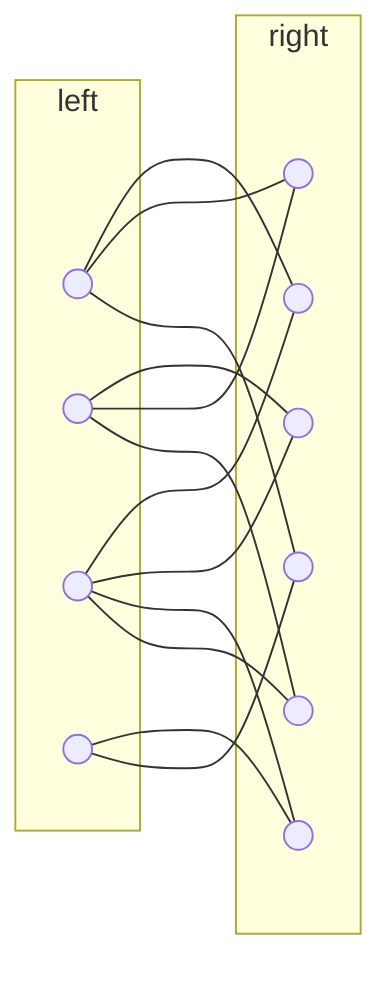

<!-- toc -->

# Polynomial Commitments

In the previous lecture, we have seen some polynomial commitment schemes based on pairings and discrete-log.

In this lecture, we will look at polynomial commitment schemes based on error-correcting codes. They are quite an awesome tool because:

- they are plausibly post-quantum secure (recall that d-log is not)
- no group exponentiations; instead, prover only uses hashes, additions and multiplications
- small global parameters

Nevertheless, there are some drawbacks too:

- large proof size
- not homomorphic & hard to aggregate

# Background: Error-correcting Code

An error-correcting code **encodes** a **message** of length $k$ into a **codeword** of length $n$, where $n > k$. The minimum distance ([Hamming](https://en.wikipedia.org/wiki/Hamming_distance)) between any two codewords is shown as $\Delta$. These parameters are important, and we may refer to an error-correcting code as:

> $[n, k, \Delta]$ code

## Example: Repetitions Code

Imagine messages of 2 bits and codewords of 6 bits, where the encoding is to repeat each bit 3 times.

```go
enc(00) = 000000
enc(01) = 000111
enc(10) = 111000
enc(11) = 111111
```

Note that the minimum distance between any two codewords is 3. So our parameters are $n=2, k=6, \Delta=3$. This code can correct 1 error during the transmission, for example:

```go
dec(010111) = 01
// 010 should be 000
```

As shown above, encoding is usually shown as `enc` and decoding is usually shown as `dec`. In our poly-commit schemes, we won't actually be using the decoding function at all, so we don't have to care about efficient decoders!

## Rate & Relative Distance

Given the $[n, k, \Delta]$ code, we define:

- **rate** as $k/n$
- **relative distance** as $\Delta/n$

We want both of these to be as high as possible, but generally there is a trade-off between them.

## Linear Code

For linear codes, the condition is that "any linear combination of codewords is also a codeword". The results of this condition are:

- the **encoding** can always be represented as a vector-matrix multiplication between the message and the generator matrix
- **minimum distance** $\Delta$ is the same as the codeword with the minimum number of non-zeros (weight)

## Reed-Solomon Code

Reed-Solomon is a widely used error-correcting code.

- the message is viewed as a unique degree $k-1$ univariate polynomial
- the codeword is the evaluation of this polynomial at $n$ publicly known points
  - for example, $(\omega, \omega^2, \ldots, \omega^n)$ for $n$-th root of unity $\omega^n \equiv 1 \pmod{p}$
- distance is $\Delta = n - k + 1$ which is very good
  - this is because a degree $k-1$ polynomial has at most $k-1$ roots
  - since the codeword is $n$ evaluations, we subtract the number of roots from this to get the minimum number of non-zeros
- encoding time is $\mathcal{O}(n\log n)$ using the FFT (Fast-Fourier Transform)

For $n = 2k$, the rate is $1/2$ and relative distance is $1/2$ which turns out to be the best you can get!

# Polynomial as a 2D Matrix

To begin constructing our poly-commit scheme, we will first take a different approach on representing our polynomial. Remember that there was a "coefficient representation" where we simply stored the list of coefficients as a vector. Now, we will use a matrix to do that.

Suppose you have a polynomial of degree $d$ where $d$ is a perfect square:

$$
f(x) = \sum_{i = 1}^{\sqrt{d}}\sum_{j = 1}^{\sqrt{d}}f_{i, j} u^{i - 1 + (j-1)\sqrt{d}}
$$

The coefficients of this polynomial can be represented by the following matrix:

$$
\begin{pmatrix}
f_{1, 1} & f_{1, 2} & \ldots & f_{1, \sqrt{d}} \\
f_{2, 1} & f_{2, 2} & \ldots & f_{2, \sqrt{d}} \\
\vdots& \vdots & \ddots & \vdots \\
f_{\sqrt{d}, 1} & f_{\sqrt{d}, 2} & \ldots & f_{\sqrt{d}, \sqrt{d}} \\
\end{pmatrix}
$$

Evaluation of this polynomial at some point $u$ can then be shown as some matrix-vector multiplication:

$$
f(u) = [1, u, u^2, \ldots, u^{\sqrt{d}-1}]

\times

\begin{pmatrix}
f_{1, 1} & f_{1, 2} & \ldots & f_{1, \sqrt{d}} \\
f_{2, 1} & f_{2, 2} & \ldots & f_{2, \sqrt{d}} \\
\vdots& \vdots & \ddots & \vdots \\
f_{\sqrt{d}, 1} & f_{\sqrt{d}, 2} & \ldots & f_{\sqrt{d}, \sqrt{d}} \\
\end{pmatrix}

\times

\begin{bmatrix}
1 \\
u^{\sqrt{d}} \\
u^{2\sqrt{d}} \\
\vdots \\
u^{d - \sqrt{d}}
\end{bmatrix}
$$

With this, we will be able to reduce a polynomial commitment of proof size $\sqrt{d}$ to an argument for vector-matrix product into as shown below:

$$
[1, u, u^2, \ldots, u^{\sqrt{d}-1}]

\times

\begin{pmatrix}
f_{1, 1} & f_{1, 2} & \ldots & f_{1, \sqrt{d}} \\
f_{2, 1} & f_{2, 2} & \ldots & f_{2, \sqrt{d}} \\
\vdots& \vdots & \ddots & \vdots \\
f_{\sqrt{d}, 1} & f_{\sqrt{d}, 2} & \ldots & f_{\sqrt{d}, \sqrt{d}} \\
\end{pmatrix} = \underbrace{[\ldots]}_{\sqrt{d}}
$$

The prover could send this resulting vector to the verifier, and the verifier could continue with the next multiplication (shown above) which is a column vector made of $u$ which the user knows. This way, a size $\sqrt{d}$ commitment is used to commit to a polynomial of degree $d$.

The verifier also knows the vector on the left side, as it is also made of $u$. The problem here is to somehow convince the verifier that the prover has used the correct coefficients in the 2D matrix. For this, the prover does the following:

1. Transform the $\sqrt{d} \times \sqrt{d}$ matrix into a $\sqrt{d} \times n$ matrix, where each **row** of length $\sqrt{d}$ is encoded into a **codeword** of length $n$ using a linear code.
2. Then, the resulting $\sqrt{d} \times n$ matrix is committed using a **Merkle Tree**, where each **column** is a **leaf**.
3. The **public parameter** is just made of the decided Hash function to be used in Merkle Tree, there is no trusted setup required!

So in summary, rows → codewords, and then columns → Merkle Tree leaves. The Merkle Root of this tree becomes the commitment.

With that said, the entire algorithm can be split into two steps:

1. **Proximity Test/Check**: Test if the committed matrix indeed consists of $\sqrt{d}$ codewords, encoded from the original rows.
   1. The verifier can learn the number of columns by looking at the path in Merkle Tree
   2. but it can't know if the rows are indeed codewords that belong to the original matrix rows
2. **Consistency Test/Check**: Test if the result of the vector-matrix multiplication is indeed what is claimed to be by the prover.

We will go into detail of each step.

## Step 1: Proximity Test

For the proximity test, the Verifier sends a random vector $\vec{r} = [r_1, r_2, \ldots, r_{\sqrt{d}}]$ (size $\sqrt{d}$). Then, the prover multiplies the vector with the matrix (size $\sqrt{d} \times n$) to obtain another vector of size $n$. Afterwards, the verifier asks to reveal several columns of this matrix, and the prover reveals them.

With that, the verifier checks the following:

- **The resulting vector is a codeword**, which should be true because any linear combination of codewords is a codeword.
- **Columns are as committed in the Merkle Tree.**
- **Inner product between $\vec{r}$ and each column is consistent**. This is done simply by looking at the corresponding elements in the size $n$ vector.

If all these are correct, then the proximity test is passed with overwhelming probability.

### Soundness (Intuition)

So why is this secure? Let us tackle each point one by one:

- If an adversarial prover tries to use a different matrix, by the linear property of codewords, the resulting vector will NOT be a codeword. The first check ensures this.
- The second check ensures that columns are as committted.
- By the first check, the prover has to use the correct matrix, but it can still send a different result vector (one that is still a codeword). In that case, due to the distance property, this new vector must have some elements that are different than the original vector. Reed-Solomon has distance 1/2, so the new vector is different at around half of the points! The second check ensured the columns to be correct, so the prover's fake vector will most likely fail the third check because at least half of the points are different!

### Soundness (Formal)

Things are a bit more complex formally. A new parameter $e$ is introduced. For $e < \Delta/4$, if the committed matrix $C$ is $e$-far from any codeword (meaning that the minimum distance of all rows to any codeword in the linear code is at least $e$), then:

$$
\Pr[w = r^TC \text{ is } e \text{ close to any codeword}] \leq \frac{e+1}{\mathbb{F}}
$$

So, if $w=r^TC$ is $e$-far from any codeword then finally:

$$
\Pr[\text{Check } 3 \text{ passes for } t \text{ random columns}] \leq \left(1 - \frac{e}{n}\right)^t
$$

### Discovery

This test was discovered independently by the two papers:

- Ligero [[Ames-Hazai-Ishai-Venkitasubramaniam'17]](https://acmccs.github.io/papers/p2087-amesA.pdf) called this the "Interleaved Test". They were using Reed-Solomon code.
- [[Bootle-Cerulli-Ghadafi-Groth-Hajiabadi-Jakobsen'17]](https://eprint.iacr.org/2017/872) introduced "Ideal Linear Commitment Model" and they also introduced a new encoding scheme called "Linear-time Encodable Code". This was the first SNARK with linear prover time!

Both of these constructions were targeted to general-purpose SNARKs!

### Optimization

The prover can actually send a message $m$ instead of the size $n$ result vector, such that the encoding of $m$ is equal to the codeword that is the resulting vector! This is good because:

- the message (size $\sqrt{d}$) is smaller than the vector (size $n$)
- check 1 is implicitly passed, because the resulting vector is literally the encoding of $m$
- furthermore, a very cool property is that the message is actually equal to $\vec{r}$ multiplied by the original coefficient matrix!

## Step 2: Consistency Test

The algorithm for consistency test is almost the same as the optimized proximity test. The prover sends a message $m$, which is the multiplication of $\vec{u}$ (that is $f(u)$) with the coefficient matrix $C$. Then, the verifier finds the encoding of this message.

Columns are ensured to be the committed ones, because we have already made that check in the proximity test. Furthermore, using the same randomly picked columns (corresponding to elements in the codeword) the verifier will check whether the multiplication is consistent.

In short:

- **The resulting vector is a codeword**, true because vector was created from the encoding of $m$
- **Columns are as committed in the Merkle Tree**, true because this was done in the previous test.
- **Inner product between $\vec{u}$ and each column is consistent**, which is checked using the same randomly picked columns (for efficiency).

### Soundness (Intuition)

By the proximity test, the committed matrix $C$ is close to a codeword. Furthermore, there exists an efficient extractor that extracts $F$ by Merkle Tree commitment, and then decoding that to find $C$ such that $\vec{u} \times F = m$ with overwhelming probability.

# Polynomial Commitment based on Linear Code

Let us now describe the polynomial commitment scheme that makes us of linear codes (with constant relative distance).

- **Keygen**: Sample a hash function
  - Hash functions are public, so this is a **transparent setup**!
  - $\mathcal{O}(1)$ complexity, yummy.
- **Commit**: Encode the coefficient matrix of $f$ row-wise with a linear code, and commit to it using Merkle Tree
  - Encoding takes $\mathcal{O}(d \log d)$ field operations using Reed-Solomon code, or $\mathcal{O}(d)$ using linear code
  - Merkle Tree commitment takes $O(d)$ hashes, but commitment size is $\mathcal{O}(1)$
- **Eval & Verify**: You are given $m = \vec{u} \times F$, encode $m$ and do the proximity & consistency tests, then find $f(u) = \langle m, \vec{u}'\rangle$
  - Eval takes $O(d)$ field operations
  - Can be made non-interactive using Fiat-Shamir

This method has proof size $\mathcal{O}(\sqrt{d})$ and verifier time $\mathcal{O}(\sqrt{d})$

## In Practice

[[Bootle-Chiesa-Groth'20]](https://eprint.iacr.org/2020/1426.pdf) dives into tensor query IOP, and they generalize the method to multiple dimensions with proof size $\mathcal{O}(d^\epsilon)$ for some constant $\epsilon < 1$.

Brakedown [[Golovnev-Lee-Setty-Thaler-Wahby'21]](https://eprint.iacr.org/2021/1043) using tensor query IOP, made some evaluations using linear code for some polynomial of degree $d=2^{25}$

- **Commit time**: 36s
- **Eval time**: 3.2s
- **Proof size**: 49MB (ouch…)
- **Verifier time**: 0.7s

They have also show that you can prove knowledge soundness without an efficient decoder. This is huge because normally an extractor would use the decoder to do the extraction, which was a problem if decoder was not efficient.

[[Bootle-Chiesa-Liu'21]](https://eprint.iacr.org/2020/1527.pdf) reduces the proof size to $\mathcal{O}(\text{polylog}(d))$ using proof composition of tensor IOP and PCP of proximity [[Mie'09]](https://link.springer.com/article/10.1007/s10472-009-9169-y)

Orion [[Xie-Zhang-Song'22]](https://eprint.iacr.org/2022/1010.pdf) achieves a proof size of $\mathcal{O}(\log^2{d})$ using proof composition of the code-switching technique [[RonZewi-Rothblum'20]](https://eprint.iacr.org/2019/1062)

Looking at SNARKs with linear prover time in order:

| Paper                                                                                    | Proof Size                       | Methodology                      |
| ---------------------------------------------------------------------------------------- | -------------------------------- | -------------------------------- |
| [[Bootle-Cerulli-Ghadafi-Groth-Hajiabadi-Jakobsen'17]](https://eprint.iacr.org/2017/872) | $O(d)$                           | Ideal Linear Model               |
| [[Bootle-Chiesa-Groth'20]](https://eprint.iacr.org/2020/1426.pdf)                        | $\mathcal{O}(d^\epsilon)$        | Tensor IOP                       |
| [[Bootle-Chiesa-Liu'21]](https://eprint.iacr.org/2020/1527.pdf)                          | $\mathcal{O}(\text{polylog}(d))$ | Tensor IOP + PCP                 |
| [[Golovnev-Lee-Setty-Thaler-Wahby'21]](https://eprint.iacr.org/2021/1043)                | $\mathcal{O}(d^\epsilon)$        | Polynomial Commitment            |
| [[Xie-Zhang-Song'22]](https://eprint.iacr.org/2022/1010.pdf)                             | $\mathcal{O}(\log^2{d})$         | Code-switching Proof Composition |

# Background: Linear-time Encodable Code

A linear code was introduced for binary messages back then in [[Spielman'96]](https://www.cs.yale.edu/homes/spielman/Research/ITsuperc.pdf), and then generalized to finite field elements by [[Druk-Ishai'14]](https://dl.acm.org/doi/10.1145/2554797.2554815). The construction uses what is called "expander graphs".

## Expander Graphs

Below is an example Bipartite graph, a graph that can be split in two parts (A, B here) such that no vertex within that sub-graph are connected. Furthermore, in this example each vertex on the left side is connected to 2 nodes in the right side, and each vertex on right is connected to 3 nodes on left.



You can think of larger **bipartite expander graphs**. The trick of using an expander as a linear code is: let each vertex in the left correspond to symbols of the message $m$, and let the right side correspond to symbols of the codeword!

Each symbol in the codeword is simply the sum of the connected symbols in message. This relationship can be easily captured as the multiplication of the message $m$ with the adjacency matrix of the expander graph.

That sounded really good, but sadly it is not sufficient; it fails on the "constant relative distance" requirement. Take a message with a single non-zero for example, the codeword must look the same for all such messages. Obviously, this is not the case here, because codewords symbols change depending on which symbol of the message is non-zero.

## Lossless Expander Graph

Let $|L|$ be the number of vertices in the left graph, and set $|R|$ to be $\alpha|L|$ for some constant $\alpha$. In the example above, $\alpha$ is larger than 1 because right has more nodes than left, but in practice we actually have $0 < \alpha < 1$. Let $g$ be the number of edges per node in the left side, e.g. $g=3$ for the example above.

What is the maximum possible expansion of a subset $S$ in the left side? Well, it is simply $g|S|$. We let $\Gamma$ denote the set of neighbors for a set, i.e. $|\Gamma(S)| = g|S|$. However, this is not true for all subsets, you must have enough nodes on the right side for that, which can be defined by the constraint:

$$
|S| \leq \frac{\alpha|L|}{g}
$$

Turns out this is too good to be true! So in practice, we use a more relaxed definition. We let the maximum expansion $|\Gamma(S)| \geq (1 - \beta)g|S|$ with the constraint:

$$
|S| \leq \frac{\delta|L|}{g}
$$

for some $\delta$. Note that the previous "too good to be true" definition uses $\beta=0$ and $\delta = \alpha$. The smaller $\beta$ you have the less-relaxed this thing is.

## Recursive Encoding

Lossless expander itself is not enough, we will do the encoding recursively. In this case, we will start with a message $m$ of length $k=|m|$. We will obtain a codeword of size $4k$.

For now, assume that we already have an encoder with rate 1/4.

```mermaid
flowchart
	m[message len=k]
	e[code len=k/2]

	subgraph codeword len=4k
	mc[message len=k]
	c1[code1 len=2k]
	c2[code2 len=k]
	end

	m --copy---> mc
	m --lossless expand--> e
	e --encode--> c1
	c1 --lossless expand--> c2

```

As shown above, the codeword has 3 parts:

- The message itself, length $k$. This is a common approach in error correcting codes, and such codes with message being the start of the codeword are called "systematic code".
- Then, the message will be encoded using a lossless expander with $\alpha = 1/2$. The resulting code has size $k/2$. This result is then encoded using an existing (assumed) encoder of rate $1/4$. The resulting codeword has length $4 \times (k/2) = 2k$. Denote this as $c_1$, this guy will be the middle part of our actual codeword.
- Finally, use a lossless expander with $\alpha = 1/2$ to encode $c_1$ and obtain $c_2$ of length $k$. This is the final part of the codeword.

$$
\text{codeword} = m || c_1 || c_2
$$

Now, about that "assumed" encoder, how do we implement it? Well, notice that the input to that encoder is of length $k/2$. We can actually use this entire algorithm as that encoder, this time the message being of length $k/2$ instead of $k$. This is why the name "recursive" is used. Once you get to a certain constant size, just use any code with good distance (e.g. Reed-Solomon) to do the encoding job.

Also note that we use two lossless expanders with $\alpha = 1/2$, but they are not the same! This is because their input sizes ($|L|$) are different.

### Sampling the Lossless Expander

As we can see, we need lossless expanders for these recursions, so we must be able to sample them efficiently. Are there any methods to do so?

[[Capalbo-Reingold-Vadhan-Widgerson'02]](https://dash.harvard.edu/handle/1/3330492) shows an explicit construction of lossless expander, but they require a large hidden constant that is hard to find in the first place. Alternatively, one can argue that sampling a random graph has a $1/\text{poly}(n)$ probability of failing to find a lossless expander.

### Improvements

Brakedown [[Golovnev-Lee-Setty-Thaler-Wahby'21]](https://eprint.iacr.org/2021/1043) assigns random weights to the edges in the graph, and they show that the resulting random summations leads to better distance metrics.

Orion [[Xie-Zhang-Song'22]](https://eprint.iacr.org/2022/1010.pdf) shows a way to do the lossless expander testing with a negligible probability (instead of $1/\text{poly}(n)$) which is awesome, because you can then do rejection sampling to efficiently find a good lossless expander! They do this by looking at the maximum density in a graph.

## Summary

Polynomial commitment (and SNARK) based on linear code has the following properties:

- 🟢 Transparent setup, $\mathcal{O}(1)$
- 🟢 Commit and Prover times are $\mathcal{O}(d)$ field operations
- 🟢 Plausibly post-quantum secure
- 🟢 Field agnostic
- 🔴 Proof size $\mathcal{O}(\sqrt{d})$, order of MBs in practice

That is the end of this lecture!
