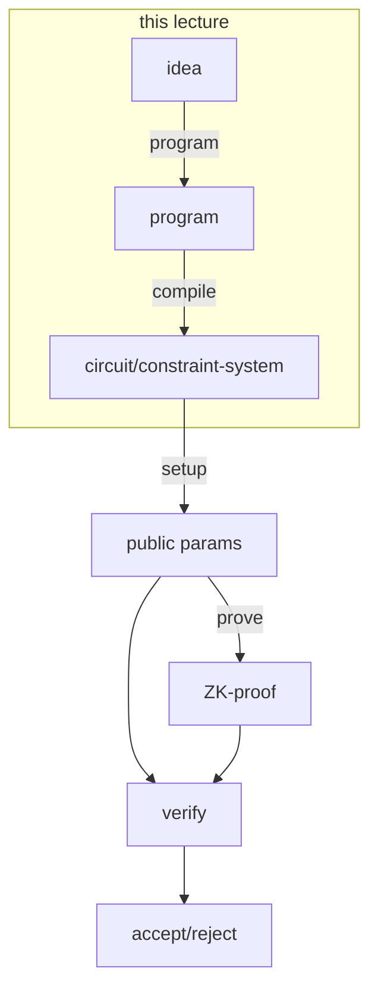

[(video 1)](https://www.youtube.com/watch?v=kho-vcQGa0c) [(video 2)](https://www.youtube.com/watch?v=guQoS2xSksI) [(video 3)](https://www.youtube.com/watch?v=zsDeoXx-miE) [(codes)](https://github.com/rdi-berkeley/zkp-course-lecture3-code)

Suppose you have an idea for an application & you want to use ZK in it. What do you do?



In this lecture, we will be doing the following:

1. Have a big picture on ZKP programmability
2. **Example**: Use an HDL (hardware-description language), such as Circom
3. **Example**: Use a library, such as Arkworks
4. **Example**: Use a programming language & compiler, such as ZoKrates
5. Overview of prominent ZKP toolchains

# Recap: ZKP for a predicate $\phi$

Let us remember what ZKP does. Suppose you have a predicate $\phi$, with some public inputs $x$ and private inputs (witness) $w$. For example, $\phi =$ I know a $w$ such that $x = \text{SHA256}(w)$.

- Prover has access to $\phi, x, w$.
- Verifier has access to $\phi, x$.
- Proof $\pi$ will prove that $\phi(x, w)$ holds, without revealing $w$.

However, the key question here is: what could $\phi$ be? What are some other examples? In theory, $\phi$ can be any NP problem statement.

- $w$ is factorization of integer $x$
- $w$ is the private key that corresponds to some public key $x$
- $w$ is the credential for account $x$
- $w$ is a valid transaction

However, transferring these statements into the programming side of things are a bit different.

# Arithmetic Circuits

In practice, $\phi$ may be an "arithmetic circuit" over inputs $x$ and $w$.

Think of Boolean Circuits that you see in electronic classes or circuit design classes, perhaps you have taken one during your undergrad studies. Well, we had AND gates, OR gates, NAND gates and such there, where the operations were happening on 1s and 0s.

In an Arithmetic Circuit, the operations happen on elements that belong to a finite field of order $p$, shown as $\mathbb{Z}_p$. Usually, $p$ is a large prime number (e.g. ~255 bits). Essentially, an Arithmetic Circuit can be represented by polynomials, for example we could have:

- $w_0 \times w_0 \times w_0 = x$
- $w_1 \times w_1 = x$

However, there is a much more nice way of thinking about circuits: treat them as a **DAG** (Directed Acyclic Graph)! In this DAG:

- **Nodes** (or **Vertices**) are inputs, gates, and constants.
- **Edges** are wires/connections.

Here is the circuit for the two polynomials above, visualized as a DAG:

```mermaid
flowchart LR
	w0((w_0)) --> x1[x]
	w0 --> x1[x]
	x1 --> x2[x]
	w0 --> x2[x]
	w1((w_1)) --> x3[x]
	w1 --> x3[x]
	x --> =2
	x2 --> =1[=]
	x((x)) --> =1
	x3 --> =2[=]
```

## Rank-1 Constraint System (R1CS)

R1CS is a format for ZKP Arithmetic Circuit (AC). It is a very commonly used format. Here is how it is defined:

- $x$ is a set of field elements $x_1, x_2, \ldots, x_l$.
- $w$ is a set of field elements $w_1, w_2, \ldots, w_{m-l-1}$
- $\phi$ is made up of $n$ equations with the form $\alpha \times \beta = \gamma$ where $\alpha, \beta, \gamma$ are _affine combinations_ of variables mentioned in the above bullet points.

Let's see some examples of $\alpha \times \beta = \gamma$.

- $w_2 \times (w_3 - w_2 - 1) = x_1$ is okay.
- $w_2 \times w_2 = w_2$ is okay.
- $w_2 \times w_2 \times w_2 = x_1$ is NOT okay! You can't have two multiplications like that here! So, what can we do? We could capture this operation with the help of an extra variable, let's say $w_4$:
  - $w_2 \times w_2 = w_4$ is okay.
  - $w_2 \times w_4 = x_1$ is okay, and these two together capture the equation above.

## Matrix Definition of R1CS

There is another way of looking at R1CS, using matrices. This time, we define as follows:

- $x \in \mathbb{Z}_p^l$ is a vector of $l$ field elements.
- $w \in \mathbb{Z}_p^{m-l-1}$ is a vector of $m-l-1$ field elements.
- $\phi$ is made up of 3 matrices: $A, B, C \in \mathbb{Z}_p^{n\times m}$

Now, we define a vector $z = (1 || x || w) \in \mathbb{Z}_p^m$ which has $m$ elements. The rule for this system is that the following equation must hold:

$$
Az \circ Bz = Cz
$$

Here, $\circ$ means the element-wise product of these.

```json
┌───────┐┌┐   ┌───────┐┌┐   ┌───────┐┌┐
|.......||| o |.......||| = |.......||| //--> every row here corresponds to
|   A   |└┘   |   B   |└┘   |   C   |└┘ // some rank-1 constraint!
|       |     |       |     |       |
└───────┘     └───────┘     └───────┘
```

## Example: Writing R1CS of an AC

Consider the following AC:

```mermaid
flowchart LR
	w0((w_0)) --> m1[x]
	w1((w_1)) --> m1
	w1 --> m2
	x0((x_0)) --> a1
	m1 --w_2--> a1[+]
	x0 --> m2[x]
	a1 --w_3--> =
	m2 --w_4--> =
```

Here, we have a public input $x_0$ and two secret inputs (witnesses) $w_0, w_1$. The first thing we have to do is capture the intermediate outputs, and we do that by assigning them secret input variables; in this case these would be $w_2, w_3, w_4$. Then, we simply write equations in the form $\alpha \times \beta = \gamma$ as discussed before, as one equation per gate!

- $w_0 \times w_1 = w_2$
- $w_3 = w_2 + x_0$ (notice that left side is actually $w_3 \times 1$)
- $w_1 \times x_0 = w_4$
- $w_3 = w_4$

As simple as that.

# Tutorial: Circom - Using a HDL for R1Cs

First thing to note is that Circom is NOT a Programming Language (PL), it is a Hardware Description Language (HDL).

|         | Programming Language                       | Hardware Description Language        |
| ------- | ------------------------------------------ | ------------------------------------ |
| Objects | Variables, Operations, Program & Functions | Wires, Gates, Circuit & Sub-circuits |
| Actions | Mutate variables, Call functions           | Connect wires, Create sub-circuits   |

There are some known HDLs for Digital Circuits:

- Verilog
- SystemVerilog
- VHDL
- Chisel

Circom is not an HDL for digital circuits, it is an HDL for R1CS. Wires make the R1CS variables and gates make the R1CS constraints. In essence, Circom does 2 things:

1. Sets variable values
2. Creates R1CS constraints

## Example: $z = x \times y$

Let's go over a basic example:

```ts
template Multiply(){
  signal input x; // private, unless explicitly stated public
  signal input y; // private, unless explicitly stated public
  signal output z; // output is always public

  z <-- x * y;
	z === x * y;
  // z <== x * y; would work too
}

// to start execution, a main component is required
// multiple mains can't exist in a code!
component main {public [x]} = Multiply();
//                      ^ explicitly state x to be public!
```

Let's analyze what is happening here:

- A `template` is just a circuit (or a sub-circuit if imported by some other)
- A `signal` is a wire, can be `input`, `output` or just some intermediate variable.
- `<--` operation sets signal values.
- `===` creates a constraint, which must be Rank-1. So, one side is linear and other is quadratic. You can't do things like `x * x * x` because $x^3$ is not quadratic.
- As a shorthand, `<==` does both at once in a single line instead of two lines.
- You can also have `-->` and `==>` which work in a similar way.

## Example: $y = f^n(x)$ where $f(x) = x^2$

Now a bit more complicated example.

```ts
template RepeatedSquaring(n){
  signal input x;  // private, unless explicitly stated public
  signal output y; // output is always public

  // intermediate signals
  signal xs[n+1];

	xs[0] <== x;
	for (var i = 0; i < n; i++) {
	  xs[i+1] <== xs[i] * xs[i];
	}
	y <== xs[n];
}

// provide template value n = 1000
component main {public [x]} = RepeatedSquaring(1000);
//                      ^ explicitly state x to be public!
```

Circom has very nice capabilities as demonstrated here!

- You can have template arguments such as `n` here, that you hard-code when you are instantiating the component.
- You can have arrays of signals.
- You can have variables (defined with `var`). These are different from signals, they are mutable & are evaluated at compile time.
- You can have loops, such as the good ol' `for` loop.
- You can also have `if` - `else` statements.
- You can access index `i` in an array with `arr[i]`.

## Example: Non-zero & Zero

```ts
template NonZero(n){
	signal input in;
	signal inverse;

	inverse <-- 1 / n; // not ok with R1CS
	1 === in * inverse; // is ok with R1CS
}

template IsZero() {
	signal input a;
	signal input b;

	component nz = NonZero();

	// check a is non-zero
	nz.in <== a;

	// b must be 0 for this to hold
	0 == a * b;

	// you could have done this much simpler as:
	// 0 === b;
	// but hey, this is an educational example! :)
}

component main {public [a, b]} = IsZero();
```

Here, `NonZero` is a sub-circuit used by `IsZero`. Within `NonZero`, we are checking if some input is not 0. However, constraints only check for equality, we don't have something like `a !=== b`. To check if something is non-zero, we can check if it has an inverse!

To do that, we do `inverse <-- 1 / n` but hey, this isn't R1! Is that a problem? Well, `<--` is just an assignment operator, not a constraint! So, we can do such a thing here; in fact, signal assignment without constraints are a lot more capable than constrainted assignments. The constraints itself is in the next line: `1 === in * signal`, which is R1.

Also notice that `IsZero` uses `NonZero` within, and it does that by instantiating the sub-circuit as `nz`. You can access the signals in a circuit with `.` operator, such as `nz.in`.

## Example: Sudoku Solution

This one is a rather large example, with quite a lot of code too. I will just take notes of the circuit, for the code itself please go to [https://github.com/rdi-berkeley/zkp-course-lecture3-code/tree/main/circom](https://github.com/rdi-berkeley/zkp-course-lecture3-code/tree/main/circom).

We would like to prove that we know the solution to a sudoku puzzle.

- The public input $x$ will be the initial setting of the sudoku board, with 0 for empty cells and some integer $1 \leq i \leq 9$ for non-empty cells.
- The private input $w$ (witness) will be our solution, again as an array of numbers.
- Our predicate $\phi$ is that we know the solution to the given Sudoku setting in the public input.

The inputs will be given as 2-dimensional arrays of size $n \times n$. We should really like to write a generic template circuit that takes the board size $n$ as template argument.

For now, let's do an example for $n=9$. What will be our constraints though? Let's list them one by one:

- The solution input should be composed of numbers in range $[1, 9]$.
- The solution input should have rows where every numbers occurs only once.
- The solution input should have columns where every numbers occurs only once.
- The solution input should have $3\times3$ groups of cells (as in Sudoku) where every number occurs once in each group.

Here is the circuit, along with it's sub-circuits.

```ts
// Assert that two elements are not equal.
// Done via the check if in0 - in1 is non-zero.
template NonEqual() {
	signal input in0;
  signal input in1;

  // do the inverse trick to check for zero
  signal inverse;
	inverse <-- 1 / (in0 - in1);
	1 === (in0 - in1) * inverse;
}

// Assert that all given values are unique
template Distinct(n) {
  signal input in[n];

  // create a non-equal component for each pair
  component neq[n][n];
  for (var i = 0; i < n; i++) {
		for (var j = 0; j < i; j++) {
			neq[i][j] = NonEqual();
			neq[i][j].in0 <== in[i];
			neq[i][j].in1 <== in[j];
		}
	}
}

// Assert that a given number can be represented in n-bits
// Meaning that it is in range [0, 2^n).
template Bits(n) {
	signal input in;

	signal bits[n];
	var bitsum = 0;
  for (var i = 0; i < n; i++) {
		bits[i] <-- (in >> i) & 1;
    bits[i] * (bits[i] - 1) === 0; // ensure bit is binary
    bitsum += bitsum + 2 ** i * bits[i];
	}
  bitsum == in;
}

// Check if a given signal is in range [1, 9]
// TODO: can we find a generic version for this?
template OneToNine() {
  signal input in;
  component lowerbound = Bits(4);
  component upperbound = Bits(4);
  lowerbound.in <== i - 1; // will work only if i >= 1
  upperbound.in <== i + 6; // will work only if i <= 9
}

// Main circuit!
template Sudoku(n) {
  signal input solution[n][n];
  signal input puzzle[n][n];

	// first, let's make sure everything is in range [1, 9]
	component inRange[n][n];
  for (var i = 0; i < n; i++) {
		for (var j = 0; j < n; j++) {
			inRange[i][j] = OneToNine();
			inRange[i][j].in <== solution[i][j];
		}
	}

  // then, let's make sure the solution agrees with the puzzle
	// meaning that non-empty cells of the puzzle should equal to
  // the corresponding solution value
  // other values of the puzzle must be 0 (empty cell)
  for (var i = 0; i < n; i++) {
		for (var j = 0; j < n; j++) {
      // this is valid if puzzle[i][j] == 0, OR
			// puzzle[i][j] == solution[i][j]
			puzzle[i][j] * (puzzle[i][j] - solution[i][j]) === 0;
		}
	}

  // ensure all the values in a row are unique
  component distinctRow[n];
	for (var row = 0; row < n; row++) {
		distinctRow[row] = Distinct(9);
		for (var col = 0; col < n; col++) {
			distinctRow[row].in[col] <== solution[row][col];
		}
	}

	// ensure all the values in a column are unique
  component distinctColumn[n];
	for (var col = 0; col < n; col++) {
		distinctColumn[col] = Distinct(9);
		for (var row = 0; row < n; row++) {
			distinctColumn[col].in[row] <== solution[row][col];
		}
	}

  // ensure all the values in each 3x3 square is unique
  // TODO: will do later :D
}

// also TODO: make this generic, not just n = 9
component main{public[puzzle]} = Sudoku(9);

```

That is very cool, right?

So yea, Circom is great and it has direct control over constraints. However, using a custom language has it's own drawbacks. An alternative is to use an already known high-level language (e.g. Rust, Go) and have a library to help you write circuits in there.

# Tutorial: Arkworks - Using a Library

The most important object in a library will be the constraint system. This guy will keep state about R1CS constraints and variables, and we will interact with it while we write our "circuit".

The key operations here will be:

- Creating a variable

```rust
cs.add_var(p, v) -> id;
// cs: constraint system
// p:  visibility of variable
// v:  assigned value
// id: variable handle
```

- Creating a linear combination of variables

```rust
// make an empty linear combination at first
lc := cs.zero();
// now fill it with variables
lc.add(c, id) -> lc';
// id: variable handle from before
// c:  coefficient
// this correspod to the following linear combination:
//   lc' := lc + c * id
```

- Adding a constraint

```rust
// suppose you have some linear constraints lc_A, lc_B, lc_C
cs.constraint(lc_A, lc_B, lc_C)
// adds a constraint lc_A * lc_B = lc_C
```

These are pretty high-level, so let's take a look at a more realistic example.

```rust
fn and(cs: ConstraintSystem, a: Var, b: Var) -> Var {
  // do a simple bitwise AND on values
	let result = cs.new_witness_var(|| a.value() & b.value());
  // constraint: a * b = result, works like AND in booleans
  self.cs.enforce_constraint(
		lc!() + a,
		lc!() + b,
		lc!() + result,
	);
	result // return new result as Var
}
```

This is cool and all, but it has quite a bit of boilerplate, and seems very tedious & error-prone. So, we would really like a language abstraction somehow, making the library a lot more friendly.

Here is an example, where we can write the same code but apply it in a `Boolean` struct and overload the `and` operator.

```rust
struct Boolean { var: Var };

impl BitAnd for Boolean {
	fn and(self: Boolean, other: Boolean) -> Boolean {
	 // do the same code above...
		Boolean { var: result } // return result wrapped in Boolean
	}
}

// later in code, you can do stuff like this:
let a = Boolean::new_witness(|| true);
let b = Boolean::new_witness(|| false);
```

There are many different libraries:

- [libsnark](https://github.com/scipr-lab/libsnark): gadgetlib (C++)
- [arkworks](https://github.com/arkworks-rs): r1cs-std + crypto-primitives (Rust)
- [Snarky](https://github.com/o1-labs/snarky) (OCaml)
- [GNARK](https://github.com/ConsenSys/gnark) (Go)
- Bellman (Rust)
- PLONKish (Rust)

At this point in lecture, we have an Arkworks tutorial. Please see the lecture itself for that, I will be omitting this part.

# Tutorial: ZoKrates - Compiling Programs to Circuits

In the Circom example, we wrote the circuit ourselves. In the Arkworks example, we used a nice high-level language but still had to explicitly specify the wiring and constraints. What if we could have a programming language, that takes in a program and compiles it to R1CS with all it's wires and constraints?

Meet ZoKrates, a tool that does what we have just described.

```rust
type F = field;

def multiplication(public F x, private F[2] ys) {
	field y0 = y[0];
	field y1 = y[1];
  assert(x = y0 * y1);
}

def repeated_squaring<N>(field x) -> field {
	field[N] mut xs;
	xs[0] = x;
	for u32 i in 0..n {
		xs[i + 1] = xs[i] * xs[i];
	}
	return xs[N];
}

def main (public field x) -> field {
	repeated_squaring::<1000>(x);
}
```

ZoKrates has quite a bit of capabilities:

- Custom types via structs
- Variables that contain values during execution/proving
- Visibility is annotated (private/public)
- `assert` creates constraints
- Integer generics `<N>`
- Arrays & array accesses
- Variables, which are mutable unlike signals
- Fixed-length loops
- If-else statements

I am omitting the example from this page, please see the lecture for the code.

# Recap: The ZKP Toolchains

We have seen that there are generally 3 options:

- **HDL**: A language for describing circuit synthesis.
  - **pros**: clear constraint & elegant syntax
  - **cons**: hard to learn & limited abstraction
- **Library**: a library for describing circuit synthesis
  - **pros**: clear constraint & as expressive as it's host language
  - **cons**: need to know that language & few optimizations
- **PL + Compiler**: a language, compiled to a circuit
  - **pros**: easiest to learn & elegant syntax
  - **cons**: limited witness computation

|         | Is NOT standalone language | Is a standalone language |
| ------- | -------------------------- | ------------------------ |
| Circuit | Library (Arkworks)         | HDL (Circom)             |
| Program |                            | PL (ZoKrates)            |

Finally, note that all of these tools essentially output an R1CS, or more specific types of it like Plonk or AIR. So, within that process, all these tools share quite a bit of common techniques. With that in mind, a library to create ZKP languages actually exists: [Circ](https://github.com/circify/circ).

You can also check out [https://zkp.science/](https://zkp.science/) which has a great coverage of tools, as well as the development of ZK theory.
