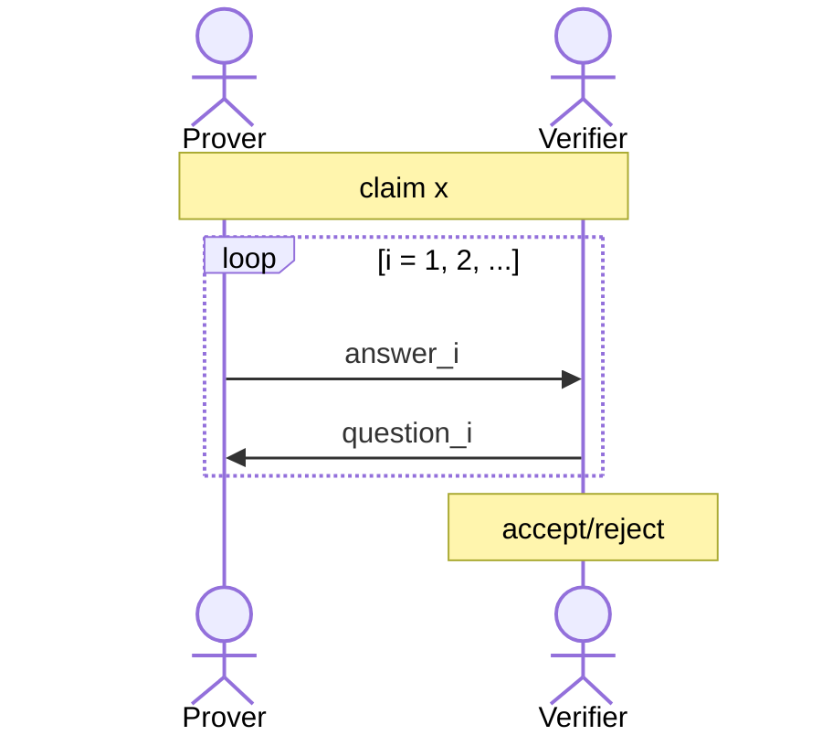
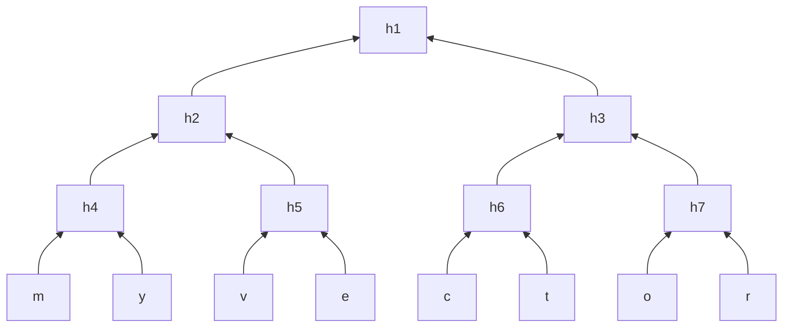
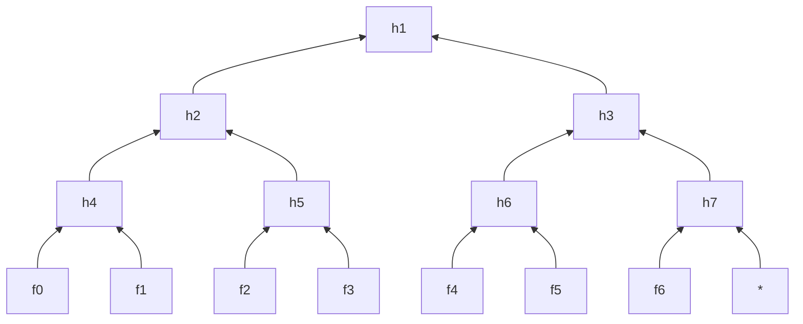
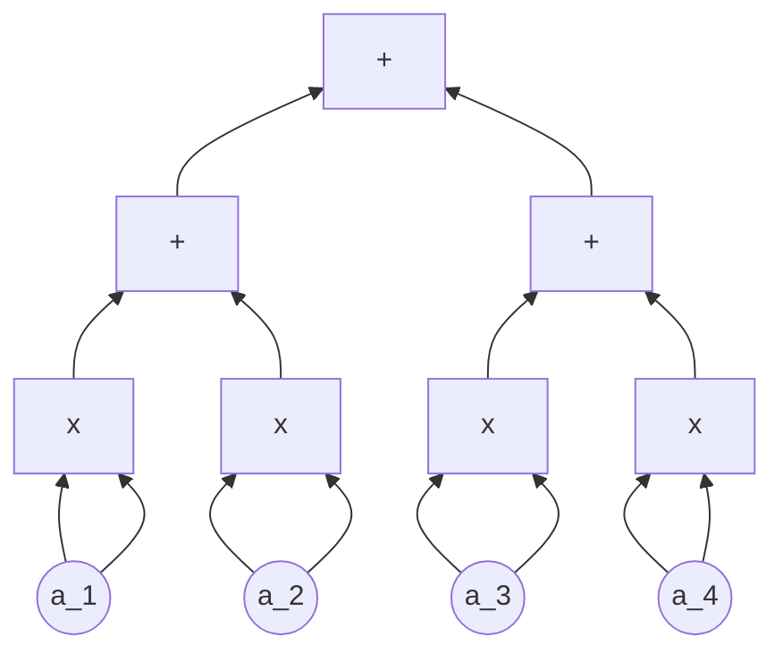
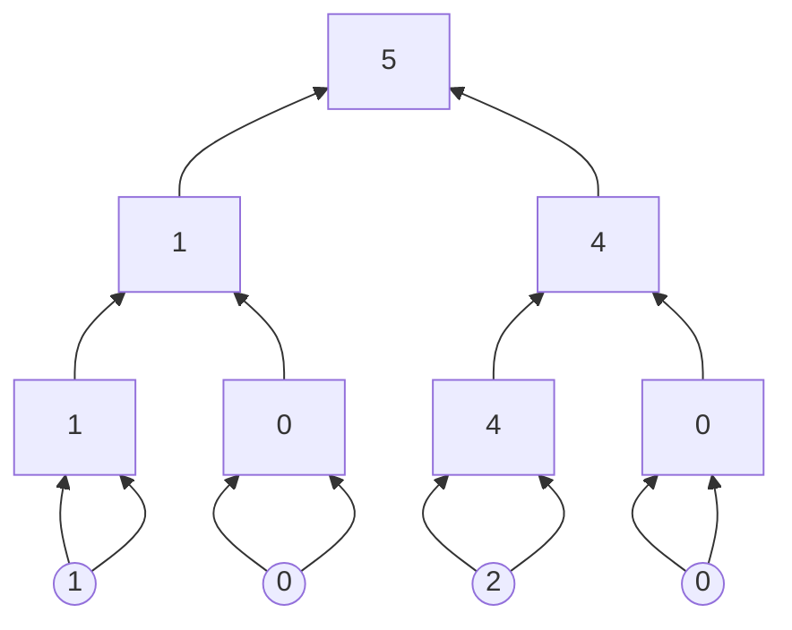

<!-- toc -->

# SNARKS via IPs

A SNARK stands for a _succinct_ proof that a certain statement is true. Succinct here is meaning that the proof is "short". For example, I have a statement:

- I know an $m$ such that $\text{SHA256}(m) = 0$.

In SNARK, the proof should be **short** and **fast** to verify. A trivial proof of the above statement is to simply send $m$ to the verifier. However, that proof is not short; it is as big as $m$. Verification is also not fast, as the verifier has to hash the entire message to actually see the proof.

A SNARK can have a proof size of few KBs and verification should take at most seconds.

# Interactive Proofs: Motivation & Model

First, we will see what Interactive Proofs (IP)s are and how they differ from a SNARK. Then, we will look at building a SNARK using the IPs.

In an interactive proof, there are two parties: a prover $P$ and a verifier $V$.

- $P$ solves a problem (has some claim), and tells the answer (proves the claim) to $V$.
- Then, they start to have a conversation. $P$'s goal is to convince $V$ that the answer is correct.

There are two requirements to this:

- **Completeness**: an honest $P$ can convince $V$ to accept.
- **(Statistical) Soundness**: If $P$ is dishonest, then $V$ will catch this with very high probability. In other words, it is negligibly probable that a dishonest $P$ can convince $V$.
  - Note that this must hold even if $P$ is computationally unbounded, and is actively trying to fool $V$.
  - If soundness holds only against polynomial-time $P$, then the protocol is actually called an **interactive argument**, not an interactive proof.

## Soundness vs. Knowledge Soundness

With that, we must make note on the different between "soundness" and "knowledge soundness". In a previous lecture by Prof. Boneh, we have talked about knowledge soundness in particular.

So, now let us think of a circuit satisfiability case. Let $C$ be some public arithmetic circuit

$$
C(x, w) \to \mathbb{F}
$$

where $x \in \mathbb{F}^n$ is some public statement and $w \in \mathbb{F}^m$ is some secret witness. Let us look at the types of "soundness" with this example:

- **Soundness**: $V$ accepts $\implies \exists w : C(x, w) = 0$
- **Knowledge soundness:** $V$ accepts $\implies P$ "knows" $\exists w : C(x, w) = 0$

As we can see, knowledge soundness is "stronger" than soundness, the prover MUST know the existing witness.

However, soundness itself can be valid in some cases even when knowledge soundness has no meaning. This is usually in cases where there is no "natural" witness. For example, $P$ can claim that the output of a program given by $V$ on the public input $x$ is 42. Well, witness is not used in the program, so there is really nothing to "know" here.

The vice-versa is true too, where knowledge soundness means something but you don't really care about soundness. This is usually in cases where the soundness is trivial. For example, $P$ knows the secret key to some Bitcoin account. Well, there does exist a private key to that account for sure. In a "sound" protocol, the verifier could just say "yep, can't argue with that" and accept, without breaking soundness itself.

- SNARK's that don't have knowledge soundness are called SNARGs, they are studied too!

## Public Verifiability

Interactive proofs and arguments only convince the party that is choosing/sending the random challenges, which is bad if there are many verifiers and prover must interact with each of them separately.

Thankfully, we have something called Fiat-Shamir Transform [[Fiat, Shamir'87]](https://link.springer.com/content/pdf/10.1007/3-540-47721-7_12.pdf), where a public-coin protocol (an IP where randomness is public) can be made **public & non-interactive**! The trick is to use a random oracle model (via a hash function in practice) to generate the required randomness on your own.

So, in summary:

| Interactive Proofs                                          | SNARKs                     |
| ----------------------------------------------------------- | -------------------------- |
| Interactive                                                 | Non-Interactive            |
| Information Theoretically Secure (aka Statistically Secure) | Computationally Secure (?) |
| Not necessarily Knowledge Sound                             | Knowledge Sound            |

# Trivial SNARK is not a SNARK

What is the trivial way to prove that you know some $w$ such that $C(x, w) = 0$? Well, you could just send $w$ right? This has two problems, both against the "succinctness" of a SNARK:

- $w$ could be large 🔴
- computing $C(x, w)$ could take a lot of time 🔴
- actually non-interactive when you think about it 🟢

## Slightly trivial SNARKs from Interactive Proofs (IPs)

Let us look at the trivial proof from an interactive proof perspective (making it slightly less trivial). Now, the prover will send $w$ to the verifier, and somehow convince that the sent $w$ satisfies $C(x, w) = 0$.

- w could still be large 🔴
- the verification is a lot faster, verifier is not computing $C(x, w)$ directly! 🟢
- interactive 🔴

Note that since $w$ is sent to the verifier, the supposedly secret witness is no more secret.

## Actual SNARKs!

What actually happens in a SNARK is that, instead of sending $w$ explicitly, the prover will cryptographically commit to $w$ and send that commitment. Again, an IP is used to convince that the committed $w$ satisfies $C(x, w) = 0$.

In doing so, the prover will reveal just enough about the committed $w$ to allow the verifier to run its checks in the interactive proof.

- commitment of $w$ is succinct 🟢
- verification is fast 🟢
- seems interactive, but can be made non-interactive using Fiat-Shamir transform. The trick there is to use a cryptographic hash function as a source of randomness 🟢

# Functional Commitment Schemes

We had talked about some very important functional commitment schemes:

- **Polynomial Commitments**: Committing to a univariate polynomial $f(X) \in \mathbb{F}_p^{(\leq d)}[X]$ where that fancy notation stands for the set of all univariate polynomials of degree at most $d$.
- **Multilinear Commitments**: Committing to a multilinear polynomial in $\mathbb{F}_p^{(\leq 1)}[X_1, \ldots, X_k]$ which is the set of all the multilinear polynomials in at most $k$ variables, each variable with degree at most 1. Here is an example multilinear polynomial: $f(x_1, \ldots, x_7) = x_1x_3 + x_1x_4x_5 + x_7$.
- **Vector Commitments**: Committing to a vector $\vec{u} = (u_1, \ldots, u_d) \in \mathbb{F}^d_p$ which is a vector of $d$ elements. With our commitment, we would like to be able to open any cell at a later time, such that $f_{\vec{u}}(i) = u_i$. Merkle Tree is an example of vector commitment scheme.

## Merkle Tree

Merkle Tree is a very famous vector commitment scheme, and we will look a bit deeper to that. Here is a vector commitment to the vector `[m, y, v, e, c, t, o, r]`.

In this binary tree, every node is made up of the hash of its children:

- $h_1 = H(h_2, h_3)$
- $h_2 = H(h_4, h_5)$
- and so on…

The leaf nodes are the elements of the committed vector, `m`, `y`, `v`, and such. The root $h_1$ is the **commitment** to this vector!

When the prover is asked to show that indeed some element of the vector exists at some position, it will provide only the necessary nodes. For example, a verifier could ask "is there really a `t` at position 6?". The prover will give: `c`, `t`, $h_7$ and $h_2$. The verifier will do the following:

- $h_6 = H(c, t)$
- $h_3 = H(h_6, h_7)$
- $h_1 = H(h_2, h_3)$

Then, the verifier will compare the calculate $h_1$ to the root given as a commitment by the prover. If they match, then `t` is indeed at that specific position in the committed vector! The way this cryptographically works is due to collision resistance in hash functions, more detailed explanation can be found in the video.

In summary, a Merkle Tree works as follows:

- The root is the **commitment** to the vector.
- The **reveal** a value in the commitment (which is a leaf in the tree) prover does the following:
  - Send sibling hashes of all nodes on root-to-leaf path.
  - Verifier checks if the hashes are consistent with the root hash.
  - The size of this proof to reveal a value is $\mathcal{O}(\log n)$ hash values.
- This is a **binding** scheme: once the root hash is sent, the committer is bound to the committed vector.
  - Opening any leaf to two different values requires finding a hash collision, assumed to be intractable.

### Example: Committing to a univariate $f(x) \in \mathbb{F}_n^{(\leq d)}[X]$

Let us think about the `[m, y, v, e, c, t, o, r]` commitment example above. Suppose that you have a polynomial $f(x) \in \mathbb{F}_7^{(\leq d)}[X]$ so this polynomial has values defined over a very small $n=7$. The degree should be small too, say something like $d=3$.

To commit to this polynomial, the prover could simply commit to the following vector:

$$
[f(0), f(1), f(2), f(3), f(4), f(5), f(6), *]
$$

Here, $*$ is just some dummy value.

Basically, the prover committed to **all evaluations** of the polynomial. The verifier can ask for some specific evaluation, by asking to reveal some position in the tree (for example $f(3)$ is at the third leaf).

Well, is this really a good method? No, it has quite huge problems actually.

- First of all, there are $|\mathbb{F_n}|$ nodes in this tree. Evaluating that many elements for large $n$ like $2^{128}$ is a nightmare. We would instead want to have some total evaluation time proportional to the degree bound $d$.
- Speaking of degree, notice that the verifier has no idea if indeed the committed polynomial has degree at most $d$.

We will see ways to solve these problems within the lecture!

# Recall: SZDL Lemma

In our previous lectures, we have touched upon a very important fact: for some **univariate** polynomial $f \in \mathbb{F}_{p}^{(\leq d)}[X]$ what is the probability that $f(r) = 0$ for some $r \in \mathbb{F}_p$? Well, if it is degree $d$ then it has $d$ roots, meaning that there are exactly $d$ points where $f$ evaluates to 0. How many total points are there? The answer is $|\mathbb{F}_p|$. So in short:

$$
\Pr_{r \in \mathbb{F}_p}[f(r) = 0] \leq \frac{d}{|\mathbb{F}_p|}
$$

For very large $p$ and small $d$ this probability becomes negligible; meaning that you can't really come up with some random field element $r$ and find that $f(r) = 0$, it is a tiny probability. Following on this "zero-test" fact, you can obtain an "equality-test" with the same reasoning:

$$
\Pr_{r \in \mathbb{F}_p}[f(r) = q(r)] \leq \frac{d}{|\mathbb{F}_p|}
$$

So if you have two polynomials $f, q$ and they both evaluate to the same thing, chances are they are the same polynomial!

**Schwarts-Zippel-Demillo-Lipton Lemma** is a multi-variate generalization of this fact. Let $f \ne q$ be $l$-variate polynomials of total degree at most $d$. Total degree refers to the maximum sum of degrees of all variables in any term, for example $x_1^2x_2 + x_1x_2$ has a total degree $3 = 2 + 1$ due to the first term. The lemma states that:

$$
\Pr_{r \in \mathbb{F}_p^l}[f(r) = q(r)] \leq \frac{d}{|\mathbb{F}_p|}
$$

The reason we mention SZDL in particular is that:

- interactive proofs tend to make use of multivariate polynomials rather than univariate polynomials.
- Instead of having a univariate polynomial with a large degree $d$, you can have a multivariate polynomial with a smaller degree $d$ which in turn reduces the proof size and makes things much more efficient.

# Low-Degree & Multilinear Extensions

We now have some math to do, but do not fear; it will be quite useful!

**Definition [Extension]**: Given a function $f : \{0, 1\}^l \to \mathbb{F}$, a $l$-variate polynomial $g$ over $\mathbb{F}$ is said to **extend** $f$ if $\forall x \in \{0, 1\}^l : f(x) = g(x)$.

**Definition [Multilinear Extension]**: Any function $f : \{0, 1\}^l \to \mathbb{F}$ has a **unique multilinear extension** (MLE) denoted $\tilde{f} : \mathbb{F}^l \to \mathbb{F}$.

- Multilinear means the polynomial has degree at most 1 in each variable. For example, $(1-x_1)(1-x_2)$ is multilinear, but $x_1^2x_2$ is not.

## Example: $f : \{0, 1\}^2 \to \mathbb{F}$

Let us think of some function $f$ defined over the domain $\{(0, 0), (0, 1), (1, 0), (1, 1)\}$.

- $f(0, 0) = 1$
- $f(0, 1) = 2$
- $f(1, 0) = 8$
- $f(1, 1) = 10$

Here is the multilinear extension for $f$, shown as $\tilde{f} : \mathbb{F}^2 \to \mathbb{F}$ which is:

$$
\tilde{f}(x_1, x_2) = (1-x_1)(1-x_2) + 2(1-x_1)x_2 + 8x_1(1-x_2) + 10x_1x_2
$$

You can check that for $(x_1, x_2) \in \{0, 1\}^2$ it holds that $f(x_1, x_2) = \tilde{f}(x_1, x_2)$. This multilinear extension is obtained using **Lagrange Interpolation**, we may get to that later.

Are there other extensions? Well, we have said that multilinear extension is unique, but there are other non-multilinear extensions of $f$. For example:

$$
g(x_1, x_2) =-x_1^2 + x_1x_2 + 8x_1 + x_2 + 1
$$

also works for the inputs in $\{0, 1\}^2$, but it is a quadratic extension (total degree is 2).

## Relation to Interactive Proofs

The important fact we must realize about multilinear extensions is the following: consider some functions $f, g$ defined over $\{0, 1\}^l$. Both of these functions have unique MLE's $\tilde{f}, \tilde{g}$. The cool thing is: if there are any disagreeing inputs such that their evaluations on $f$ and $g$ are not equal, then the MLEs of these functions $\tilde{f}, \tilde{g}$ will disagree on almost all the points within their domain!

You might think of how the hash of an input changes drastically even if the input is changed slightly. This kind of resembles that, if the two functions have different evaluations on the set of points that they are defined on, then the MLE will have many many different evaluations on a lot of points.

The multilinear extensions "blow up & amplify" the tiny differences between $f, g$, so that you can see the resulting extreme differences in the extensions $\tilde{f}, \tilde{g}$.

## Quick Evaluation of MLEs

Given as input all $2^l$ evaluations of a function $f : \{0, 1\}^l \to \mathbb{F}$, for any point $r \in \mathbb{F}^l$ there is an $\mathcal{O}(2^l)$-time algorithm for evaluating the MLE $\tilde{f}(r)$.

The trick is using **Lagrange Interpolation**. For every input $w = (w_1, w_2, \ldots, w_l) \in \{0, 1\}^l$, define the multilinear Lagrange basis polynomial as follows:

$$
\tilde{\delta}_w(r) = \prod_{i=1}^l(r_iw_i + (1-r_i)(1-w_i))
$$

It can be shown that you can get the evaluations of $\tilde{f}(r)$ using these:

$$
\tilde{f}(r) = \sum_{w \in \{0, 1\}^l}f(w) \times \tilde{\delta}_w(r)
$$

For each $w \in \{0, 1\}^l$ the result $\tilde{\delta}_w(r)$ can be computed with $\mathcal{O}(l)$ field operations. As such, the overall algorithm for $2^l$ points takes time $\mathcal{O}(l2^l)$. Using dynamic programming, this can be reduced to $\mathcal{O}(2^l)$.

# The Sum-Check Protocol

We will now examine a seminal work [[Lund-Fortnow-Karloff-Nissan'90]](https://dl.acm.org/doi/10.1145/146585.146605), known as the sum-check protocol.

We have a verifier $V$ with oracle access to some $l$-variate polynomial $g$ over field $\mathbb{F}$. The goal of this verifier is compute the quantity:

$$
\sum_{b_1 \in \{0, 1\}}\sum_{b_2 \in \{0, 1\}}\ldots\sum_{b_l \in \{0, 1\}}g(b_1, b_2, \ldots, b_l)
$$

If you look closely, this sum is actually sum of all evaluations of $b \in \{0, 1\}^l$ in $g$. In the naive method, the verifier would query each input, and find the sum in a total of $2^l$ queries. We will consider this to be a costly operation.

Instead, a prover will compute the sum and convince a verifier that this sum is correct. In doing so, the verifier will make only a single query to the oracle! Let's see how. Denote $P$ as prover and $V$ as verifier.

- **Start**: $P$ sends the claimed answer $C_1$. The protocol must check that indeed:

$$
C_1 = \sum_{b_1 \in \{0, 1\}}\sum_{b_2 \in \{0, 1\}}\ldots\sum_{b_l \in \{0, 1\}}g(b_1, b_2, \ldots, b_l)
$$

- **Round 1**: $P$ sends univariate polynomial $s_1(X_1)$ claimed to equal $H_1(X_1)$ (H standing for honest):

$$
H_1(X_1) = \sum_{b_2 \in \{0, 1\}}\sum_{b_3 \in \{0, 1\}}\ldots\sum_{b_l \in \{0, 1\}}g(X_1, b_2, \ldots, b_l)
$$

This sum is basically almost $C_1$, but instead of $b_1 \in \{0, 1\}$ we use the variable $X_1$. Since the entire thing is a sum, and $X_1$ is the only variable; this whole thing is a univariate polynomial.

- **Round 1 Check**: $V$ now checks that $C_1 = s_1(0) + s_1(1)$, basically filling in the missing sums for $b_1 \in \{0, 1\}$.
  - If this check passes, then $V$ can now believe that $C_1$ is the correct answer so long as $s_1 = H_1$. Well, how can we check that $s_1 = H_1$?
  - Remember that if two polynomials agree at a random point, they are highly likely to be equal! So, $V$ picks a random point $r_1 \in \mathbb{F}$ and checks that $s_1(r_1) = H_1(r_1)$.
  - Calculating $s_1(r_1)$ is easy for the verifier, it's just some univariate polynomial with a not-so-high degree. However, the verifier does not know $H_1$.
- **Recursion into Round 2**: If you look at the form of $H_1$, it looks a lot like the sum $C_1$. So, you can think of doing the same operations for $C_2 = H_1(r_1)$ and then do the entire thing to verify the sum $C_2$.

$$
C_2 = H_1(r_1)= \sum_{b_2 \in \{0, 1\}}\sum_{b_3 \in \{0, 1\}}\ldots\sum_{b_l \in \{0, 1\}}g(r_1, b_2, b_3, \ldots, b_l)
$$

- **Recursion into Rounds 3, 4, …,** $l$: The verifier and prover keep doing this until the last round.
- **Final Round (Round $l$)**: Like before, $P$ sends univariate polynomial $s_l(X_l)$ claim to equal $H_l(X_l)$ which is:

$$
H_l = g(r_1, r_2, \ldots, r_{l-1}, X_l)
$$

- **Final Round Check**: $V$ now checks that $s_{l-1}(r_{l-1}) = s_l(0) + s_l(1)$.
  - Again, if this check passes $V$ must make sure that $s_l = H_l$. However, we don't have to recurse anymore!
  - Notice that $H_l$ is just a single query to the $g$. So, $V$ can pick a random point $r_l \in \mathbb{F}$ and immediately query the oracle to find $s_l(r_l) = g(r_1, r_2, \ldots, r_l)$.
  - No need for anymore rounds, just a single oracle query was enough.

## Analysis

- **Completeness**: This holds by design, if prover sends the prescribed univariate polynomial in each round, then all of verifier's checks will pass.
- **Soundness**: If the prover does not send the prescribed messages, then the verifier rejects with probability at least $1 - \frac{l\times d}{|\mathbb{F}|}$ where $d$ is the maximum degree of $g$ in any variable.
  - For example, $|\mathbb{F}| \approx 2^{128}, d =3, l = 60$ will make this probability $2^{-120}$ which is tiny.
  - You can prove this by induction on the number of variable $l$, see the video for the proof.
- Cost: Total communication is $\mathcal{O}(dl)$ field elements.
  - $P$ sends $l$ messages with each being a univariate polynomial of degree at most $d$.
  - $V$ sends $l-1$ messages, each being a random field element.
  - $P$ runtime is $\mathcal{O}(d \times 2^l \times eval)$ and $V$ runtime is $\mathcal{O}(dl + eval)$, here $eval$ is the time required to evaluate $g$ at one point.

## Application: Counting Triangles in a Graph

To demonstrate how sum-check protocol can be applied, we will look at an interactive proof about counting triangles in a graph.

- **Given Input**: $A \in \{0, 1\}^{n \times n}$, representing the adjacency matrix of a graph.
- **Desired Output**: $\sum_{(i, j, k) \in n \times n \times n} A_{ij} A_{jk} A_{ik}$ which counts the triangles, as if all three points are 1 (meaning that there is an edge) then the term is counted, but if there is only a single 0 there the term is ignored.
- Fastest known algorithm runs in matrix-multiplication time, currently about $n^{2.37}$.

The protocol works as follows:

- Interpret the matrix $n\times n$ matrix as if it's a function $A : \{0, 1\}^{\log n} \times \{0, 1\}^{\log n} \to \mathbb{F}$. The video has a great example showing how this works. Basically, to see what value a cell within the matrix contains, you evaluate the function $A$ with the respective inputs.
- Remember SZDL lemma, meaning that there is a unique multilinear extension $\tilde{A}$ for that function $A$.
- Define the polynomial $g(X, Y, Z) = \tilde{A}(X, Y) \tilde{A}(Y, Z) \tilde{A}(X, Z)$.
- Apply the sum-check protocol to $g$ to compute:

$$
\sum_{a \in \{0, 1\}^{\log n}} \sum_{b \in \{0, 1\}^{\log n}}\sum_{c \in \{0, 1\}^{\log n}}g(a, b, c)
$$

How much is the cost of this protocol?

- Total communication is $\mathcal{O}(\log n)$.
- Verifier runtime is $\mathcal{O}(n^2)$, which is linear in the size of matrix. This runtime is dominated by evaluating $g(r_1, r_2, r_3)$ in the final round of the sum-check protocol.
- Prover runtime is $\mathcal{O}(n^3)$.

# SNARK for Circuit-Satisfiability

Let us get to the highlight of this lecture: how to use all this knowledge for circuit satisfiability? Recall that in this problem we have an arithmetic circuit $C$ over $\mathbb{F}$ of size $S$ and output $y$. The prover $P$ claims to know a witness $w$ such that $C(x, w) = y$. For simplicitly, let's take the public input $x$ to be empty.

## Transcript

We will use a notion of **transcript**, which is defined as an assignment of a value to every gate in the circuit. A transcript $T$ is a **correct transcript** if it assigns the gate values obtained by evaluating the circuit $C$ on a valid witness $w$.

Consider the circuit below:

A correct transcript for this circuit yielding output 5 would be the following assignment:

Remember the trick of viewing a matrix as a function back in the "counting triangles" example? Well, we can do a similar trick for transcripts too!

A transcript $T$ can be viewed as a function $T : \{0, 1\}^{\log S} \to \mathbb{F}$. Assign each gate in $C$ a $\log S$-bit label and view $T$ as a function mapping gate labels to $\mathbb{F}$. Basically, by giving the correct gate label to this function you can select a value at the circuit transcript, something like $T(0, 0, 0, 0) = 1$ for the example above.

## Polynomial-IOP for SNARK

Recall that our SNARK is all about proving that we know a secret witness $w$ such that for some public input $x$ and arithmetic circuit $C$ it holds that $C(x, w) = 0$. Denote the circuit size as $S = |C|$.

- First, we will construct the **correct transcript** of $C(x, w)$, which we denote as $T : \{0, 1\}^{\log S} \to \mathbb{F}$. We have talked about how this happens in the previous section.
- Prover $P$ will calculate the **extension** of $T$ to obtain a polynomial $h : \mathbb{F}^{\log S} \to \mathbb{F}$. This extension $h$ is the first message sent to the verifier.

$$
\forall x \in \{0, 1\}^{\log S} : h(x) = T(x)
$$

- The verifier $V$ needs to verify that this is indeed true, but it will only make a few evaluations of $h$ in doing so.

We have talked about why using extensions was a good idea for this kind of proof. Remember that if there is even just a single tiny error in the transcript, the extension of this transcript will disagree on almost all points with respect to the correct transcript.

Alright then, how do we do it?

### Step 1: Moving from $h$ to $g_h$

First, we will construct a $(3 \log S)$-variate polynomial $g_h$ such that: $h$ extends a correct transcript $T$ if and only if $\forall (a, b, c) \in \{0, 1\}^{3\log S} : g_h(a, b, c) = 0$. To evaluate $g_h(r)$ for any $r \in \mathbb{F}$, it should suffice to evaluate $h$ at only 3 inputs.

As a sketch of the proof, define $g_h(a, b, c)$ as the following:

$$
\tilde{add}(a, b, c)(h(a) -(h(b)+h(c)) + \tilde{mult}(a, b, c)(h(a)-(h(b)h(c)))
$$

We have two new functions here, let's just quickly introduce what they are:

- $\tilde{add}(a, b, c)$ is a multilinear extension of a _wiring predicate_ of a circuit, which returns 1 if and only if $a$ is an **addition** gate and it's two inputs are gates $b$ and $c$.
- $\tilde{mult}(a, b, c)$ is a multilinear extension of a _wiring predicate_ of a circuit, which returns 1 if and only if $a$ is a **multiplication** gate and it's two inputs are gates $b$ and $c$.

With this definition, notice what happens:

- If $\tilde{add}(a, b, c) = 1$ then $g_h(a, b, c) = h(a) - (h(b) + h(c))$. For this to be zero, $h(a) = h(b)+h(c)$ is required.
- If $\tilde{mult}(a, b, c) = 1$ then $g_h(a, b, c) = h(a) - h(b) h(c)$. For this to be zero, $h(a) = h(b)h(c)$ is required.
- Otherwise, $g_h(a, b, c) = 0$.

As such, if the addition and multiplications in the extension $h$ behave correctly with respect to the correct transcription $T$, then the sum of evaluating the points on $g_h(a, b, c)$ should be 0. As a further note, in structured circuits (circuits with repeating structure & wiring) the computation of $\tilde{add}$ and $\tilde{mult}$ can be made a bit more efficient.

What we accomplish by doing this is the following: the original claim is that $h$ extends a correct transcript $T$. This is quite a complicated thing to show per se, there may be many things going on with $h$. $g_h$ on the other hand requires a more simpler structure, just check if the result is 0 for all the inputs.

Note that $\{0, 1\}^{3\log S}$ is sometimes referred to as **boolean hypercube** within the lecture. This is because $\{0, 1\}^3$ is a boolean hypercube (specifically the corners of the hypercube can be labeled as the elements of this set) and we want $g_h$ to vanish over $\log S$ variables using this hypercube.

### Step 2: Proving $g_h$

So, how can the verifier check that indeed $\forall (a, b, c) \in \{0, 1\}^{3\log S} : g_h(a, b, c) = 0$? In doing so, verifier should only evaluate $g_h$ at a single point!

**Using a Quotient Polynomial:** Imagine for a moment that $g_h$ were a univariate polynomial $g_h(X)$. In that case, this would be defined over some subset $H \subseteq \mathbb{F}$ and we would want to check that $\forall x \in H : g_h(x) = 0$.

There is a well-known result in polynomials that will be very useful here: $\forall x \in H : g_h(x) = 0$ if and only if it is divisible by the **vanishing polynomial** for $H$. The vanishing polynomial is defined as $Z_H$:

$$
Z_H(x) = \prod_{a \in H}(x - a)
$$

The polynomial IOP will work as follows:

- $P$ sends a polynomial $q$ such that $g_h(X) = q(X) \times Z_H(X)$.
- $V$ verifies this by picking a random $r \in H$ and checking $g_h(r) = q(r) \times Z_H(r)$.

This approach is not really the best approach though; it has problems.

- First of all, $g_h$ is not univariate, it is obviously $(3 \log S)$-variate.
- Having the prover find and send the quotient polynomial $q$ is expensive.
- In the final SNARK, this would mean applying polynomial commitment to additional polynomials, increasing the cost.

Well, we say that there are problems but this approach is actually used by well-known schemes: **Marlin**, **Plonk** and **Groth16**.

**Using Sum-Check Protocol**: An alternative approach for this step, which we have been foreshadowing throughout this lecture, is the sum-check protocol!

Sum-check handles multi-variate polynomials, and it doesn't require $P$ to send additional large polynomials. The sum-check we are interested in is the following:

$$
0 = \sum_{a \in \{0, 1\}^{\log S}}\sum_{b \in \{0, 1\}^{\log S}}\sum_{b \in \{0, 1\}^{\log S}}g_h(a, b, c)^2
$$

To capture the general idea, we are working with integers $\mathbb{Z}$ instead of finite field $\mathbb{F}$ here. When we square the result like that, the entire sum is zero if and only if $g_h(a, b, c)$ is zero for all inputs.

- In the end, the verifier will only compute $g_h(r_1, r_2, r_3)$ for some random inputs, and it suffices to compute $h(r_1), h(r_2), h(r_3)$ for that.
- Outside of these evaluations, $V$ runs in time $\mathcal{O}(\log S)$
- $P$ performs $\mathcal{O}(S)$ field operations given a witness $w$.

That concludes this rather dense lecture! Don't be discouraged if you didn't understand the entire thing, I don't think any of us can really get it in a single run.
