[(video 1)](https://www.youtube.com/watch?v=tAdLHQVWlUY) [(video 2)](https://www.youtube.com/watch?v=LbpPCN-f_XA) [(video 3)](https://www.youtube.com/watch?v=nQ4nmbad-eo)

We will use polynomial commitments in this lecture, so let's quickly recall what they are!

- The prover would like to commit to some polynomial $f \in \mathbb{F}_p^{(\leq d)}[X]$.
- An $eval$ function uses evaluate some values for this polynomial, without revealing it. For example, pick some public $u, v \in \mathbb{F}_p$.
  - Prover will convince that $f(u) = v$ and $deg(f) \leq d$.
  - Verifier will only know $d, u, v$ and a polynomial commitment $com_f$, also shown as $\boxed{f}$ sometimes.
- The proof size for $eval$ and the verifier time should both be in $\mathcal{O}_\lambda(\log d)$. **Spoilers**: it will turn out be constant $\mathcal{O}(1)$ which is really a magical thing to me.

# KZG Poly-commit Scheme

In this lecture, we will use KZG [[Kate-Zaverucha-Goldberg'10]](https://www.iacr.org/archive/asiacrypt2010/6477178/6477178.pdf) polynomial commitment scheme.

Fix some finite cyclic group $\mathbb{G}$ of order $p$. This group basically has some generator value $G$ and the group consists of it's multiplications:

$$
\mathbb{G} = \{0, G, 2G, 3G, \ldots, (p-1)G\}
$$

The group has addition operation defined on it, where you can add $aG + bG$ to obtain $cG$ where $a + b \equiv c \pmod{p}$.

## Trusted Setup: $setup(\lambda) \to gp$

KZG starts with a trusted setup $setup(\lambda) \to gp$ to produce public parameters. This is done as follows:

1. Sample some random $\tau \in \mathbb{F}_p$.
2. Compute $\forall i \in [d] : H_i = \tau^iG$. Basically, you have $d+1$ group elements, each multiplied to some power of tau ($\tau$) and multiplied by $G$. These computed values will be the public parameters $gp$.

$$
gp = \left(H_0=G, H_1=\tau G, H_2=\tau^2 G, \ldots, H_d=\tau^d G \right) \in \mathbb{G}^{d+1}
$$

1. Finally and most importantly, **delete** $\tau$. If this number is leaked and in wrong hands, they can create fake proofs! This is why the setup must take place in a trusted environment. We will actually see a better way for this setup, where multiple parties will take place in the ceremony and it suffices for only one of them to be trusted!

## Commitment: $commit(gp, f) \to com_f$

A commitment will take the public parameters $gp$ along with the polynomial $f$ to be committed, and produces the commitment.

- The commitment is shown as $commit(gp, f) \to com_f$
- Our commitment will be $com_f = f(\tau) G \in \mathbb{G}$.

But wait, $\tau$ was deleted after setup so how do we obtain this? Well, think of the polynomial $f$ as follows:

$$
f(X)= f_0+ f_1X + f_2X^2 + \ldots +f_dX^d
$$

Notice that for every $X^i$ (including $X^0$) you write $H_i$ you get the following:

$$
f_0H_0 + f_1H_1 + f_2H_2 + \ldots + f_dH_d
$$

We can very well do this because we know what each $H_i$ is, they are given us within the public parameters $gp$. If you expand $H_i$ you notice that:

$$
f_0G + f_1\tau G +f_2\tau^2 G + \ldots f_d \tau^d G = f(\tau)G
$$

We got the commitment we've wanted! Note that this commitment is **binding**, but not **hiding** as is.

## Evaluation: $eval$

Let us now see how a verifier evaluates the commitment.

- Prover knows $(gp, f, u, v)$ and wants to prove that $f(u) = v$.
- Verifier knows $(gp, com_f, u, v)$.

We will have some series of if-and-only-if's now, which will connect everything really nicely.

- $f(u) = v$ if and only if $u$ is a root of $\hat{f} := f - v$. This makes sense because if indeed $f(u)=v$ then $f(u) - v = 0$ which would make $u$ a root for $\hat{f}$.
- $u$ is a root of $\hat{f}$ if and only if the polynomial $(X-u)$ divides $\hat{f}$. You might be familiar with this property already throughout this lecture.
- $(X-u)$ divides $\hat{f}$ if and only if $\exists q \in \mathbb{F}_p[X]$ such that $q(X)(X-u) = \hat{f}(X) =f(X) -v$. This is another way of saying that since $(X-u)$ divides $\hat{f}$ there will be no remainder left from this division, and there will be some resulting quotient polynomial $q$.

With this knowledge in mind, here is the plan:

1. Prover computes $q(X)$ and commits to $q$ as $com_q$. Remember that commitment results in a single group element only.
2. Prover send the proof $\pi = com_q$. That's right, the entire proof is just the commitment to $q$ which means the proof size is a single group element, independent of the degree $d$.
3. Verifier accepts if $(\tau - u)com_q = com_f - vG$

You may notice that there is $\tau$ here, which is supposed to be secret; and you are right. What actually happens is that something called **pairing** is used here to hide $\tau$ while still allowing the above computation. In doing so, only $H_0$ and $H_1$ will be used, which again makes this thing independent of degree $d$.

So are we really independent of $d$? Well, the prover must compute the quotient polynomial $q$ and the complexity of that is related to $d$, so you will lose from prover time when you have large degrees.

You might ask, how to prove that this is a secure poly-commit scheme? We are not going into that today…

## Properties of KZG

KZG has some cool properties!

- **Generalizations**: It has been shown that you can use KZG to commit to $k$-variate polynomials [[Papamanthou-Shi-Tamassia'13]](https://eprint.iacr.org/2011/587.pdf)
- **Batch Proofs**: Suppose you have commitments to $n$ polynomials $f_1, f_2, \ldots, f_n$ and you have $m$ values to reveal in each of them, meaning that you basically want to prove all evaluations defined by $f_i(u_{i, j}) = v_{i, j}$ for $i \in [n]$ and $j \in [m]$.
  - Normally, this would require $n \times m$ evaluations, but thanks to KZG we can actually do this in a single proof that is a single group element!
- **Linear-time Commitments**: How long does it take to commit to a polynomial of degree $d$? Well, we would really like this to be in linear time with $d$, and turns out it is possible to do so. This deserves a sub-section on its own though, so let us do that.

## Linear-time Commitments

The way we calculate the commitment $com_f = f(\tau) G$ will change based on how we represent a polynomial $f \in \mathbb{F}_p^{(\leq d)}[X]$. There are several ways.

- **Coefficient Representation**: Simply, keep a record of $d+1$ coefficients to construct the polynomial.
  - $f(X) = f_0 + f_1X + \ldots f_dX^d$ would mean that we are storing an array of values $[f_0, f_1, \ldots, f_d]$.
  - We can compute the commitment in linear time $\mathcal{O}(d)$ since we just have to multiply $f_i$ with $H_i$ for $i \in [d]$, giving us: $com_f = f_0H_0 + f_1H_1 + \ldots + f_dH_d$
- **Point-Value Representation with NTT**: A polynomial of degree $d$ can be defined by $d+1$ points. So, we have $d+1$ points and their evaluations $(a_0, f(a_0)), (a_1, f(a_1)), \ldots, (a_d, f(a_d))$.
  - Computing $com_f$ naively would be to construct the coefficients $f_0, f_1, \ldots, f_d$ to basically convert point-value representation to coefficient representation, and then compute the commitment as shown in that case.
  - Converting from point-value to coefficient representation takes time $\mathcal{O}(d \log d)$ using Number Theory Transform (NTT) which is closely related to Fourier Transform. However, this is more than linear time, we want to do better!
- **Point-Value Representation with Lagrange Interpolation**: Thankfully, there is a linear-time algorithm to commit to a polynomial in point-value representation. The idea is to use Lagrange Interpolation to compute the commitment.

$$
f(\tau) = \sum_{i=0}^d\lambda_i(\tau)f(a_i)
$$

$$
\lambda_i(\tau) = \frac{\prod_{j=0, j\ne i}^d(\tau - a_j)}{\prod_{j=0, j\ne i}^d(a_i - a_j)} \in \mathbb{F}_p
$$

The idea here is that our public parameters will actually be in Lagrange form, and the process of getting this just a linear transformation that everyone can do. So, we obtain public parameters $\hat{gp}$ that looks like:

$$
\hat{gp}=\left(\hat{H}_0=\lambda_0(\tau)G, \hat{H}_1=\lambda_1(\tau)G, \ldots, \hat{H}_d=\lambda_d(\tau)G\right) \in \mathbb{G}^{d+1}
$$

This way, the commitment can be compute in linear time $\mathcal{O}(d)$:

$$
com_f = f(\tau)G = f(a_0)\hat{H}_0 + f(a_1)\hat{H}_1 + \ldots + f(a_d)\hat{H}_d
$$

## Fast Multi-point Proof Generation

Let $\Omega \subseteq \mathbb{F}_p$ and $|\Omega| = d$. Suppose that the prover needs an evaluation proof $\pi_a$ for all $a \in \Omega$. Normally, this would require $\mathcal{O}(d^2)$ time because proving one takes time linear in $d$ and there are $d$ values.

Thanks to [[Feist-Khovratovic'20]](https://eprint.iacr.org/2023/033) there is a much faster algorithm to do this.

- If $\Omega$ is a [multiplicative group](https://mathworld.wolfram.com/MultiplicativeGroup.html) then it takes time in $\mathcal{O}(d\log d)$
- otherwise, it takes time in $\mathcal{O}(d \log^2 d)$

# Dory Poly-commit Scheme

KZG has some difficulties:

- it requires a trusted setup to compute the public parameters $gp$
- $gp$ size is linear in the degree $d$

Can we do any better? Kind of yeah! Dory [[Lee'20]](https://eprint.iacr.org/2020/1274.pdf) is a polynomial commitment scheme with the following properties:

- 🟢 It has transparent setup, so there is no need for a trusted setup
- 🟢 $com_f$ is still just a single group element, independent of degree
- 🔴 $eval$ proof size is $\mathcal{O}(\log d)$ group elements; KZG took constant time.
- 🔴 $eval$ verification time is $\mathcal{O}(\log d)$; KZG took constant time.
- 🟢 prover time is $\mathcal{O}(d)$

# PCS to Commit to a Vector

Poly-commit schemes are a drop-in replacement for Merkle Trees, which we have used before to make vector commitments.

Suppose you have some vector $(u_1, u_2, \ldots, u_k) \in \mathbb{F}_p^{(\leq d)}$. To commit to this vector, the prover will interpolate a polynomial $f$ such that $f(i) = u_i$ for $i \in [k]$. Then, the prover can simply commit to this polynomial $f$ as we have described above.

If a verifier wants to query some vector elements, like "show me that $u_2 = a$ and $u_4 = b$" this translate to "show me $f(2)=a$ and $f(4)=b$" and we know we can prove this in a single group element using a batch proof thanks to KZG.

If we were to use a Merkle Tree, each evaluation proof would have size $\mathcal{O}(\log k)$ and for $\ell$ proofs this would mean $\mathcal{O}(\ell \log k)$ proof size, a lot bigger than the constant proof size of KZG.

For more applications of using PCS in Merkle Trees, see [Verkle Trees](https://vitalik.ca/general/2021/06/18/verkle.html)!

# Proving Properties of Committed Polynomials

Before we start, we would like to make note of a shorthand notation: when we say the verifier queries a polynomial $f$ at some random point $r$ to get $f(r)$ we actually mean that the prover computes $y = f(r)$ and a proof of this evaluation $\pi_f$, then it sends back $y, \pi_f$ to the verifier.

Also note that everything we will do in our interactive proofs will be public-coin protocols, so although what we will do looks interactive just keep in mind that we can use Fiat-Shamir transform to make them non-interactive.

## Equality Testing

Recall that in KZG, the verifier could test if $f = g$ just by knowing $com_f, com_g$, also shown as $\boxed{f}, \boxed{g}$. For bit more complex equality tests, that won't be enough.

For example, suppose that the verifier has $\boxed{f}, \boxed{g_1}, \boxed{g_2}, \boxed{g_3}$ and would like to see if $f = g_1g_2g_3$. To do this, the verifier has to query the prover on all four polynomials at some random field element and test equality.

## Important Proof Gadgets for Uni-variates

Let $\Omega \subseteq \mathbb{F}_p$ where $|\Omega|=k$. Let $f \in \mathbb{F}_p^{(\leq d)}[X]$ be a polynomial of degree $d$ and $d \geq k$. The verifier has a commitment to this polynomial, $\boxed{f}$.

We will now construct efficient poly-IOPs for the following proof gadgets:

- **Equality Test**: prove that $f, g$ are equal. We know that evaluating them at a random point and seeing if they are equal does the trick, assuming degree is much smaller than the size of the finite field.
- **Zero Test**: prove that $f$ is identically zero on $\Omega$, meaning that it acts like a zero-polynomial for every value in $\Omega$, but of course it can do whatever it wants for values outside of $\Omega$ but in $\mathbb{F}_p$.
- **Sum Check**: prove that $\sum_{a\in \Omega}f(a) = 0$
- **Product Check**: prove that $\prod_{a\in \Omega} f(a) = 1$
- **Permutation Check**: prove that evaluations of $f$ over $\Omega$ is a permutation of evaluations of $g$ over $\Omega$
- **Prescribed Permutation Check**: prove that evaluations of $f$ over $\Omega$ is a permutation of evaluations of $g$ over $\Omega$, with a "prescribed" permutation $W : \Omega \to \Omega$. This permutation is a bijection $\forall i \in [k] : W(\omega^i) = \omega^j$

To start, we need to introduce the concept of a **vanishing polynomial**.

**Definition**: The vanishing polynomial of $\Omega$ (as defined above) is:

$$
Z_\Omega(X) := \prod_{a\in\Omega}(X-a)
$$

with degree $k$. Then, let $\omega \in \mathbb{F}_p$ be a primitive $k$-th root of unity, meaning that $\omega^k = 1$. If the set $\Omega$ is defined as follows:

$$
\Omega = \{1, \omega, \omega^2, \ldots, \omega^{k-1}\} \subseteq \mathbb{F}_p
$$

then $Z_\Omega(X) = X^k-1$. This is really nice, because for such cases, evaluating $Z_\Omega(r)$ for some random field element $r$ means just taking $r^k$ and subtracting one, which costs around $\log k$ field operations, thanks to repeated-squaring method of multiplication.

### Zero Test

In the following graph, we denote `Z(r)` for $Z_\Omega(r)$. Also remember that when we say "the verifier queries some polynomial and the prover shows its evaluation", what we mean is that in the background the prover computes them and sends the result along with an evaluation proof.

With that said, let us see the zero-test poly-IOP.

Let's analyze the costs in this IOP:

- The verifier made two polynomial queries (although a batch proof could have been done), and also it computed $Z_\Omega(r)$ on it's own which takes time $\mathcal{O}(\log k)$.
- The prover time is dominated by the time to compute $q(X)$ and then commit to it, which runs in time $\mathcal{O}(k \log k)$.

### Product Check and Sum Check

Prod-check and sum-check are almost identical, so we will only look at prod-check. Again, our claim is that $\prod_{a \in \Omega}f(a)=1$ and we would like to prove that.

Set $t \in \mathbb{F}_p^{(\leq k)}[X]$ to be a polynomial of degree $k$. Define the evaluations of this polynomial as follows:

- $t(1) = f(1)$
- $t(\omega)= f(1) \times f(\omega)$
- $t(\omega^2) = f(1) \times f(\omega) \times f(\omega^2)$
- and so on, with the final evaluation of $t(\omega^{k-1})$ being equal to the product itself!
- $t(\omega^{k-1}) = \prod_{a \in \Omega} f(a)=1$

You can see that we can define $t(\omega^s) = \prod_{i = 0}^{s}f(\omega^i)$ for $s \in [k-1]$. It is also important to notice the recurrence relation between $t$ and $f$:

$$
\forall x \in \Omega : t(\omega x) = t(x) f(\omega x)
$$

which is made possible because $\Omega$ consists of powers of $\omega$. The lemma we will use with these is the following:

- if $t(\omega^{k-1}) = 1$
- and $t(\omega x) - t(x) f(\omega x) = 0$ for all $x \in \Omega$
- then, $\prod_{a \in \Omega}f(a) = 1$

Let's write the interactive proof! The idea will to construct another polynomial $t_1(X)$ which is:

$$
t_1(X) = t(\omega X) - t(x)f(\omega X)
$$

which implies that if a zero-test on $t_1(X)$ for $\Omega$ passes, then prod-check passes.

```mermaid
sequenceDiagram
	actor P as Prover(f)
	actor V as Verifier(com_f)

	note over P: construct t(X)
	note over P: construct t1(X) = t(ωX) - t(X) * f(ωX)

	note over P: set q(X) = t1(X)/(X^k - 1)
	P ->> V: com_q, com_t
	note over V: r ← F_p
	V ->> P: query t(X) at ω^(k-1), r, ωr
	P ->> V: show t(ω^(k-1)), t(r), t(ωr)
	V ->> P: query q(X) at r
	P ->> V: show q(r)
	V ->> P: query f(X) at ωr
	P ->> V: show f(r)

	note over V: accept if t(ω^(k-1)) = 1
	note over V: and if t(ωr) - t(r)f(ωr) = q(r)(r^k - 1)


```

The cost of this protocol is as follows:

- Proof size is two commitments ($\boxed{q}, \boxed{t}$) and five evaluations, and keeping in mind that evaluations can be batched, the entire proof size is just 3 group elements.
- Prover time is dominated by computing $q(X)$ that runs in time $\mathcal{O}(k \log k)$
- Verifier time is dominated by computing $(r^k-1)$ and $\omega^{k-1}$, both in time $\mathcal{O}(\log k)$

Note that almost the same protocol works for **rational functions**. There, our claim is $\prod_{a\in \Omega}(f/g)(a)=1$ and we construct a similar $t$ polynomial, only this time $f(x)$ is divided by $g(x)$ in the definition. Then, the lemma is also similar:

- if $t(\omega^{k-1}) = 1$
- and $t(\omega x)g(wx) - t(x) f(\omega x) = 0$ for all $x \in \Omega$
- then, $\prod_{a \in \Omega}f(a)/g(a) = 1$

Almost the same!

### Permutation Check

We have two polynomials $f, g \in \mathbb{F}_p^{(\leq d)}[X]$ and we want to show that

- $(f(1), f(\omega), f(\omega^2), \ldots, f(\omega^{k-1})) \in \mathbb{F}_p^k$ is just a permutation of
- $(g(1), g(\omega), g(\omega^2), \ldots, g(\omega^{k-1})) \in \mathbb{F}_p^k$
- essentially proving that $g(\Omega)$ is same as $f(\Omega)$, but just permuted.

To prove this, we will do what is known as the Lipton's trick [Lipton'89]. We will construct two auxiliary polynomials:

- $\hat{f}(X) = \prod_{a \in \Omega}(X - f(a))$
- $\hat{g}(X) = \prod_{a \in \Omega}(X - g(a))$

Now notice that $\hat{f} = \hat{g}$ if and only if $f$ is a permutation of $g$. This is because the product is a series of multiplications, which is a commutative operation.

Normally, to prove that $\hat{f} = \hat{g}$ the prover would only have to show the evaluation of them at a random point, $r \in \mathbb{F}_p$ given by the verifier. However, computing these polynomials are a bit expensive, so instead the prover will do a clever trick: do a prod-check on the following rational function:

$$
\frac{\hat{f}(r)}{\hat{g}(r)} = \prod_{a \in \Omega}\left(\frac{r - f(a)}{r - g(a)}\right) = 1
$$

We have just mentioned that prod-check can be done on rational functions, so we can very well do this! The cost of this proof is just two commitments, and six evaluations.

### Prescribed Permutation Check

Again we have two polynomials $f, g \in \mathbb{F}_p^{(\leq d)}[X]$ and a permutation $W: \Omega \to \Omega$. The verifier has commitments to these $\boxed{f}, \boxed{g}, \boxed{W}$. Our claim is that $f(y) = g(W(y))$ for all $y \in \Omega$, in other words, $g$ is a permutation of $f$ over $\Omega$ as described by $W$.

At a first glance, it is tempting to do a simple **zero-test** on $f(y) -  g(W(y))=0$, right? Nope, notice that $g(W(y))$ results in a polynomial of degree $|\Omega|^2$, but we wanted to have a linear time prover; this results in a quadratic time prover!

Instead, we have a clever method that will run in linear time. We start with the following observation: if the set of pairs $(W(a), f(a))_{a \in \Omega}$ is a permutation of $(a, g(a))_{a \in \Omega}$ then $f(y) = g(W(y))$ for all $y \in \Omega$.

Here is a quick example of this:

- Permutation: $W(\omega^0) = \omega^2, W(\omega^1) = \omega^0, W(\omega^2) = \omega^1$
- First set of pairs: $(\omega^0, g(\omega^0)), (\omega^1, g(\omega^1)), (\omega^2, g(\omega^2))$
- Second set of pairs: $(\omega^0, f(\omega^0)), (\omega^2, f(\omega^1)), (\omega^1, f(\omega^2))$

For the proof itself, we actually need bivariate polynomials; univariate polynomials will not be enough. Nevertheless, the proof is much similar to the previously described permutation check.

Define two auxiliary polynomials, which will be bivariate polynomials of total degree $|\Omega|$:

- $\hat{f}(X, Y) = \prod_{a \in \Omega}(X - Y \cdot W(a) - f(a))$
- $\hat{g}(X, Y) = \prod_{a \in \Omega}(X - Y \cdot a - g(a))$

The lemma here is that if $\hat{f}(X, y) = \hat{g}(X, Y)$ then $(W(a), f(a))_{a \in \Omega}$ is a permutation of $(a, g(a))_{a \in \Omega}$. The proof of this is left as exercise, though if you want to try, you might make use of the fact that $\mathbb{F}_p[X, Y]$ is a unique factorization domain.

The protocol continues with the verifier generating two random points $r, s \in \mathbb{F}_p$ and sending these to the prover. Again, instead of actually evaluating the auxiliary polynomials, the prover will do a prod-check over what they describe:

$$
\frac{\hat{f}(r, s)}{\hat{g}(r, s)} = \prod_{a \in \Omega}\left(\frac{r - s\cdot W(a) - f(a)}{r - s \cdot a - g(a)}\right) = 1
$$

This protocol is sound and complete, assuming $2d/p$ is negligible. The cost of this protocol is just like the cost described for prod-check.

# PLONK

The time has come! **PLONK** [[Gabizon-Williamson-Ciobotaru'19]](https://eprint.iacr.org/2019/953) is a poly-IOP for a general circuit $C(x, w)$.

But, before we delve into PLONK, we must realize that PLONK itself in practice is more like an abstract IOP, that when used with some poly-commit scheme will result in a SNARK system. Here are some examples in practice:

| Poly-commit Scheme                 | Poly-IOP | SNARK System     |
| ---------------------------------- | -------- | ---------------- |
| KGZ'10, uses pairings              | PLONK    | Aztec, JellyFish |
| Bulletproofs, no pairings required | PLONK    | Halo2            |
| FRI, uses hashes                   | PLONK    | Plonky2          |

With that said, let us begin.

## Step 1: Compile circuit to computation trace

We will use an example circuit with an example evaluation. Our circuits have gates with two inputs and a single input, also shown as "gate fan-in = 2".

The circuit above computes $(x_1+x_2)(x_2+w_1)$. Suppose that the public inputs are $x_1=5, x_2=6$ and the secret input (witness) is $w_1=1$. As a result, the output of this circuit is 77, which is also public. The prover will try to prove that he knows a value of $w_1$ that makes the output 77 with the given public inputs.

We compile this evaluation into a computation trace, which is simply a table that shows inputs and outputs for each gate, along with circuit inputs.

- Circuit inputs are $5, 6, 1$.
- Gate traces are given in the following table.

| Gate No. | Left Input | Right Input | Output |
| -------- | ---------- | ----------- | ------ |
| Gate 0   | 5          | 6           | 11     |
| Gate 1   | 6          | 1           | 7      |
| Gate 2   | 11         | 7           | 77     |

## Step 1.5: Encode trace as a polynomial

We have spent a lot of time learning how to commit to polynomials, so let's get them to work! First, some definitions:

- $|C|$ is the circuit size, equal to number gates in the circuit.
- $|I| = |I_x| + |I_w|$ is the number of inputs to the circuit, which is the number of public inputs and the secret inputs combined.
- We then let $d = 3\times|C| + |I|$
- Let $\Omega = \{1, \omega, \omega^2, \ldots, \omega^{d-1}\}$ where $\omega^d = 1$.

The plan is to encode the entire computation trace into a polynomial $T \in \mathbb{F}_p^{(\leq d)}[X]$ such that:

- $T$ encodes all inputs with $T(\omega^{-j})$ correspond to input $j \in [|I|]$
- $T$ encodes all wires, which it does $\forall \ell \in \{0, 1, \ldots, |C|-1\}$:
  - $T(\omega^{3l})$ corresponds to the left input of gate $\ell$
  - $T(\omega^{3l+1})$ corresponds to the right input of gate $\ell$
  - $T(\omega^{3l+2})$ corresponds to output of gate $\ell$

In the circuit example above, there are 12 points, which defines a degree-11 polynomial. To interpolate a polynomial to the values in the computation trace, the prover can actually use Fast Fourier-Transform (FFT) to compute the coefficients of polynomial $T$ in time $\mathcal{O}(d \log d)$.

However, in general we won't compute the coefficients, but instead use the point-value representation of the polynomial as described above.

## Step 2: Prove validity of $T$

So the prover has computed $T$, and committed to it as $\boxed{T}$. It sends it to the verifier, but the verifier must make sure that $T$ indeed belongs to the correct computation trace. To do that, it must do the following:

1. $T$ encodes the correct inputs
2. Every gate is evaluated correctly
3. The "wiring" is implemented correctly
4. The output of last gate is 0. Well, in this example the output is 77, but generally the verifier expects a 0 output, remember how we say $C(x, w) = 0$.

### (1) $T$ encodes the correct inputs

Remember both prover and verifier has the statement $x$. They will now interpolate a polynomial $v(X) \in \mathbb{F}_p^{(\leq |I_x|)}[X]$ that encodes the $x$-inputs to the circuit:

- for $j \in \{1, 2, \ldots, |I_x|\}: v(\omega^ {-j}) = \text{input \#j}$
- In our example: $v(\omega^{-1}) = 5, v(\omega^{-2})=6, v(\omega^{-3})=1$ so $v$ is quadratic (i.e. it is defined by 3 points).
- Constructing $v(X)$ takes linear time proportional to the size of input $x$.

Next, they will agree on the points encoding the input $\Omega_{inp} := \{\omega^{-1}, \omega^{-2}, \ldots, \omega^{-|I_x|}\}$. Then, the prover will use a zero-test on $\Omega_{inp}$ to prove that $T(y) - v(y) = 0$ for all $y \in \Omega_{inp}$.

It is quite easy to do this, because vanishing polynomial for $\Omega_{inp}$ is often calculated quickly.

### (2): Every gate is evaluated correctly

The idea here is to encode gate types using a selector polynomial $S(X)$. Remember that in our example we encoded the two gate inputs and an output as $\omega$ to the power $3\ell, 3\ell+1, 3\ell+2$ for some gate $\ell$. Now, we will encode the "types" of these gates.

Define $S(X) \in \mathbb{F}_p^{(\leq d)}[X]$ such that $\forall \ell \in \{0,  1, \ldots, |C|-1\}$:

- $S(\omega^{3l}) = 1$ if gate $\ell$ is an addition gate `+`
- $S(\omega^{3l}) = 0$ if gate $\ell$ is a multiplication gate `x`

In our example, $S(\omega^0) = 1, S(\omega^3)=1, S(\omega^6)=0$. Notice that the selector polynomial depends on the circuit, but not on the inputs! So in fact, the selector polynomial is a product of the preprocessing setup: prover will have $S$ itself, and the verifier will have a commitment to it $\boxed{S}$.

Now, we make a really nice observation: $\forall y \in \Omega_{gates} := \{1, \omega^3, \omega^6, \ldots, \omega^{3(|C|-1)}\}$ it should hold that:

$$
S(y) (T(y) + T(\omega y)) + (1-S(y))(T(y)\times T(\omega y)) = T(\omega^2 y)
$$

Here, $T(y), T(\omega y), T(\omega^2 y)$ are the left input, right input and output respectively. Prover will use a zero-test on the set $\Omega_{gates}$ to prove that $\forall y \in \Omega_{gates}$:

$$
S(y) \times (T(y) + T(\omega y)) + (1-S(y))(T(y)\times T(\omega y)) - T(\omega^2 y) = 0
$$

### (3) The wiring is correct

What do we mean by wiring? Well, if you look at the circuit (or the table) you will notice that some outputs become inputs on other gates. For example, the input 6 is a right input for gate 0, and a left input for gate 1 and such. Prover will have to prove that this wiring has been done correctly.

For that, the wires of $C$ are encoded with respect to their constraints. In our example:

- $T(\omega^{-2}) = T(\omega^1) = T(\omega^3)$
- $T(\omega^{-1}) = T(\omega^0)$
- $T(\omega^2) = T(\omega^6)$
- $T(\omega^{-3}) = T(\omega^4)$

Define a polynomial $W : \Omega \to \Omega$ that implements a single left-rotation:

- $W(\omega^{-2}, \omega^1, \omega^3) = (\omega^1, \omega^3, \omega^{-2})$
- $W(\omega^{-1}, \omega^{0}) = (\omega^{-1}, \omega^{0})$
- $W(\omega^{2}, \omega^6) = (\omega^6, \omega^{2})$
- $W(\omega^{-3}, \omega^{4}) = (\omega^{4}, \omega^{-3})$

Why we do this fantastic thing is due to a lemma; if $\forall y \in \Omega : T(y) = T(W(y))$ then the wire constraints are satisfied. The idea behind this bizarre method is that, if $T$ is indeed **invariant** (does not change its behavior) under such a rotation, then the wiring must be correct. This is because had the wirings be false, the rotation would cause a value to be different and this would not hold.

Remember that $P(W(y))$ has degree $d \times d = d^2$ but we want prover to work in linear time $d$ only. This is where the **prescribed permutation check** we have described in this lecture comes into play.

### (4) Output of last gate is 0

Proving the last one is easy, just show that $T(\omega^{3|C|-1}) = 0$.

## Final Step: The PLONK Poly-IOP

The setup procedure results in $pp \to (S, W)$ and $vp\to (\boxed{S}, \boxed{W})$and is transparent, no need for trust! The prover knows $(pp, x, w)$ and verifier knows $(vp, x)$.

```mermaid
sequenceDiagram
	actor P as Prover
	actor V as Verifier

	note over P: construct T(X)
	P ->> V: com_T
	note over V: construct V(x)
	note over P, V: ✅ T encodes the inputs
	note over P, V: ✅ gates are evaluated correctly
	note over P, V: ✅ wiring is correct
	note over P, V: ✅ output of last gate is 0


```

The resulting PLONK proof is a short one, it has $\mathcal{O}(1)$ commitments! Furthermore, the verifier is fast. Although the SNARK we have described is not zero-knowledge, it is quite easy to make it into a zkSNARK. There are actually generic transformations that can convert any poly-IOP into a zero-knowledge poly-IOP.

The paper proves that if $7|C|/p$ is negligible, then this PLONK poly-IOP is complete and knowledge sound. Try and see for yourself where that 7 comes from.

## PLONK Extensions

The main challenge is to reduce the prover time. Furthermore, just using `+` and `x` gates might feel a bit too constraining. We do have alternative solutions though! Each of the following try to improve the prover time in various ways.

### HyperPlonk

What HyperPlonk [[Chen-Bünz-Boneh-Zhang'22]](https://eprint.iacr.org/2022/1355) does is that they replace $\Omega$ with $\{0, 1\}^t$ where $t = \log|\Omega|$. As such, the polynomial $T$ becomes a multilinear polynomial with $t$ variables. Zero-test is then replaced by a multilinear sum-check that runs in linear time.

### Plonkish Arithmetization: Custom Gates

In our example, we had gates with two inputs and an output, along with selector polynomials that cover addition and multiplication. Furthermore, each constraint was specific to the row itself. It is possible to generalize this usage to obtain **custom gates**, that can even make use of multiple rows! Custom gates are included in the gate check step. This is used in AIR (Algebraic Intermediate Representation).

### Plookup: Lookup Tables

There is an extension of Plonkish Arithmetization, that actually enables one to ensure that some values in the computation trace are present in a pre-defined list, basically acting like a look-up argument!
